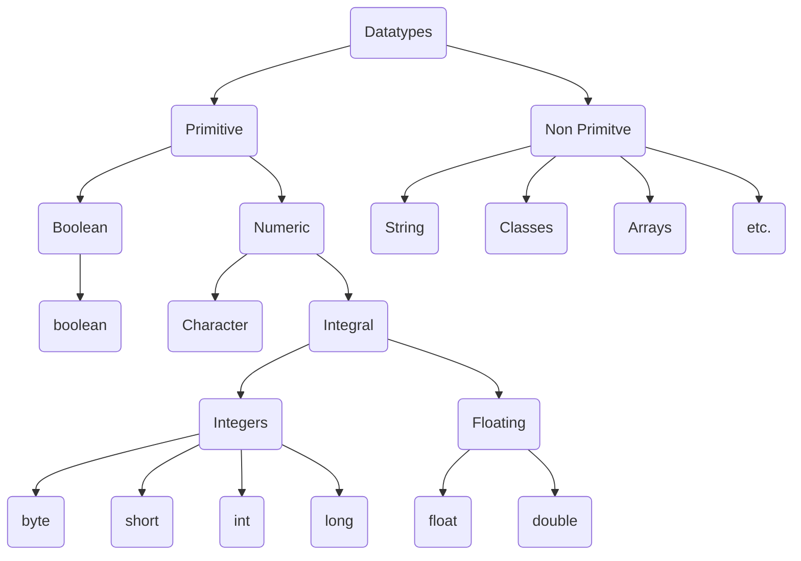

# Basics of Java

## 1. Variables
> A variable is a memory location used to store data values, and is being referenced by a variable name in programming.

### a. Declaration of a variable in Java
> Declaration of a variable in Java means that we are instructing the Java Compiler to assign a memory location, which is later being referenced in the program.
#### Syntax
`dataType variableName;`
#### Example
`int age;`

### b. Initialization of a variable in Java
> Initialization of a variable in Java means that we are assigning an initial value to the variable that we had declared earlier.
#### Syntax
`variableName = value;`
#### Example
`age = 20;`

> Note : Java is statically typed which means that we can use a variable only if it is declared earlier in the program.
    
For Example : 
```java

// This is wrong.
age = 20;
int age;

//This is right.
int age;
age = 20;
```

### c. Rules for naming variables in Java

1. Java is ***case sensitive*** which means that Java treats two variable with same name but different cases, as two differenet variables.
Example : `speed`,`Speed`,`SPEED`,`speeD`,`SpEEd` -> All these are completely different variables.
2. Variable name must start with a `ALPHABET`, `_` or a `$` symbol.
Example : `int Speed;`, `int $speed;`, `int _speed_limit;` -> These are valid variable names.  
          `int 1speed;`, `int @speed;` -> These are invalid variable names.
3. Variable names must ***not be a Java keyword***.  
Example : `int for;`, `int while;` -> These are invalid variable names.
4. Variable names must be ***meaningful***.  
Example : `int s;`, `int a;` -> These names are not meaningful but valid.  
          `int speed;`, `int age;` -> These names are meaningful and valid too.

## 2. Data Types

