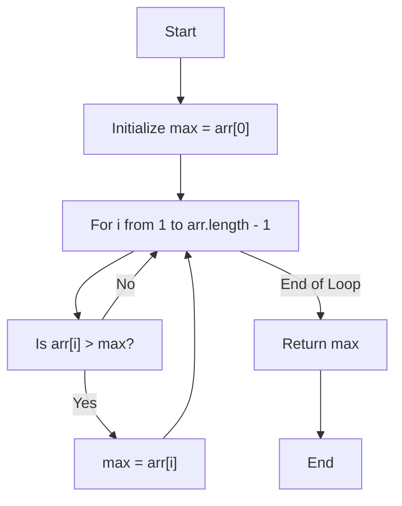

# Striver's Array Series (***Day 1 - Basic***)

## Question 01 : [Largest Element in Array](https://www.geeksforgeeks.org/problems/largest-element-in-array4009/0)

### 💡 Intuition and Approach

The problem is to find the largest element in an array. This can be efficiently solved using a simple traversal with a variable to track the maximum value.

### 🧠 Intuition

- **Given**: An array `arr` of integers.
- **Objective**: Find the largest element in the array.
- **Approach**:
  1. **Initialize**: Assume the first element is the largest by initializing a `max` variable with the first element.
  2. **Traverse the array**: Iterate through the array starting from the second element.
  3. **Update the maximum**: At each step, check if the current element is greater than the `max` variable. If it is, update `max`.
  4. **Return the result**: After completing the traversal, `max` will hold the largest element in the array.

### 🔍 Detailed Walkthrough

- **Example**:
  - Given array: `[3, 1, 4, 1, 5, 9, 2, 6, 5, 3, 5]`
  - Initialize `max` with the first element: `max = 3`
  - Traverse the array and update `max` as follows:
    - `max = 4` (when comparing with 4)
    - `max = 5` (when comparing with 5)
    - `max = 9` (when comparing with 9)
  - Result: `9` is the largest element.

### 📜 Code Explanation

```java
public int largest(int arr[], int n) {
    int max = arr[0]; // Initialize the max variable with the first element
    for (int i = 1; i < arr.length; i++) { // Traverse the array starting from the second element
        if (max < arr[i]) max = arr[i]; // Update max if the current element is greater
    }
    return max; // Return the largest element
}
```
### Flowchart

