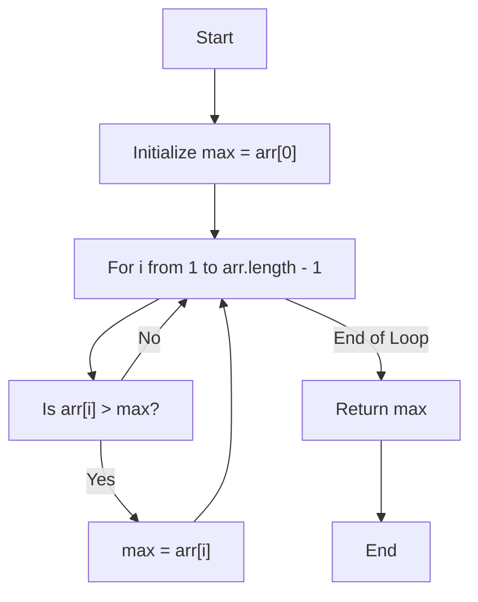
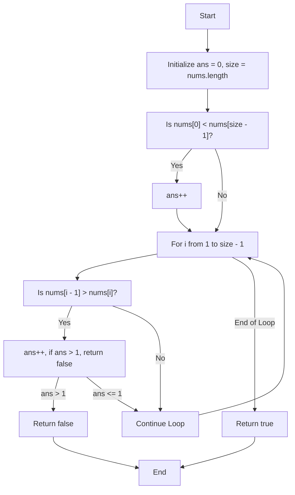
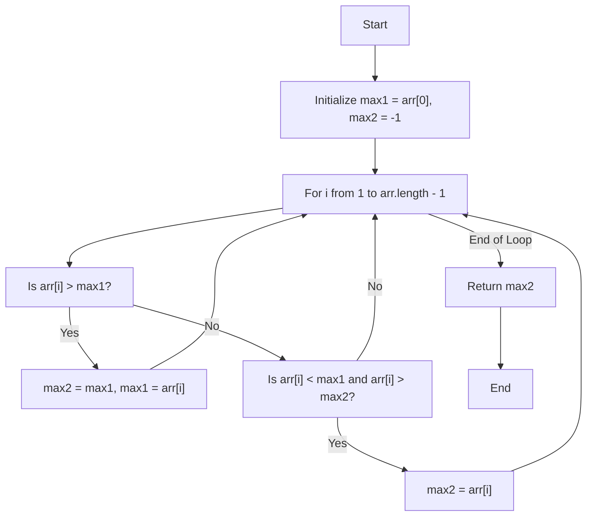
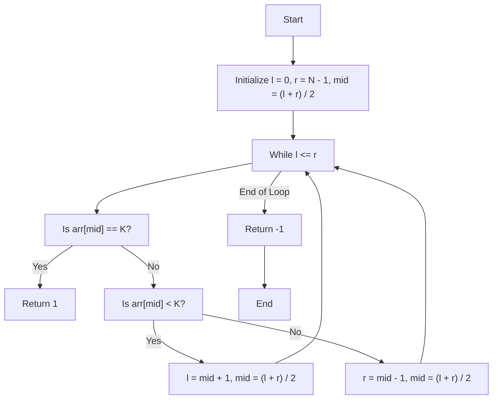
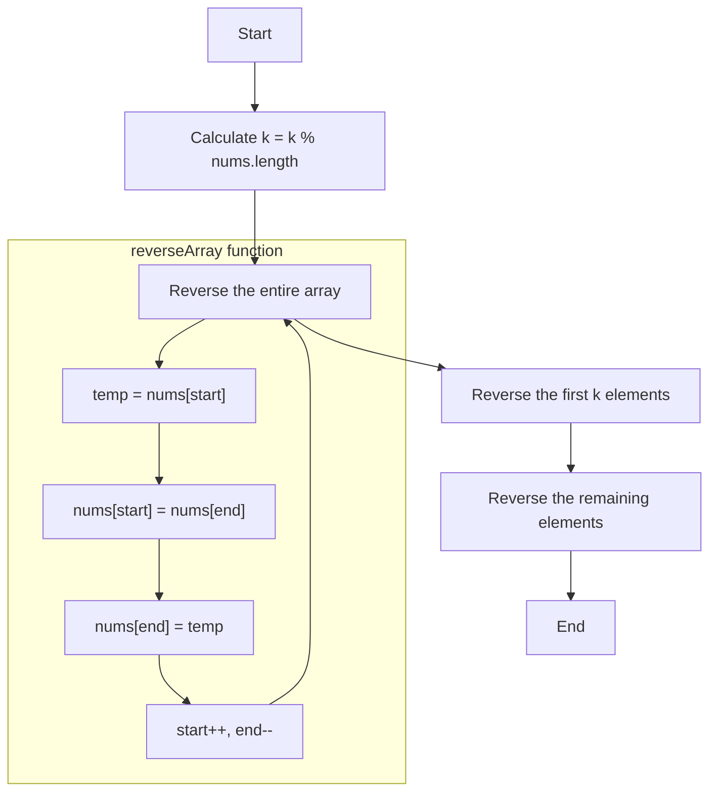

# Striver's Array Series (***Day 1 - Basic***)

- [Striver's Array Series (***Day 1 - Basic***)](#strivers-array-series-day-1---basic)
  - [Question 01 : Largest Element in Array](#question-01--largest-element-in-array)
    - [💡 Intuition and Approach](#-intuition-and-approach)
    - [🧠 Intuition](#-intuition)
    - [🔍 Detailed Walkthrough](#-detailed-walkthrough)
    - [📜 Code Explanation](#-code-explanation)
    - [Flowchart](#flowchart)
  - [Question 02 : Check If the Array is Sorted \& Rotated](#question-02--check-if-the-array-is-sorted--rotated)
    - [💡 Intuition and Approach](#-intuition-and-approach-1)
    - [💡 Intuition (Brute Force)](#-intuition-brute-force)
    - [🔍 Detailed Walkthrough (Brute Force)](#-detailed-walkthrough-brute-force)
    - [📜 Code Explanation (Brute Force)](#-code-explanation-brute-force)
    - [💡 Intuition (Optimal)](#-intuition-optimal)
    - [🔍 Detailed Walkthrough (Optimal)](#-detailed-walkthrough-optimal)
    - [📜 Code Explanation (Optimal)](#-code-explanation-optimal)
    - [Flowchart (Optimal)](#flowchart-optimal)
  - [Question 03 : Second Largest Element in Array without Sorting](#question-03--second-largest-element-in-array-without-sorting)
    - [💡 Intuition and Approach](#-intuition-and-approach-2)
    - [💡 Intuition](#-intuition-1)
    - [🔍 Detailed Walkthrough](#-detailed-walkthrough-1)
    - [📜 Code Explanation](#-code-explanation-1)
    - [Flowchart](#flowchart-1)
  - [Question 04 : Searching an Element in a Sorted Array](#question-04--searching-an-element-in-a-sorted-array)
    - [💡 Intuition and Approach](#-intuition-and-approach-3)
    - [💡 Intuition](#-intuition-2)
    - [🔍 Detailed Walkthrough](#-detailed-walkthrough-2)
    - [📜 Code Explanation](#-code-explanation-2)
    - [Flowchart](#flowchart-2)
  - [Question 05 : Rotate Array](#question-05--rotate-array)
    - [💡 Intuition and Approach](#-intuition-and-approach-4)
    - [💡 Intuition](#-intuition-3)
    - [🔍 Detailed Walkthrough](#-detailed-walkthrough-3)
    - [📜 Code Explanation](#-code-explanation-3)
    - [Flowchart](#flowchart-3)

## Question 01 : [Largest Element in Array](https://www.geeksforgeeks.org/problems/largest-element-in-array4009/0)

### 💡 Intuition and Approach

The problem is to find the largest element in an array. This can be efficiently solved using a simple traversal with a variable to track the maximum value.

### 🧠 Intuition

- **Given**: An array `arr` of integers.
- **Objective**: Find the largest element in the array.
- **Approach**:
  1. **Initialize**: Assume the first element is the largest by initializing a `max` variable with the first element.
  2. **Traverse the array**: Iterate through the array starting from the second element.
  3. **Update the maximum**: At each step, check if the current element is greater than the `max` variable. If it is, update `max`.
  4. **Return the result**: After completing the traversal, `max` will hold the largest element in the array.

### 🔍 Detailed Walkthrough

- **Example**:
  - Given array: `[3, 1, 4, 1, 5, 9, 2, 6, 5, 3, 5]`
  - Initialize `max` with the first element: `max = 3`
  - Traverse the array and update `max` as follows:
    - `max = 4` (when comparing with 4)
    - `max = 5` (when comparing with 5)
    - `max = 9` (when comparing with 9)
  - Result: `9` is the largest element.

### 📜 Code Explanation

```java
public int largest(int arr[], int n) {
    int max = arr[0]; // Initialize the max variable with the first element
    for (int i = 1; i < arr.length; i++) { // Traverse the array starting from the second element
        if (max < arr[i]) max = arr[i]; // Update max if the current element is greater
    }
    return max; // Return the largest element
}
```

> [!NOTE]
> [Click here to see full code](/IntermediateJAVA/Arrays/Striver's%20Array%20Series/LargestElement.java)


### Flowchart



## Question 02 : [Check If the Array is Sorted & Rotated](https://leetcode.com/problems/check-if-array-is-sorted-and-rotated/description/)

### 💡 Intuition and Approach

The problem is to check if a given array is sorted and then rotated. A sorted and rotated array is a result of taking a sorted array and moving some elements from the beginning to the end. This can be checked using either a brute force approach or an optimized approach.

### 💡 Intuition (Brute Force)

- **Given**: An array `nums` of integers.
- **Objective**: Determine if the array is sorted and rotated.
- **Approach**:
  1. Iterate through all possible rotations of the array.
  2. For each rotation, check if the array is sorted.
  3. If any rotation results in a sorted array, return `true`.
  4. If no rotation results in a sorted array, return `false`.

### 🔍 Detailed Walkthrough (Brute Force)

- **Example**:
  - Given array: `[3, 4, 5, 1, 2]`
  - Check all rotations: `[3, 4, 5, 1, 2]`, `[4, 5, 1, 2, 3]`, `[5, 1, 2, 3, 4]`, `[1, 2, 3, 4, 5]`, `[2, 3, 4, 5, 1]`
  - Identify that `[1, 2, 3, 4, 5]` is sorted.
  - Result: The array is sorted and rotated, so return `true`.

### 📜 Code Explanation (Brute Force)

```java
public boolean check(int[] nums) {
    if (nums.length <= 1)
        return true;
    for (int x = 0; x < nums.length; x++) {
        for (int i = 0; i < nums.length - 1; i++) {
            int j = (i + x) % nums.length;
            int k = (j + 1) % nums.length;
            if (nums[j] > nums[k])
                break;
            else {
                if (i == nums.length - 2)
                    return true;
            }
        }
    }
    return false;
}
```
> [!NOTE]
> [Click here to see full code](/IntermediateJAVA/Arrays/Striver's%20Array%20Series/SortedAndRotated.java)

### 💡 Intuition (Optimal)

- **Given**: An array `nums` of integers.
- **Objective**: Determine if the array is sorted and rotated.
- **Approach**:
  1. Count the number of places where the current element is greater than the next element.
  2. If this count is more than 1, the array is not sorted and rotated.
  3. If the count is 1 or 0, the array is sorted and rotated.

### 🔍 Detailed Walkthrough (Optimal)

- **Example**:
  - Given array: `[3, 4, 5, 1, 2]`
  - Count the number of inversions: 
    - `3 < 4` (no inversion)
    - `4 < 5` (no inversion)
    - `5 > 1` (1 inversion)
    - `1 < 2` (no inversion)
  - Total inversions: 1
  - Result: The array is sorted and rotated, so return `true`.

### 📜 Code Explanation (Optimal)

```java
class Solution {
    public boolean check(int[] nums) {
        int ans = 0, size = nums.length;
        if (nums[0] < nums[size - 1]) {
            ans++;
        }
        for (int i = 1; i < size; i++) {
            if (nums[i - 1] > nums[i]) {
                ans++;
                if (ans > 1) {
                    return false;
                }
            }
        }
        return true;
    }
}
```
### Flowchart (Optimal)


## Question 03 : [Second Largest Element in Array without Sorting](https://www.geeksforgeeks.org/problems/second-largest3735/0)

### 💡 Intuition and Approach

The problem is to find the second largest element in an array without sorting it. This can be efficiently solved using a single traversal with two variables to track the maximum and second maximum values.

### 💡 Intuition

- **Given**: An array `arr` of integers.
- **Objective**: Find the second largest element in the array.
- **Approach**:
  1. **Initialize**: Assume the first element is the largest by initializing `max1` with the first element and `max2` as -1.
  2. **Traverse the array**: Iterate through the array starting from the second element.
  3. **Update the maximum and second maximum**:
     - If the current element is greater than `max1`, update `max2` to `max1` and then update `max1` to the current element.
     - If the current element is between `max1` and `max2`, update `max2`.
  4. **Return the result**: After completing the traversal, `max2` will hold the second largest element in the array.

### 🔍 Detailed Walkthrough

- **Example**:
  - Given array: `[12, 35, 1, 10, 34, 1]`
  - Initialize `max1` with the first element: `max1 = 12`, `max2 = -1`
  - Traverse the array and update `max1` and `max2` as follows:
    - `max1 = 35`, `max2 = 12` (when comparing with 35)
    - `max2 = 34` (when comparing with 34)
  - Result: `34` is the second largest element.

### 📜 Code Explanation

```java
int print2largest(int arr[], int n) {
    int max1 = arr[0]; // Initialize the max1 variable with the first element
    int max2 = -1; // Initialize the max2 variable as -1
    for (int i = 1; i < arr.length; i++) { // Traverse the array starting from the second element
        if (max1 < arr[i]) { // If current element is greater than max1
            max2 = max1; // Update max2 to be the old max1
            max1 = arr[i]; // Update max1 to be the current element
        }
        if (arr[i] < max1 && arr[i] > max2) { // If current element is between max1 and max2
            max2 = arr[i]; // Update max2 to be the current element
        }
    }
    return max2; // Return the second largest element
}
```
> [!NOTE]
> [Click here to see full code](/IntermediateJAVA/Arrays/Striver's%20Array%20Series/SecondLargest.java)

### Flowchart


## Question 04 : [Searching an Element in a Sorted Array](https://www.geeksforgeeks.org/problems/who-will-win-1587115621/0)

### 💡 Intuition and Approach

The problem is to search for a target element in a sorted array. This can be efficiently solved using the Binary Search algorithm, which operates in logarithmic time.

### 💡 Intuition

- **Given**: A sorted array `arr` of integers and a target element `K`.
- **Objective**: Determine if `K` exists in the array. Return `1` if it exists, otherwise return `-1`.
- **Approach**:
  1. **Initialize**: Set the left pointer `l` to the start of the array and the right pointer `r` to the end of the array.
  2. **Binary Search**: Calculate the middle index `mid`. Compare the middle element with the target `K`.
     - If the middle element is equal to `K`, return `1`.
     - If the middle element is less than `K`, adjust the left pointer to `mid + 1`.
     - If the middle element is greater than `K`, adjust the right pointer to `mid - 1`.
  3. **Repeat**: Continue the process until the left pointer exceeds the right pointer.
  4. **Return the result**: If the element is not found, return `-1`.

### 🔍 Detailed Walkthrough

- **Example**:
  - Given array: `[1, 2, 3, 4, 5, 6, 7, 8, 9]`, target `K = 5`
  - Initial pointers: `l = 0`, `r = 8`
  - Calculate `mid = (0 + 8) / 2 = 4`
  - Compare `arr[4]` with `K`:
    - `arr[4] = 5` which is equal to `K`
  - Result: Element `5` is found, return `1`.

### 📜 Code Explanation

```java
static int searchInSorted(int arr[], int N, int K) {
    int l = 0; // Initialize the left pointer
    int r = N - 1; // Initialize the right pointer
    int mid = (l + r) / 2; // Calculate the middle index
    
    while (l <= r) { // Continue until left pointer exceeds the right pointer
        if (arr[mid] == K) return 1; // If middle element is equal to K, return 1
        else if (arr[mid] < K) { // If middle element is less than K
            l = mid + 1; // Adjust the left pointer
            mid = (l + r) / 2; // Recalculate the middle index
        } else { // If middle element is greater than K
            r = mid - 1; // Adjust the right pointer
            mid = (l + r) / 2; // Recalculate the middle index
        }
    }
    return -1; // If element is not found, return -1
}
```

> [!NOTE]
> [Click here to see full code](/IntermediateJAVA/Arrays/Striver's%20Array%20Series/SearchingInSortedArray.java)

### Flowchart


## Question 05 : [Rotate Array](https://leetcode.com/problems/rotate-array/description/)

### 💡 Intuition and Approach

The problem is to rotate an array to the right by `k` steps. This can be efficiently solved using the array reversal technique.

### 💡 Intuition

- **Given**: An array `nums` and an integer `k`.
- **Objective**: Rotate the array to the right by `k` steps.
- **Approach**:
  1. **Effective Rotation**: Calculate the effective rotation by taking `k` modulo the length of the array, ensuring `k` is within the range of the array length.
  2. **Reverse the Entire Array**: Reverse the whole array.
  3. **Reverse the First k Elements**: Reverse the first `k` elements.
  4. **Reverse the Remaining Elements**: Reverse the elements from `k` to the end of the array.

### 🔍 Detailed Walkthrough

- **Example**:
  - Given array: `[1, 2, 3, 4, 5, 6, 7]`, `k = 3`
  - Effective `k`: `k = 3 % 7 = 3`
  - Step 1: Reverse the entire array: `[7, 6, 5, 4, 3, 2, 1]`
  - Step 2: Reverse the first `k` elements: `[5, 6, 7, 4, 3, 2, 1]`
  - Step 3: Reverse the remaining elements: `[5, 6, 7, 1, 2, 3, 4]`
  - Result: Array after rotating `[1, 2, 3, 4, 5, 6, 7]` by 3 steps to the right is `[5, 6, 7, 1, 2, 3, 4]`.

### 📜 Code Explanation

```java
public void rotate(int[] nums, int k) {
    k = k % nums.length; // Calculate effective rotation
    reverseArray(nums, 0, nums.length - 1); // Reverse the entire array
    reverseArray(nums, 0, k - 1); // Reverse the first k elements
    reverseArray(nums, k, nums.length - 1); // Reverse the remaining elements
}

public static void reverseArray(int[] nums, int start, int end) {
    int temp;
    while (start < end) {
        temp = nums[start];
        nums[start] = nums[end];
        nums[end] = temp;
        start++;
        end--;
    }
}
```

> [!NOTE]
> [Click here to see full code](/IntermediateJAVA/Arrays/Striver's%20Array%20Series/RotateArray.java)

### Flowchart


