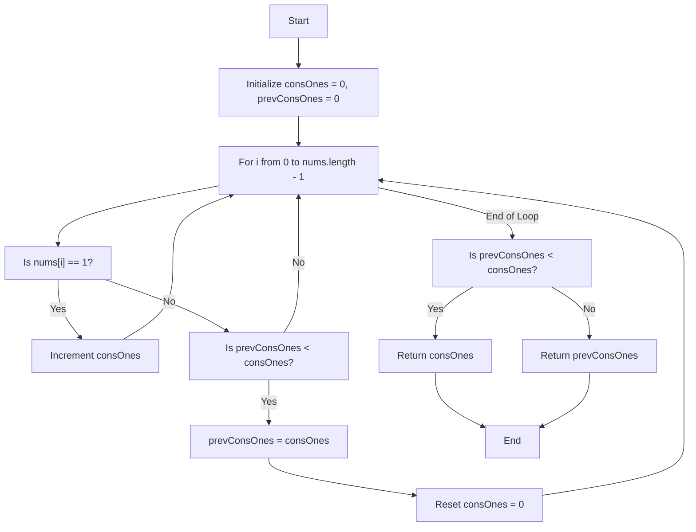
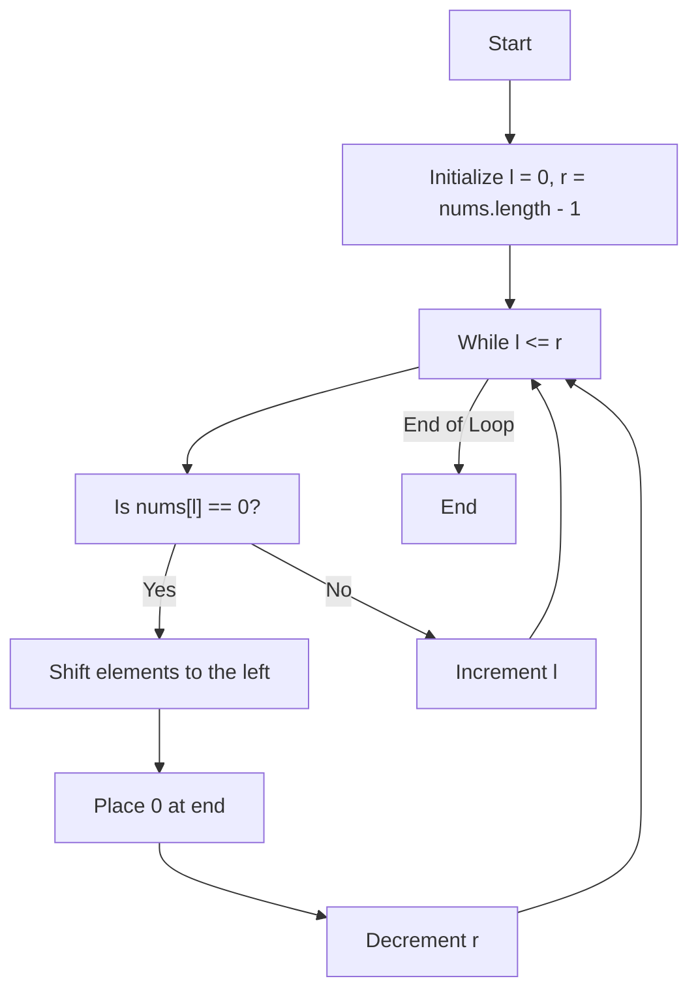
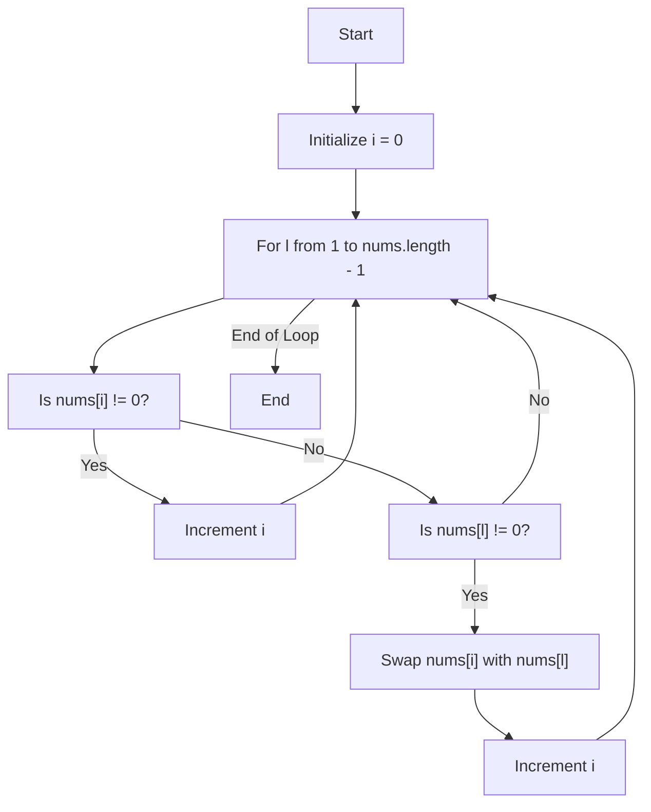
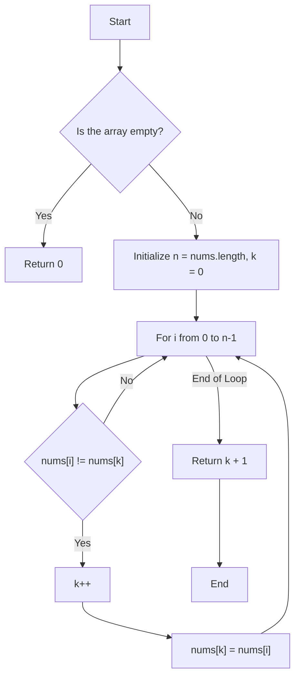
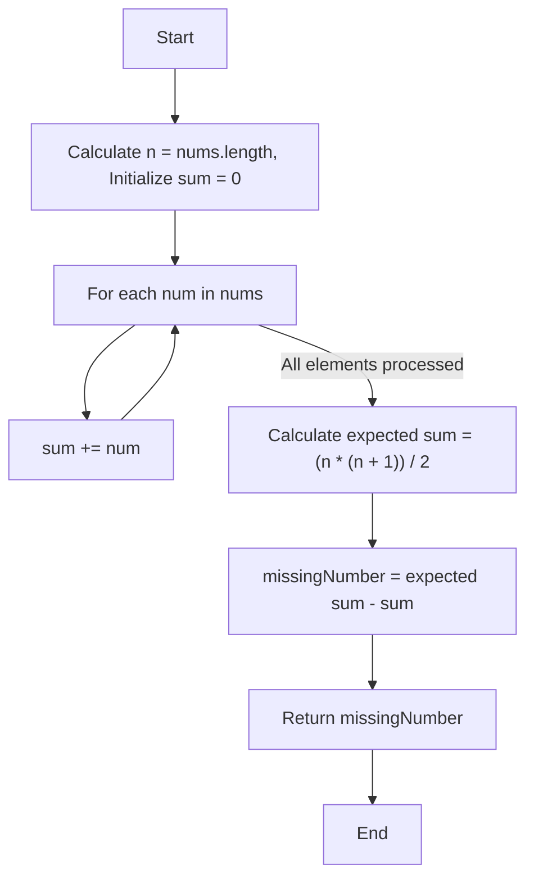
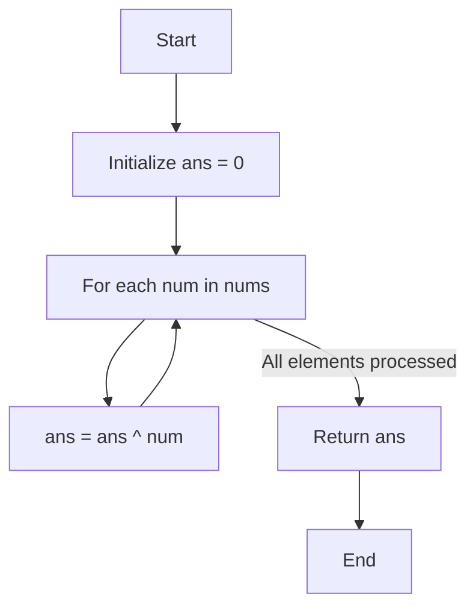
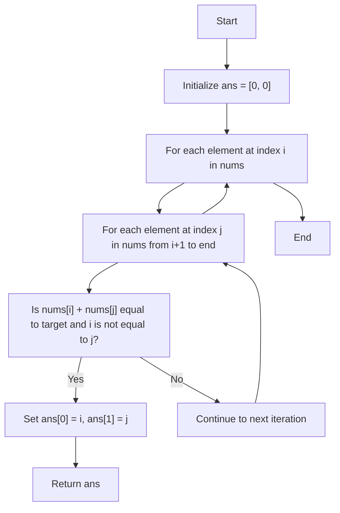

# Striver's Array Series (***Day 2 - Easy***)

- [Striver's Array Series (***Day 2 - Easy***)](#strivers-array-series-day-2---easy)
  - [Question 06 : Maximum Consecutive Ones](#question-06--maximum-consecutive-ones)
    - [💡 Intuition and Approach](#-intuition-and-approach)
    - [💡 Intuition](#-intuition)
    - [🔍 Detailed Walkthrough](#-detailed-walkthrough)
    - [📜 Code Explanation](#-code-explanation)
    - [Flowchart](#flowchart)
  - [Question 07 : Move Zeroes](#question-07--move-zeroes)
    - [💡 Intuition and Approach](#-intuition-and-approach-1)
    - [💡 Intuition](#-intuition-1)
    - [🔍 Detailed Walkthrough](#-detailed-walkthrough-1)
    - [📜 Code Explanation](#-code-explanation-1)
    - [Flowchart](#flowchart-1)
    - [💡 Intuition and Approach (*Optimal*)](#-intuition-and-approach-optimal)
    - [💡 Intuition (*Optimal*)](#-intuition-optimal)
    - [🔍 Detailed Walkthrough (*Optimal*)](#-detailed-walkthrough-optimal)
    - [📜 Code Explanation (*Optimal*)](#-code-explanation-optimal)
    - [Flowchart (*Optimal*)](#flowchart-optimal)
  - [Question 08 : Remove Duplicates from Sorted Array](#question-08--remove-duplicates-from-sorted-array)
    - [💡 Intuition and Approach](#-intuition-and-approach-2)
    - [💡 Intuition](#-intuition-2)
    - [📝 Approach](#-approach)
    - [🔍 Detailed Walkthrough](#-detailed-walkthrough-2)
    - [📜 Code Explanation](#-code-explanation-2)
    - [Flowchart](#flowchart-2)
  - [Question 09 : Missing Number](#question-09--missing-number)
    - [💡 Intuition and Approach](#-intuition-and-approach-3)
    - [🧠 Intuition](#-intuition-3)
    - [📝 Steps](#-steps)
    - [🔍 Detailed Walkthrough](#-detailed-walkthrough-3)
    - [📜 Code Explanation](#-code-explanation-3)
    - [Flowchart](#flowchart-3)
  - [Question 10 : Single Number](#question-10--single-number)
    - [💡 Intuition and Approach](#-intuition-and-approach-4)
    - [🧠 Intuition](#-intuition-4)
    - [📝 Steps](#-steps-1)
    - [🔍 Detailed Walkthrough](#-detailed-walkthrough-4)
    - [📜 Code Explanation](#-code-explanation-4)
    - [Flowchart](#flowchart-4)
  - [Question 11 : Union of Two Sorted Arrays](#question-11--union-of-two-sorted-arrays)
    - [💡 Intuition and Approach](#-intuition-and-approach-5)
    - [🧠 Intuition](#-intuition-5)
    - [📝 Steps](#-steps-2)
    - [🔍 Detailed Walkthrough](#-detailed-walkthrough-5)
    - [📜 Code Explanation](#-code-explanation-5)
  - [Question 12 : Two Sum](#question-12--two-sum)
    - [💡 Intuition and Approach](#-intuition-and-approach-6)
    - [🧠 Intuition](#-intuition-6)
    - [📝 Steps](#-steps-3)
    - [🔍 Detailed Walkthrough](#-detailed-walkthrough-6)
    - [📜 Code Explanation](#-code-explanation-6)
    - [Flowchart](#flowchart-5)


## Question 06 : [Maximum Consecutive Ones](https://leetcode.com/problems/max-consecutive-ones/description/)

### 💡 Intuition and Approach

The problem is to find the maximum number of consecutive ones in an array of binary numbers. This can be efficiently solved by iterating through the array and updating the count of consecutive ones.

### 💡 Intuition

- **Given**: An array `nums` of binary numbers (0s and 1s).
- **Objective**: Find the maximum number of consecutive ones in the array.
- **Approach**:
  1. **Iterate Through Array**: Traverse the array `nums`.
  2. **Count Consecutive Ones**: Maintain two variables, `consOnes` and `prevConsOnes`, to keep track of consecutive ones.
  3. **Update Count**:
     - If the current element is `1`, increment `consOnes`.
     - If the current element is `0`, compare `prevConsOnes` with `consOnes`, update `prevConsOnes` if needed, and reset `consOnes` to `0`.
  4. **Return Result**: After iterating through the array, compare `prevConsOnes` with `consOnes` one final time and return the maximum count.

### 🔍 Detailed Walkthrough

- **Example**:
  - Given array: `[1, 1, 0, 1, 1, 1, 0, 1, 1, 1, 1]`
  - Initialize `consOnes = 0` and `prevConsOnes = 0`.
  - Traverse the array:
    - At index `0`, `nums[0] = 1`, increment `consOnes` to `1`.
    - At index `1`, `nums[1] = 1`, increment `consOnes` to `2`.
    - At index `2`, `nums[2] = 0`, reset `consOnes` to `0`.
    - At index `3`, `nums[3] = 1`, increment `consOnes` to `1`.
    - At index `4`, `nums[4] = 1`, increment `consOnes` to `2`.
    - At index `5`, `nums[5] = 1`, increment `consOnes` to `3`.
    - At index `6`, `nums[6] = 0`, reset `consOnes` to `0`.
    - At index `7`, `nums[7] = 1`, increment `consOnes` to `1`.
    - At index `8`, `nums[8] = 1`, increment `consOnes` to `2`.
    - At index `9`, `nums[9] = 1`, increment `consOnes` to `3`.
    - At index `10`, `nums[10] = 1`, increment `consOnes` to `4`.
  - Result: Maximum consecutive ones is `4`.

### 📜 Code Explanation

```java
public static int findMaxConsecutiveOnes(int[] nums) {
    int consOnes = 0; // Initialize variable to count consecutive ones
    int prevConsOnes = 0; // Initialize variable to track previous consecutive ones
    for (int i = 0; i < nums.length; i++) { // Iterate through the array
        if (nums[i] == 1) { // If current element is 1
            consOnes++; // Increment consecutive ones count
        } else { // If current element is 0
            if (prevConsOnes < consOnes) { // Check if current count is greater than previous
                prevConsOnes = consOnes; // Update previous count
            }
            consOnes = 0; // Reset consecutive ones count
        }
    }
    if (prevConsOnes < consOnes) { // Check for last consecutive ones count
        return consOnes; // Return max consecutive ones count
    } else {
        return prevConsOnes;
    }
}
```

> [!NOTE]
> [Click here to see full code](/IntermediateJAVA/Arrays/Striver's%20Array%20Series/MaximumConsecutiveOnes.java)

### Flowchart


## Question 07 : [Move Zeroes](https://leetcode.com/problems/move-zeroes/)

### 💡 Intuition and Approach

The problem is to move all the zeroes in an array to the end while maintaining the relative order of other elements. This can be efficiently solved using a two-pointer approach.

### 💡 Intuition

- **Given**: An array `nums`.
- **Objective**: Move all zeroes to the end while maintaining the relative order of other elements.
- **Approach**:
  1. **Two Pointers**: Use two pointers, `l` and `r`, initially pointing to the start and end of the array, respectively.
  2. **Iterate Until Pointers Meet**: While `l` is less than or equal to `r`, perform the following steps:
     - If `nums[l]` is `0`, shift all elements from `l` to `r` one position to the left, effectively moving the zero to the end of the array.
     - Decrement `r` to move towards the left.
     - Increment `l` to move towards the right.
  3. **Placing Zeroes**: After the loop, all zeroes will be moved to the end. Place `0` at index `r`.
  
### 🔍 Detailed Walkthrough

- **Example**:
  - Given array: `[0, 1, 0, 3, 12]`
  - Initialize `l = 0` and `r = 4`.
  - Iteration 1: `nums[l]` is `0`, shift elements to the left: `[1, 0, 3, 12, 12]`, decrement `r` to `3`.
  - Iteration 2: `nums[l]` is `1`, increment `l` to `1`.
  - Iteration 3: `nums[l]` is `0`, shift elements to the left: `[1, 3, 12, 12, 0]`, decrement `r` to `2`.
  - Iteration 4: `nums[l]` is `3`, increment `l` to `2`.
  - Iteration 5: `nums[l]` is `12`, increment `l` to `3`.
  - Result: Array after moving zeroes to the end: `[1, 3, 12, 0, 0]`.

### 📜 Code Explanation

```java
public void moveZeroes(int[] nums) {
    int l = 0; // Initialize left pointer
    int r = nums.length - 1; // Initialize right pointer
    while (l <= r) { // Iterate until pointers meet
        if (nums[l] == 0) { // If current element is 0
            // Shift elements to the left
            for (int i = l; i < r; i++) {
                nums[i] = nums[i + 1];
            }
            nums[r] = 0; // Place 0 at end
            r--; // Move left pointer towards left
        } else {
            l++; // Move left pointer towards right
        }
    }
}
```

> [!NOTE]
> [Click here to see full code](/IntermediateJAVA/Arrays/Striver's%20Array%20Series/MoveZeroes.java)

### Flowchart


### 💡 Intuition and Approach (*Optimal*)

The problem is to move all the zeroes in an array to the end while maintaining the relative order of other elements. This can be efficiently solved using a two-pointer approach.

### 💡 Intuition (*Optimal*)

- **Given**: An array `nums`.
- **Objective**: Move all zeroes to the end while maintaining the relative order of other elements.
- **Approach**:
  1. **Single Pass**: Iterate through the array using a single loop.
  2. **Two Pointers**: Use one pointer, `i`, to track the position where non-zero elements should be placed.
  3. **Shift Zeroes**: If `nums[i]` is not zero, increment `i`. If it is zero, find the next non-zero element using another pointer `l`. Swap `nums[i]` with `nums[l]` and increment `i`.
  
### 🔍 Detailed Walkthrough (*Optimal*)

- **Example**:
  - Given array: `[0, 1, 0, 3, 12]`
  - Initialize `i = 0`.
  - Iteration 1: `nums[i]` is `0`, find the next non-zero element at index `1`. Swap `nums[i]` with `nums[1]`: `[1, 0, 0, 3, 12]`, increment `i` to `1`.
  - Iteration 2: `nums[i]` is `0`, find the next non-zero element at index `3`. Swap `nums[i]` with `nums[3]`: `[1, 3, 0, 0, 12]`, increment `i` to `2`.
  - Iteration 3: `nums[i]` is `0`, find the next non-zero element at index `4`. Swap `nums[i]` with `nums[4]`: `[1, 3, 12, 0, 0]`, increment `i` to `3`.
  - Result: Array after moving zeroes to the end: `[1, 3, 12, 0, 0]`.

### 📜 Code Explanation (*Optimal*)

```java
class Solution {
    public void moveZeroes(int[] nums) {
        int i = 0; // Initialize pointer to track position of non-zero elements
        for (int l = 1; l < nums.length; l++) { // Iterate through the array
            if (nums[i] != 0) { // If current element is not zero
                i++; // Increment pointer
            } else { // If current element is zero
                if (nums[l] != 0) { // Find next non-zero element
                    int temp = nums[i]; // Swap nums[i] with nums[l]
                    nums[i] = nums[l];
                    nums[l] = temp;
                    i++; // Increment pointer
                }
            }
        }
    }
}
```

### Flowchart (*Optimal*)


## Question 08 : [Remove Duplicates from Sorted Array](https://leetcode.com/problems/remove-duplicates-from-sorted-array/description/)

### 💡 Intuition and Approach

The problem at hand is to remove duplicates from a sorted array `nums` and return the new length of the array after removal, ensuring each element appears only once. The modified array should have the unique elements in the first part of the array, and it doesn't matter what you leave beyond the new length.

### 💡 Intuition

- Since the array is sorted, duplicates are contiguous.
- We can maintain a pointer (`k`) that keeps track of the position of the last unique element encountered.
- By iterating through the array and comparing the current element with the last unique element (`nums[k]`), we can identify if the current element is a duplicate.
- If it's not a duplicate, increment `k` and update `nums[k]` with the current element.

### 📝 Approach

1. **Initialization**:
   - Start with a pointer `k` at position 0, which will track the index of the last unique element in the array.

2. **Iteration**:
   - Loop through the array starting from the first element.
   - For each element `nums[i]`:
     - Compare it with `nums[k]` (the last unique element).
     - If they are different, it means `nums[i]` is a new unique element:
       - Increment `k` to move to the next position for storing this new unique element.
       - Assign `nums[i]` to `nums[k]`.

3. **Completion**:
   - After processing all elements, the first `k + 1` elements of the array `nums` will be unique.
   - The value `k + 1` represents the new length of the array after removing duplicates.

### 🔍 Detailed Walkthrough

Let's walk through an example to clarify:

Consider the input array: `nums = [1, 1, 2, 2, 3, 4, 4, 5]`.

- Start with `k = 0`. The first element `nums[0]` is always unique, so it stays in place.

- Loop through the array:
  - `i = 1`: `nums[1]` (1) is equal to `nums[k]` (1). It's a duplicate, so continue to the next element.
  - `i = 2`: `nums[2]` (2) is different from `nums[k]` (1). Increment `k` to 1 and set `nums[1]` to `nums[2]`. Now `nums` looks like `[1, 2, 2, 2, 3, 4, 4, 5]`.
  - `i = 3`: `nums[3]` (2) is equal to `nums[k]` (2). It's a duplicate, so continue to the next element.
  - `i = 4`: `nums[4]` (3) is different from `nums[k]` (2). Increment `k` to 2 and set `nums[2]` to `nums[4]`. Now `nums` looks like `[1, 2, 3, 2, 3, 4, 4, 5]`.
  - `i = 5`: `nums[5]` (4) is different from `nums[k]` (3). Increment `k` to 3 and set `nums[3]` to `nums[5]`. Now `nums` looks like `[1, 2, 3, 4, 3, 4, 4, 5]`.
  - `i = 6`: `nums[6]` (4) is equal to `nums[k]` (4). It's a duplicate, so continue to the next element.
  - `i = 7`: `nums[7]` (5) is different from `nums[k]` (4). Increment `k` to 4 and set `nums[4]` to `nums[7]`. Now `nums` looks like `[1, 2, 3, 4, 5, 4, 4, 5]`.

- The final value of `k` is 4, so the new length is `k + 1 = 5`.

### 📜 Code Explanation 

```java
public class Solution {
    public int removeDuplicates(int[] nums) {
        int n = nums.length; // Length of the input array
        int k = 0; // Pointer for the position of the last unique element

        // Loop through the array starting from the first element
        for (int i = 0; i < n; i++) {
            // If the current element is different from the last unique element
            if (nums[i] != nums[k]) {
                k++; // Increment the pointer for the unique element position
                nums[k] = nums[i]; // Update the next position with the current unique element
            }
        }

        // The length of the array with unique elements is k + 1
        return k + 1;
    }
}
```

> [!NOTE]
> [Click here to see full code](/IntermediateJAVA/Arrays/Striver's%20Array%20Series/RemoveSortedDuplicates.java)

### Flowchart


## Question 09 : [Missing Number](https://leetcode.com/problems/missing-number/)

### 💡 Intuition and Approach

The problem is to find the missing number from an array containing `n` distinct numbers taken from the range `0` to `n`. 

To solve this problem, we can use the mathematical formula for the sum of the first `n` natural numbers:

$$\text{Sum}_{\text{expected}} = \frac{n \cdot (n + 1)}{2}$$

### 🧠 Intuition

- **Given**: An array `nums` of length `n` containing numbers from `0` to `n` with one missing.
- **Objective**: Find the missing number.
- **Approach**:
  1. **Calculate the expected sum** of the first `n` natural numbers using the formula: $\frac{n \cdot (n + 1)}{2}$.
  2. **Calculate the actual sum** of the elements in the array.
  3. **The difference** between the expected sum and the actual sum is the missing number.

### 📝 Steps

1. **Initialize**:
   - Calculate the length `n` of the array.
   - Initialize a variable `sum` to store the sum of elements in the array.

2. **Calculate the sum** of the array elements:
   - Iterate through each element in the array and add it to `sum`.

3. **Calculate the expected sum** using the formula $\frac{n \cdot (n + 1)}{2}$.

4. **Find the missing number** by subtracting the actual sum from the expected sum.

### 🔍 Detailed Walkthrough

- **Example**:
  - Given array: `[3, 0, 1]`
  - Length of the array `n = 3`
  - Expected sum: $\frac{3 \cdot (3 + 1)}{2} = 6$
  - Actual sum: $3 + 0 + 1 = 4$
  - Missing number: $6 - 4 = 2$

### 📜 Code Explanation

```java
public class Solution {
    public int missingNumber(int[] nums) {
        int n = nums.length; // Length of the input array
        int sum = 0; // Initialize sum to store the sum of elements
        for (int num : nums) {
            sum += num; // Calculate the sum of array elements
        }
        return ((n * (n + 1)) / 2 - sum); // Return the missing number
    }
}
```
This code efficiently computes the missing number by leveraging the properties of arithmetic sums, ensuring a time complexity of $O(n)$ and a space complexity of $O(1)$.

> [!NOTE]
> [Click here to see full code](/IntermediateJAVA/Arrays/Striver's%20Array%20Series/MissingNumber.java)


### Flowchart


## Question 10 : [Single Number](https://leetcode.com/problems/single-number/description/)

### 💡 Intuition and Approach

The problem is to find the single number in an array where every element appears twice except for one. This problem can be efficiently solved using **bit manipulation**.

### 🧠 Intuition

- **Given**: An array `nums` of integers where every element appears twice except for one.
- **Objective**: Find the element that appears only once.
- **Approach**:
  1. **XOR Property**: XOR of a number with itself is `0` and XOR of a number with `0` is the number itself. Therefore, `a ^ a = 0` and `a ^ 0 = a`.
  2. Using the above properties, XOR all elements in the array. The result will cancel out all elements that appear twice, leaving the single number.

### 📝 Steps

1. **Initialize**:
   - Initialize a variable `ans` to `0`. This will hold the result of XOR operations.

2. **XOR all elements**:
   - Iterate through each element `num` in the array `nums`.
   - XOR each element with `ans`.

3. **Return the result**:
   - After completing the XOR operations, `ans` will hold the single number.

### 🔍 Detailed Walkthrough

- **Example**:
  - Given array: `[4, 1, 2, 1, 2]`
  - XOR operations:
    - `0 ^ 4 = 4`
    - `4 ^ 1 = 5`
    - `5 ^ 2 = 7`
    - `7 ^ 1 = 6`
    - `6 ^ 2 = 4`
  - Result: `4` is the single number.

### 📜 Code Explanation

```java
public class Solution {
    public int singleNumber(int[] nums) {
        int ans = 0; // Initialize the result variable
        for (int num : nums) {
            ans = ans ^ num; // XOR each element with the result
        }
        return ans; // Return the single number
    }
}
```
This code efficiently finds the single number using bit manipulation with a time complexity of $O(n)$ and a space complexity of $O(1)$.

> [!NOTE]
> [Click here to see full code](/IntermediateJAVA/Arrays/Striver's%20Array%20Series/SingleNumber.java)

### Flowchart


## Question 11 : [Union of Two Sorted Arrays](https://www.geeksforgeeks.org/problems/union-of-two-sorted-arrays-1587115621/0)

### 💡 Intuition and Approach

The task is to find the union of two arrays, which contains elements that are present in either of the two arrays or both. This can be achieved by iterating through both arrays simultaneously and comparing elements.

### 🧠 Intuition

- **Given**: Two arrays `arr1` and `arr2` of lengths `n` and `m` respectively.
- **Objective**: Find the union of the two arrays.
- **Approach**:
  1. **Iterate Through Arrays**: Initialize two pointers `i` and `j` for `arr1` and `arr2` respectively.
  2. **Compare Elements**:
     - If `arr1[i]` equals `arr2[j]`, add it to the union if it's not a duplicate, and move both pointers forward.
     - If `arr1[i]` is less than `arr2[j]`, add `arr1[i]` to the union if it's not a duplicate, and move the pointer for `arr1` forward.
     - If `arr1[i]` is greater than `arr2[j]`, add `arr2[j]` to the union if it's not a duplicate, and move the pointer for `arr2` forward.
  3. **Handle Remaining Elements**: After one array is fully traversed, add the remaining elements of the other array to the union.

### 📝 Steps

1. **Initialize Variables**:
   - Initialize an ArrayList `union` to store the union of elements.
   - Initialize two pointers `i` and `j` for `arr1` and `arr2` respectively.
   - Initialize a variable `prev` to track the previously added element to avoid duplicates.

2. **Compare and Add Elements**:
   - While both pointers are within bounds:
     - Compare elements at `arr1[i]` and `arr2[j]`.
     - Based on the comparison, add elements to the `union` list, ensuring no duplicates.
     - Move the pointers accordingly.

3. **Handle Remaining Elements**:
   - If any array is fully traversed, add the remaining elements of the other array to the `union` list.

4. **Return Union**:
   - Return the `union` list containing the elements of the union.

### 🔍 Detailed Walkthrough

- **Example**:
  - Given arrays: `arr1 = [1, 2, 2, 3, 4]` and `arr2 = [2, 2, 4, 4, 5]`
  - Union: `[1, 2, 3, 4, 5]`

### 📜 Code Explanation

```java
private static ArrayList<Integer> findUnion(int[] arr1, int[] arr2, int n, int m) {
    ArrayList<Integer> union = new ArrayList<>();
    //Logic
    int i = 0;
    int j = 0;
    int prev = -1000000001;
    while(i < n && j < m){
        if(arr1[i] == arr2[j]){
            if(!(prev == arr1[i])){
                union.add(arr1[i]);
                prev = arr1[i];
            }
            i++;
            j++;
        }
        else{
            if(arr1[i] < arr2[j]){
                if(!(prev == arr1[i])){
                    union.add(arr1[i]);
                    prev = arr1[i];
                }
                i++;
            }
            else{
                if(!(prev == arr2[j])){
                    union.add(arr2[j]);
                    prev = arr2[j];
                }
                j++;
            }
        }
    }
    if(i == n){
        while(j < m){
            if(!(prev == arr2[j])){
                union.add(arr2[j]);
                prev = arr2[j];
            }
            j++;
        }
    }
    else{
        while(i < n){
            if(!(prev == arr1[i])){
                union.add(arr1[i]);
                prev = arr1[i];
            }
            i++;
        }
    }
    return union;
}
```

> [!NOTE]
> [Click here to see full code](/IntermediateJAVA/Arrays/Striver's%20Array%20Series/UnionOfSortedArrays.java)

## Question 12 : [Two Sum](https://leetcode.com/problems/two-sum/description/)

### 💡 Intuition and Approach

The problem aims to find two numbers in an array `nums` such that they add up to a specific target number. This can be efficiently solved using a brute-force approach with nested loops.

### 🧠 Intuition

- **Given**: An array `nums` of integers and a target integer `target`.
- **Objective**: Find two distinct indices `i` and `j` in the array such that `nums[i] + nums[j]` equals `target`.
- **Approach**:
  1. **Brute-force Search**: Iterate through each element in the array.
  2. For each element `nums[i]`, iterate through the remaining elements (`nums[j]`) to find a pair such that their sum equals `target`.
  3. If such a pair is found, return their indices `i` and `j`.

### 📝 Steps

1. **Initialization**:
   - Initialize an array `ans` of size `2` to store the indices of the two numbers.
   
2. **Iterate through the array**:
   - Use a nested loop to traverse each pair of elements in the array.
   
3. **Check for pairs**:
   - For each pair (`nums[i]`, `nums[j]`), check if their sum equals the target.
   - Ensure that the indices `i` and `j` are distinct.
   
4. **Return the result**:
   - If a pair is found, set the indices in the `ans` array and return it.

### 🔍 Detailed Walkthrough

- **Example**:
  - Given array: `[2, 7, 11, 15]`, target: `9`.
  - Iterating through the array:
    - For `nums[0] = 2`, search for a pair with sum `9 - 2 = 7`.
    - Found pair: `nums[0] + nums[1] = 2 + 7 = 9`.
    - Return indices: `0` and `1`.

### 📜 Code Explanation

```java
public static int[] twoSum(int[] nums, int target) {
    int[] ans = new int[2]; // Initialize array to store indices
    // Iterate through each element in the array
    for (int i = 0; i < nums.length - 1; i++) {
        for (int j = i + 1; j < nums.length; j++) {
            // Check if sum of current pair equals target
            if (nums[i] + nums[j] == target && i != j) {
                ans[0] = i; // Set first index
                ans[1] = j; // Set second index
                break;
            }
        }
    }
    return ans; // Return array with indices
}
```

> [!NOTE]
> [Click here to see full code](/IntermediateJAVA/Arrays/Striver's%20Array%20Series/TwoSum.java)

### Flowchart 
