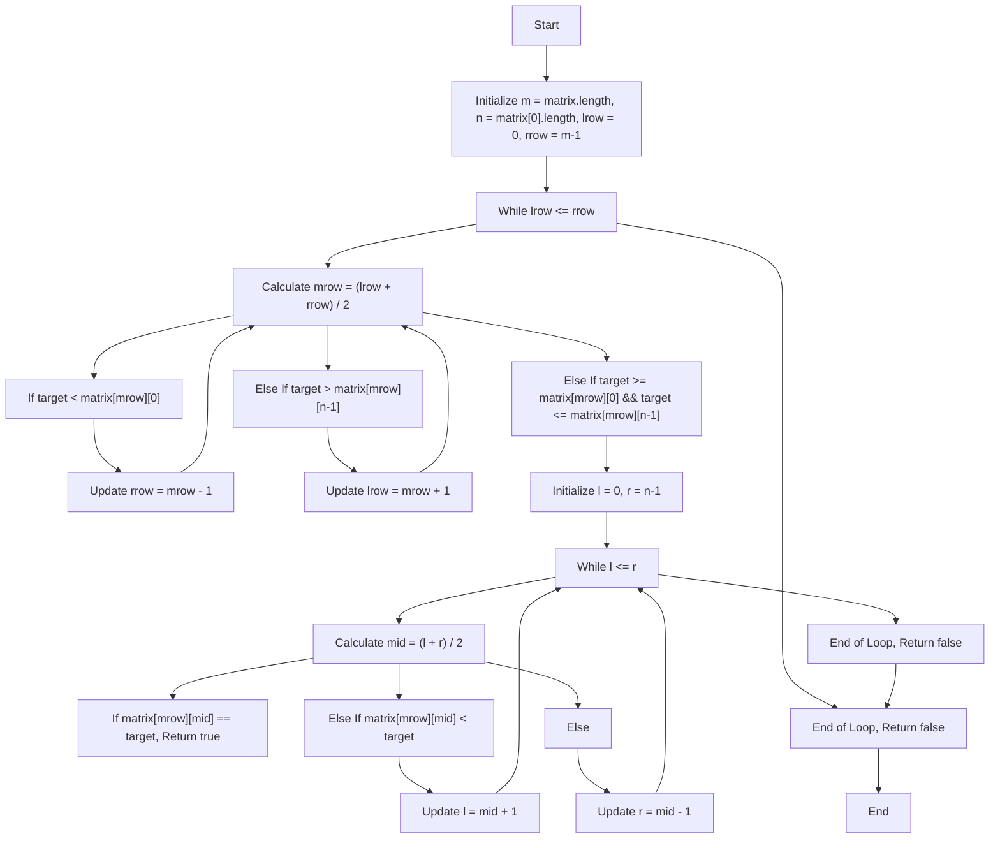
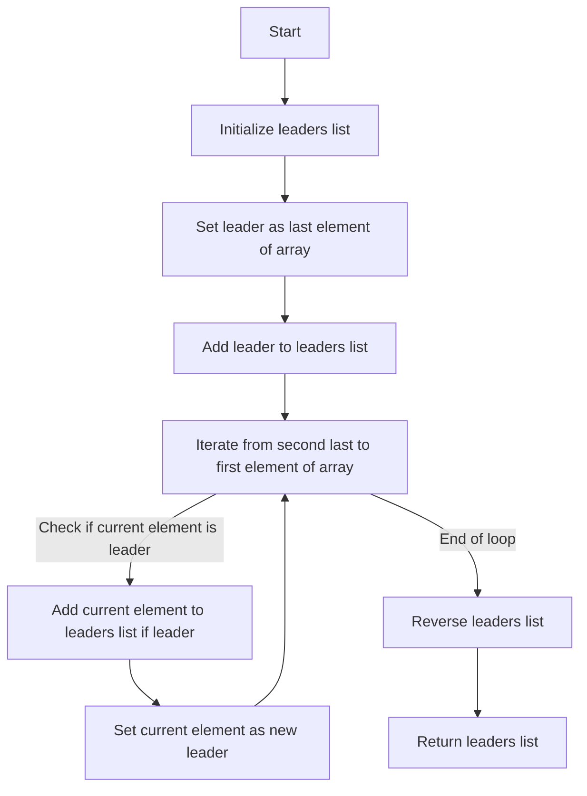
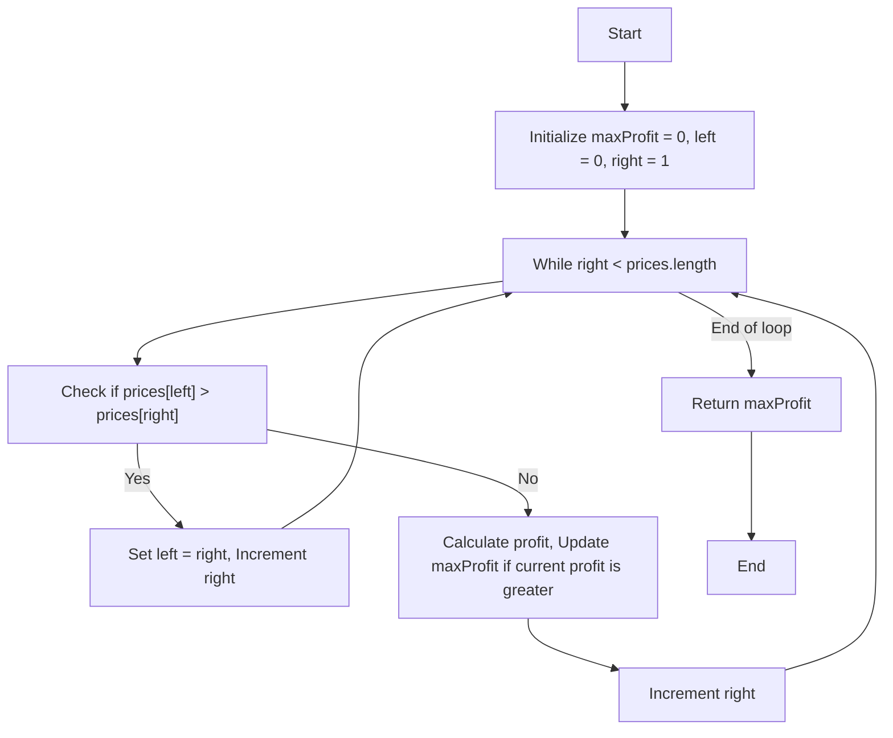
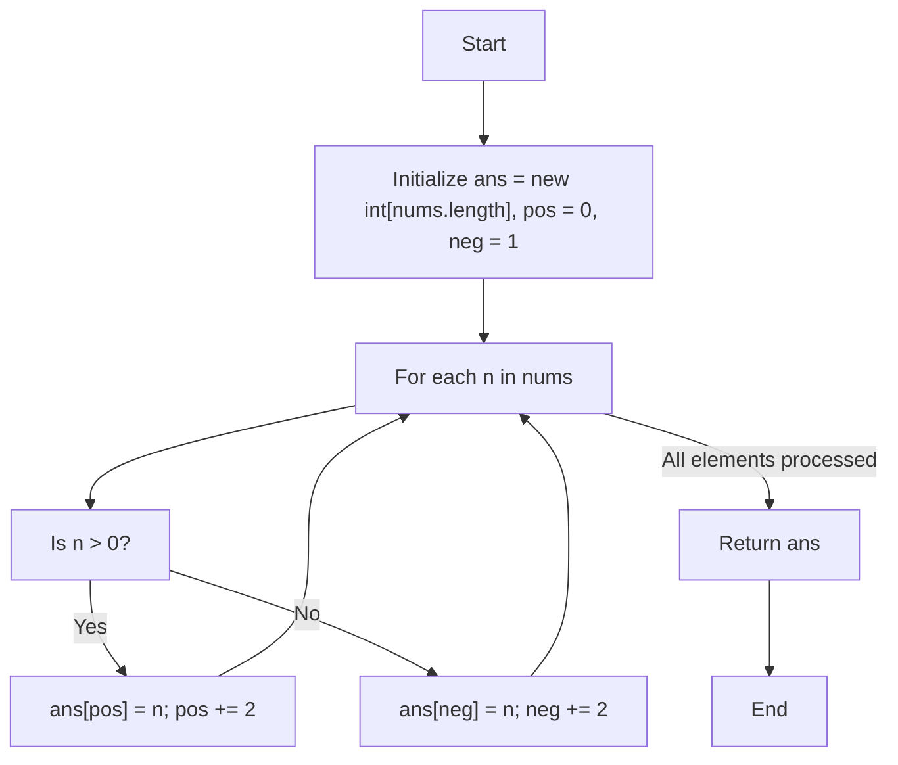
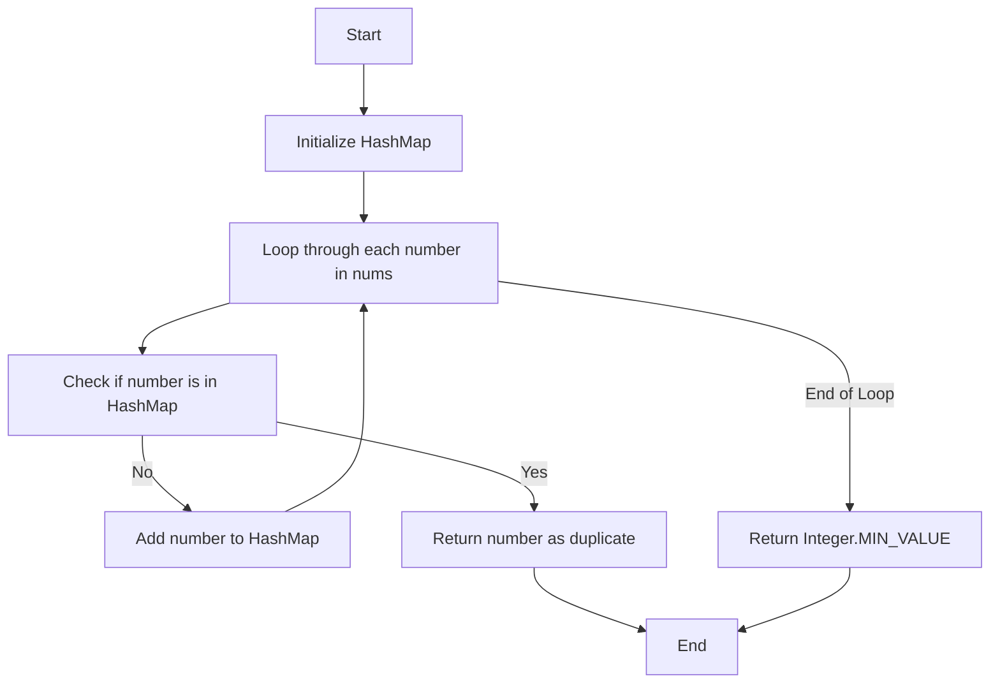
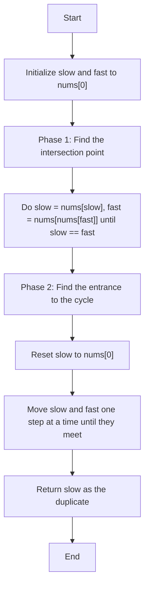
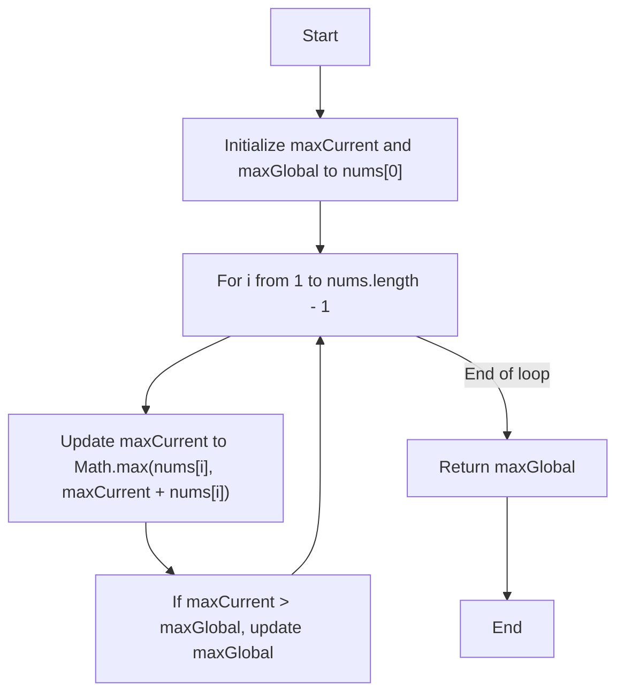
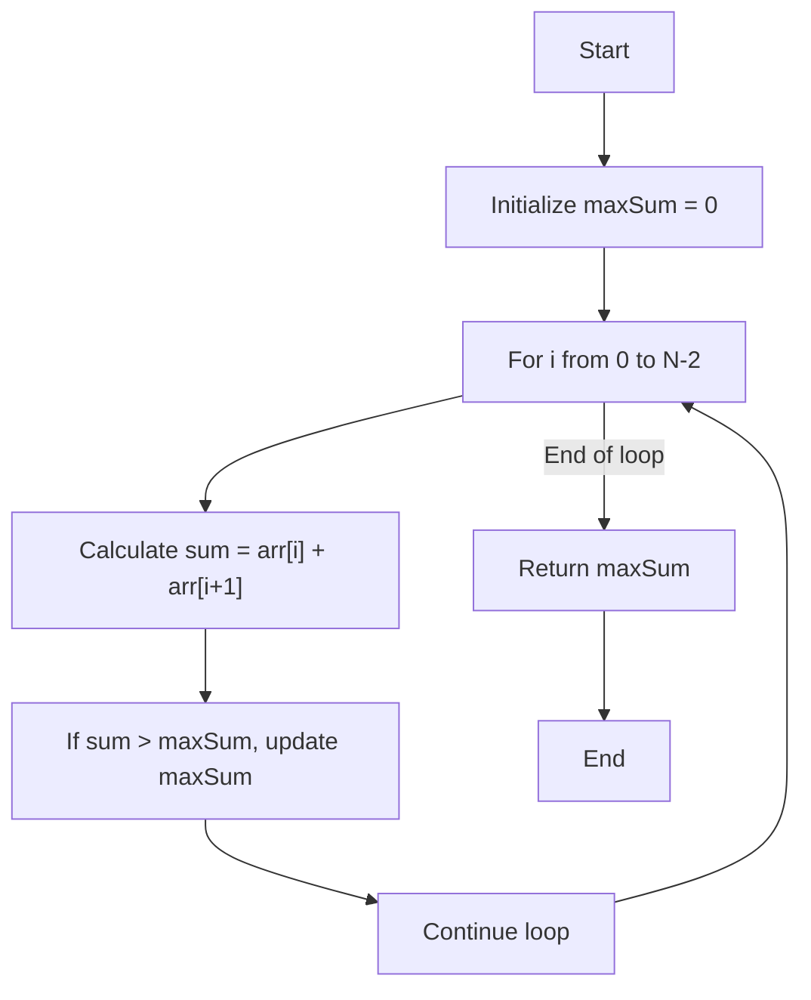
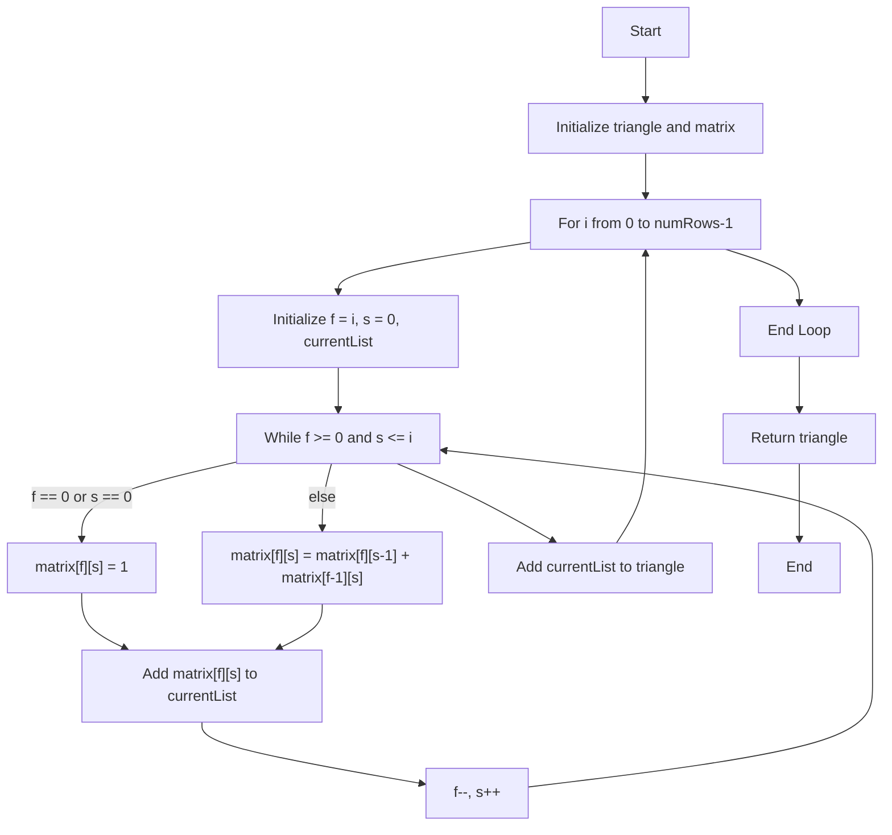

# Striver's Array Series (***Day 3 - Medium***)

- [Striver's Array Series (***Day 3 - Medium***)](#strivers-array-series-day-3---medium)
  - [Question 13 : Search a 2D Matrix](#question-13--search-a-2d-matrix)
    - [🔍 Intuition and Approach](#-intuition-and-approach)
    - [🧠 Intuition](#-intuition)
    - [📝 Approach](#-approach)
    - [🔍 Detailed Walkthrough](#-detailed-walkthrough)
    - [💻 Code](#-code)
    - [📊 Flowchart](#-flowchart)
  - [Question 14 : Leader in an Array](#question-14--leader-in-an-array)
    - [💡 Intuition and Approach](#-intuition-and-approach-1)
    - [🧠 Intuition](#-intuition-1)
    - [🔍 Detailed Walkthrough](#-detailed-walkthrough-1)
    - [📜 Code Explanation](#-code-explanation)
    - [📊 Flowchart](#-flowchart-1)
  - [Question 15 : Best Time to Buy and Sell Stock](#question-15--best-time-to-buy-and-sell-stock)
    - [💡 Intuition and Approach](#-intuition-and-approach-2)
    - [🧠 Intuition](#-intuition-2)
    - [🔍 Detailed Walkthrough](#-detailed-walkthrough-2)
    - [📜 Code Explanation](#-code-explanation-1)
    - [📊 Flowchart](#-flowchart-2)
  - [Question 16 : Rearrange Array Elements by Sign](#question-16--rearrange-array-elements-by-sign)
    - [🧠 Intuition](#-intuition-3)
    - [📋 Approach](#-approach-1)
    - [🚶 Detailed Walkthrough](#-detailed-walkthrough-3)
    - [📝 Code](#-code-1)
    - [📊 Flowchart](#-flowchart-3)
    - [💡 Notes](#-notes)
    - [💡 Tips](#-tips)
  - [Question 17 : Find the Duplicate Number](#question-17--find-the-duplicate-number)
    - [🧠 Intuition](#-intuition-4)
    - [📜 Approach](#-approach-2)
    - [🚀 Detailed Walkthrough](#-detailed-walkthrough-4)
    - [⏲️ Time Complexity](#️-time-complexity)
    - [💾 Space Complexity](#-space-complexity)
    - [🚀 Code](#-code-2)
    - [📊 Flowchart](#-flowchart-4)
    - [🧠 Intuition](#-intuition-5)
    - [📜 Approach](#-approach-3)
    - [🚀 Detailed Walkthrough](#-detailed-walkthrough-5)
    - [⏲️ Time Complexity](#️-time-complexity-1)
    - [💾 Space Complexity](#-space-complexity-1)
    - [📜 Code](#-code-3)
    - [📊 Flowchart](#-flowchart-5)
  - [Question 18 : Maximum Subarray](#question-18--maximum-subarray)
    - [🧠 Intuition](#-intuition-6)
    - [📜 Approach](#-approach-4)
    - [🚀 Detailed Walkthrough](#-detailed-walkthrough-6)
    - [⏲️ Time Complexity](#️-time-complexity-2)
    - [💾 Space Complexity](#-space-complexity-2)
    - [📜 Code](#-code-4)
    - [📊 Flowchart](#-flowchart-6)
    - [📝 Example](#-example)
    - [✨ Notes](#-notes-1)
  - [Question 19 : Max Sum in Subarray](#question-19--max-sum-in-subarray)
    - [🧠 Intuition](#-intuition-7)
    - [🚀 Approach](#-approach-5)
    - [Detailed Walkthrough 📝](#detailed-walkthrough-)
    - [📘 Example](#-example-1)
    - [💻 Code](#-code-5)
    - [⏳ Time Complexity](#-time-complexity)
    - [💾 Space Complexity](#-space-complexity-3)
    - [📊 Flowchart](#-flowchart-7)
  - [Question 20 : Pascal's Triangle](#question-20--pascals-triangle)
    - [🧠 Intuition](#-intuition-8)
    - [📚 Approach](#-approach-6)
    - [📝 Detailed Walkthrough](#-detailed-walkthrough-7)
    - [🔄 Code](#-code-6)
    - [⏳ Time Complexity](#-time-complexity-1)
    - [💾 Space Complexity](#-space-complexity-4)
    - [📊 Flowchart](#-flowchart-8)
    - [Summary](#summary)

## Question 13 : [Search a 2D Matrix](https://leetcode.com/problems/search-a-2d-matrix/description/)

### 🔍 Intuition and Approach

The problem involves searching for a target value in a 2D matrix where each row is sorted in ascending order and the first element of each row is greater than the last element of the previous row. This structure allows us to perform an efficient search using a combination of binary search techniques on both rows and columns.

### 🧠 Intuition

Given the matrix's properties, we can break the search into two parts:

1. **Row Search**: Since each row is sorted and the first element of each row is greater than the last element of the previous row, we can use binary search to find the row where the target might be located.
2. **Column Search**: Once the appropriate row is found, perform another binary search within that row to find the target element.

### 📝 Approach

1. **Binary Search on Rows**:
    - Initialize two pointers, `lrow` and `rrow`, to represent the current search range in the rows.
    - Calculate the middle row `mrow`.
    - Check if the target is within the range of values in the middle row:
        - If the target is less than the first element of `mrow`, search the upper half.
        - If the target is greater than the last element of `mrow`, search the lower half.
        - If the target is within the bounds of `mrow`, proceed to search within this row.

2. **Binary Search within the Row**:
    - Initialize two pointers, `l` and `r`, to represent the search range within the row.
    - Calculate the middle element `mid`.
    - If the middle element is equal to the target, return `true`.
    - If the middle element is less than the target, search the right half.
    - If the middle element is greater than the target, search the left half.
    - If the target is not found within the row, return `false`.

### 🔍 Detailed Walkthrough

Let's walk through an example to clarify:

Consider the matrix :  
$$
\begin{array}{ccc}
1 & 3 & 5 \\
7 & 9 & 11 \\
13 & 15 & 17 \\
\end{array}
$$
and the target `9`.

1. **Row Search**:
    - Initialize `lrow = 0`, `rrow = 2`.
    - Calculate `mrow = (0 + 2) / 2 = 1`.
    - Check row `1`: `[7, 9, 11]`.
    - The target `9` is within this row.

2. **Column Search**:
    - Initialize `l = 0`, `r = 2`.
    - Calculate `mid = (0 + 2) / 2 = 1`.
    - The element at `matrix[1][1]` is `9`, which matches the target.
    - Return `true`.

### 💻 Code 
```java
public static boolean search(int[][] matrix, int target) {
    int m = matrix.length; 
    int n = matrix[0].length;
    int lrow = 0, rrow = m-1, mrow = (lrow+rrow)/2;
    while(lrow <= rrow){
        if(target < matrix[mrow][0]){
            rrow = mrow-1;
            mrow = (lrow+rrow)/2;
        }
        else if(target > matrix[mrow][n-1]){
            lrow = mrow+1;
            mrow = (lrow+rrow)/2;
        }
        else if(target >= matrix[mrow][0] && target <= matrix[mrow][n-1]){
            int l = 0;
            int r = n-1;
            int mid = (l+r)/2;

            while(l <= r){
                if(matrix[mrow][mid] == target) return true;
                else if(matrix[mrow][mid] < target){
                    l = mid+1;
                    mid = (l+r)/2;
                }
                else{
                    r = mid-1;
                    mid = (l+r)/2;
                }
            }
            return false;
        }
    }
    return false;
}
```

> [!NOTE]
> [Click here to see full code](/IntermediateJAVA/Arrays/Striver's%20Array%20Series/Search2DMatrix.java)

### 📊 Flowchart

Here is the flowchart for the code:



## Question 14 : [Leader in an Array](https://www.geeksforgeeks.org/problems/leaders-in-an-array-1587115620/0)

### 💡 Intuition and Approach

The task is to find the leaders in an array, where a leader is an element whose value is greater than all the elements to its right.

### 🧠 Intuition

- **Given**: An array `arr` of integers.
- **Objective**: Find the leaders in the array.
- **Approach**:
  1. **Iterate from the end**: Start iterating from the end of the array.
  2. **Track the leader**: Initialize a variable `leader` with the last element of the array.
  3. **Find leaders**: Iterate backwards through the array. If an element is greater than or equal to the current `leader`, it is a leader. Update `leader` accordingly.
  4. **Reverse the leaders list**: Since we're adding leaders from right to left, reverse the list to get the correct order.

### 🔍 Detailed Walkthrough

- **Example**:
  - Given array: `[16, 17, 4, 3, 5, 2]`
  - Leaders: `17`, `5`, `2`
    - Start from the end: `2` is the initial leader.
    - Iterate backwards:
      - `5` is greater than `2`, so it's a leader.
      - `17` is greater than `5`, so it's a leader.
  - Reverse the leaders list to get `[17, 5, 2]`.

### 📜 Code Explanation

```java
public static ArrayList<Integer> leaders(int[] arr, int n){
    ArrayList<Integer> leaders = new ArrayList<>();
    int leader = arr[n-1]; // Start with the last element as the leader
    leaders.add(leader); // Add the last element to leaders list
    for(int i = n-2; i >= 0; i--){
        if(arr[i] < leader) continue; // If current element is smaller, skip
        leader = arr[i]; // Update leader
        leaders.add(leader); // Add leader to leaders list
    }
    Collections.reverse(leaders); // Reverse the leaders list
    return leaders; // Return the leaders list
}
```
> [!NOTE]
> [Click here to see full code](/IntermediateJAVA/Arrays/Striver's%20Array%20Series/LeaderInAnArray.java)

### 📊 Flowchart


## Question 15 : [Best Time to Buy and Sell Stock](https://leetcode.com/problems/best-time-to-buy-and-sell-stock/description/)

### 💡 Intuition and Approach

The task is to find the maximum profit that can be achieved from buying and selling a stock. The stock prices for each day are given in an array.

### 🧠 Intuition

*   **Given**: An array `prices` where `prices[i]` is the price of a given stock on the `i`\-th day.
*   **Objective**: Find the maximum profit by choosing a single day to buy one stock and choosing a different day in the future to sell that stock.
*   **Approach**:
    1.  **Two-Pointer Technique**: Use two pointers (`left` and `right`). The `left` pointer points to the day to buy the stock and the `right` pointer points to the day to sell the stock.
    2.  **Iterate through the array**: Move the `right` pointer through the array to find the maximum profit.
    3.  **Update pointers**: If the price on the `left` pointer is greater than the price on the `right` pointer, move the `left` pointer to the `right` pointer's position. Otherwise, calculate the profit and update the `maxProfit` if the current profit is greater.

### 🔍 Detailed Walkthrough

*   **Example**:
    *   Given prices: `[7, 1, 5, 3, 6, 4]`
    *   Max Profit: `5`
        *   Buy on day 2 (price = 1) and sell on day 5 (price = 6), profit = 6 - 1 = 5. 

### 📜 Code Explanation
```java
public int maxProfit(int[] prices){
    int maxProfit = 0; // Initialize maxProfit to 0
    int left = 0, right = 1; // Initialize pointers
    while(right < prices.length){
        if(prices[left] > prices[right]){
            left = right; // Update left pointer if current left price is greater than right price
            right++;
        }
        else{
            maxProfit = Math.max(maxProfit, prices[right] - prices[left]); // Update maxProfit
            right++;
        }
    }
    return maxProfit; // Return the maximum profit
}
```
> [!NOTE]
> To see full code , [click here](/IntermediateJAVA/Arrays/Striver's%20Array%20Series/BuyAndSellStock.java)

### 📊 Flowchart


## Question 16 : [Rearrange Array Elements by Sign](https://leetcode.com/problems/rearrange-array-elements-by-sign/description/)

### 🧠 Intuition

The problem requires rearranging an array such that positive and negative numbers alternate, starting with a positive number. Given that there are always equal numbers of positive and negative numbers, this can be achieved by placing positive numbers at even indices and negative numbers at odd indices.

### 📋 Approach

1.  **Initialize Result Array**: Create an array `ans` of the same length as the input array `nums` to store the rearranged elements.
2.  **Pointers for Positions**: Use two pointers, `pos` for positive numbers (starting at 0) and `neg` for negative numbers (starting at 1).
3.  **Iterate Through Input Array**: Traverse through each element in the input array `nums`.
    *   If the element is positive, place it at the position indicated by `pos` and increment `pos` by 2.
    *   If the element is negative, place it at the position indicated by `neg` and increment `neg` by 2.
4.  **Return Result**: After the loop, the `ans` array contains the rearranged elements, which is then returned.

### 🚶 Detailed Walkthrough

1.  **Initialization**:
    
    *   Create an array `ans` of length equal to `nums`.
    *   Initialize `pos` to 0 and `neg` to 1.
2.  **Iterate through `nums`**:
    
    *   For each element `n` in `nums`:
        *   If `n` is positive, assign `ans[pos] = n` and increment `pos` by 2.
        *   If `n` is negative, assign `ans[neg] = n` and increment `neg` by 2.
3.  **Result**:
    
    *   After processing all elements in `nums`, return the `ans` array which now has positive and negative numbers in alternate positions.

### 📝 Code
```java
public class Solution {
    public int[] rearrangeArray(int[] nums) {
        int[] ans = new int[nums.length];
        int pos = 0;
        int neg = 1;
        for (int n : nums) {
            if (n > 0) {
                ans[pos] = n;
                pos += 2;
            } else {
                ans[neg] = n;
                neg += 2;
            }
        }
        return ans;
    }
}
```
> [!NOTE]
> To see full code , [click here](/IntermediateJAVA/Arrays/Striver's%20Array%20Series/AlternatingIntegers.java)

### 📊 Flowchart


### 💡 Notes

*   This approach ensures that the array is traversed only once, making it efficient with a time complexity of $O(n)$.
*   The space complexity is $O(n)$ due to the creation of the result array `ans`.

### 💡 Tips

*   Make sure to always start placing positive numbers at even indices and negative numbers at odd indices to satisfy the alternating condition.
*   Using separate pointers for positive and negative placements helps to maintain the alternating order effectively.


## Question 17 : [Find the Duplicate Number](https://leetcode.com/problems/find-the-duplicate-number/description/)

<details style="
  border: 1px solid #444;
  border-radius: 5px;
  padding: 10px;
  background-color: #222;
  color: #ddd;
">
    <summary style="
    cursor: pointer;
    font-weight: bold;
    color: #ddd;
  ">
        <em>Using HashMap</em>
    </summary>

### 🧠 Intuition
We use a HashMap to track numbers we have encountered. If we find a number already in the HashMap, it is the duplicate.

### 📜 Approach
1. Initialize an empty HashMap.
2. Iterate through each number in the array.
3. For each number, check if it exists in the HashMap:
   - If it exists, return that number as the duplicate.
   - If it doesn't exist, add it to the HashMap with a value of 1.
4. If no duplicate is found (though problem guarantees there is one), return Integer.MIN_VALUE.

### 🚀 Detailed Walkthrough
1. Create an empty HashMap `map`.
2. Loop through each number `x` in `nums`.
3. If `x` is not in the HashMap, add `x` to the HashMap with a count of 1.
4. If `x` is already in the HashMap, return `x` as the duplicate.
5. If no duplicates are found (this shouldn't happen per problem constraints), return `Integer.MIN_VALUE`.

### ⏲️ Time Complexity
- $O(n)$: Traversing the array once with $O(1)$ HashMap operations.

### 💾 Space Complexity
- $O(n)$: Using a HashMap to store up to `n` elements.

### 🚀 Code
```java
public int findDuplicate(int[] nums) {
    HashMap<Integer,Integer> map = new HashMap<>();
    for(int x : nums){
        if(map.get(x) == null) map.put(x,1);
        else return x;
    }
    return Integer.MIN_VALUE;
}
```

> [!NOTE]
> To see full code , [click here](/IntermediateJAVA/Arrays/Striver's%20Array%20Series/FindDuplicate.java)

### 📊 Flowchart


</details>
<br>
<details style="
  border: 1px solid #444;
  border-radius: 5px;
  padding: 10px;
  background-color: #222;
  color: #ddd;
">
    <summary style="
    cursor: pointer;
    font-weight: bold;
    color: #ddd;
  ">
        <em>Using Floyd's Tortoise and Hare Algorithm</em>
    </summary>

### 🧠 Intuition
The problem can be reduced to finding a cycle in a linked list. By treating the array as a linked list where each index points to the value as the next node, we can detect a cycle using Floyd's Tortoise and Hare algorithm.

### 📜 Approach
1. *Initialize* : Set both `slow` and `fast` pointers to the first element of the array.
2. *Phase 1* - Finding the intersection point:
   - Move `slow` pointer one step at a time.
   - Move `fast` pointer two steps at a time.
   - Continue until `slow` and `fast` pointers meet.
3. *Phase 2* - Finding the entrance of the cycle:
   - Reset `slow` pointer to the start of the array.
   - Move both `slow` and `fast` pointers one step at a time.
   - The point where they meet again is the duplicate number.

### 🚀 Detailed Walkthrough
1. Initialize `slow` and `fast` to the first element:
   - `slow = nums[0]`
   - `fast = nums[0]`
2. Phase 1 - Intersection Point:
   - Move `slow` one step at a time: `slow = nums[slow]`
   - Move `fast` two steps at a time: `fast = nums[nums[fast]]`
   - Continue until `slow` equals `fast`
3. Phase 2 - Entrance of Cycle:
   - Reset `slow` to the start of the array: `slow = nums[0]`
   - Move both `slow` and `fast` one step at a time: `slow = nums[slow]`, `fast = nums[fast]`
   - The point where `slow` and `fast` meet is the duplicate number
4. Return `slow` as the duplicate number.

### ⏲️ Time Complexity
- $O(n)$: Each phase of the algorithm runs in linear time.

### 💾 Space Complexity
- $O(1)$: Only constant space is used.

### 📜 Code
```java
public int findDuplicateOptimal(int[] nums) {
    int slow = nums[0];
    int fast = nums[0];

    // Phase 1: Finding the intersection point
    do {
        slow = nums[slow];
        fast = nums[nums[fast]];
    } while (slow != fast);

    // Phase 2: Finding the entrance to the cycle
    slow = nums[0];
    while (slow != fast) {
        slow = nums[slow];
        fast = nums[fast];
    }

    return slow;
}
```

### 📊 Flowchart


</details>

## Question 18 : [Maximum Subarray](https://leetcode.com/problems/maximum-subarray/description/)

### 🧠 Intuition
The goal is to find the maximum sum of a contiguous subarray within a one-dimensional numeric array. ***Kadane's Algorithm*** helps in solving this problem efficiently using a dynamic programming approach. The intuition is to iterate through the array while keeping track of the maximum sum subarray ending at each position and updating the global maximum sum encountered so far.

### 📜 Approach
1. **Initialize `maxCurrent` and `maxGlobal`**:
   - Set both `maxCurrent` and `maxGlobal` to the first element of the array. This ensures that the algorithm has a valid starting point.
2. **Iterate through the array starting from the second element**:
   - For each element, update `maxCurrent` to be the maximum of the current element itself and the sum of `maxCurrent` plus the current element.
   - Update `maxGlobal` if `maxCurrent` is greater than `maxGlobal`.
3. **Return `maxGlobal`**:
   - After iterating through the entire array, `maxGlobal` will contain the largest sum of any contiguous subarray.

### 🚀 Detailed Walkthrough
1. **Initialize `maxCurrent` and `maxGlobal`**:
   ```java
   int maxCurrent = nums[0], maxGlobal = nums[0];
   ```
   - Set both to the first element of `nums`.

2. **Iterate through the array**:
   ```java
   for(int i = 1; i < nums.length; i++){
       maxCurrent = Math.max(nums[i], maxCurrent + nums[i]);
       if(maxCurrent > maxGlobal) maxGlobal = maxCurrent;
   }
   ```
   - For each element `nums[i]` from index 1 to the end of the array:
     - Update `maxCurrent` to the maximum of the current element itself and the sum of `maxCurrent` plus the current element.
     - If `maxCurrent` is greater than `maxGlobal`, update `maxGlobal` to `maxCurrent`.

3. **Return the result**:
   ```java
   return maxGlobal;
   ```
   - `maxGlobal` contains the maximum sum of any contiguous subarray.

### ⏲️ Time Complexity
- $O(n)$: The algorithm iterates through the array exactly once.

### 💾 Space Complexity
- $O(1)$: Only a few extra variables are used, regardless of the input size.

### 📜 Code
Here is the implementation of the `maxSubArray` function in Java:

```java
public int maxSubArray(int[] nums) {
    int maxCurrent = nums[0], maxGlobal = nums[0];
    for(int i = 1; i < nums.length; i++){
        maxCurrent = Math.max(nums[i], maxCurrent + nums[i]);
        if(maxCurrent > maxGlobal) maxGlobal = maxCurrent;
    }
    return maxGlobal;
}
```
> [!NOTE]
> To see full code , [click here](/IntermediateJAVA/Arrays/Striver's%20Array%20Series/FindDuplicate.java)

### 📊 Flowchart


### 📝 Example
Let's consider an example to illustrate the algorithm:

- **Input** : `nums = [-2,1,-3,4,-1,2,1,-5,4]`
- **Output** : `6` (The contiguous subarray `[4,-1,2,1]` has the largest sum = 6)

### ✨ Notes
- Kadane's Algorithm is optimal for solving the Maximum Subarray Sum problem in terms of both time and space complexity.
- This algorithm works for both positive and negative integers in the array.

## Question 19 : [Max Sum in Subarray](https://www.geeksforgeeks.org/problems/max-sum-in-sub-arrays0824/0)

### 🧠 Intuition 

The problem is to find the maximum sum of any two adjacent elements in an array. The simplest approach is to iterate through the array and calculate the sum of each pair of adjacent elements, keeping track of the maximum sum encountered.

### 🚀 Approach 

1. **Initialize**:
   - Initialize a variable `maxSum` to store the maximum sum of adjacent pairs. Start with an initial value of 0.
2. **Iterate**:
   - Iterate through the array from the first element to the second last element.
3. **Calculate Sum**:
   - For each element, calculate the sum of the current element and the next element.
4. **Update Maximum**:
   - If the calculated sum is greater than `maxSum`, update `maxSum`.
5. **Return Result**:
   - After iterating through the array, return the value of `maxSum`.

### Detailed Walkthrough 📝

1. **Initialization**:
   - Set `maxSum` to 0.

2. **Iteration**:
   - Loop through the array using an index `i` from 0 to `N-2` (since we are looking at pairs, we stop at the second last element).
   - In each iteration, calculate the sum of `arr[i]` and `arr[i+1]`.
   - If the calculated sum is greater than `maxSum`, update `maxSum` with this sum.

3. **Return the Result**:
   - After completing the loop, `maxSum` will hold the maximum sum of any two adjacent elements.
   - Return `maxSum`.

### 📘 Example 

Consider the array `arr = [1, 3, 5, 2, 7, 8]` with `N = 6`.

- Initial `maxSum = 0`
- Iteration 1: `arr[0] + arr[1] = 1 + 3 = 4`, `maxSum = 4`
- Iteration 2: `arr[1] + arr[2] = 3 + 5 = 8`, `maxSum = 8`
- Iteration 3: `arr[2] + arr[3] = 5 + 2 = 7`, `maxSum = 8`
- Iteration 4: `arr[3] + arr[4] = 2 + 7 = 9`, `maxSum = 9`
- Iteration 5: `arr[4] + arr[5] = 7 + 8 = 15`, `maxSum = 15`
- Final `maxSum = 15`

### 💻 Code
```java
    public static long pairWithMaxSum(long arr[], long N){
        long maxSum = 0;
        for(long i = 0; i < N - 1; i++){
            if(maxSum < arr[(int)i] + arr[(int)(i+1)]) maxSum = arr[(int)i] + arr[(int)(i+1)];
        }
        return maxSum;
    }
```

> [!NOTE]
> To see full code, [click here](/IntermediateJAVA/Arrays/Striver's%20Array%20Series/MaxSumInSubarrays.java)

### ⏳ Time Complexity 

- The time complexity of this approach is $O(N)$, where $N$ is the length of the array. This is because we iterate through the array once.

### 💾 Space Complexity 

- The space complexity is $O(1)$ because we are using a constant amount of extra space.

### 📊 Flowchart 



## Question 20 : [Pascal's Triangle](https://leetcode.com/problems/pascals-triangle/)

### 🧠 Intuition
The goal is to generate Pascal's Triangle up to `numRows`. Pascal's Triangle is a triangular array of integers where each row represents the coefficients of the binomial expansion. Each number is the sum of the two directly above it in the previous row, except for the edges, which are always `1`.

### 📚 Approach
1. **Initialize a 2D array**: Use a 2D array `matrix` to store the values of Pascal's Triangle.
2. **Iterate through rows**: For each row `i`, create a new list to hold the current row's values.
3. **Fill the values**: Use a nested loop to fill the values in the current row. The value at position `(f, s)` in `matrix` is the sum of the values to the left and above it, i.e., `matrix[f][s] = matrix[f][s-1] + matrix[f-1][s]`, except for the edges where it is always `1`.
4. **Add current row to result**: After calculating the values for the current row, add the list to the `triangle` list.

### 📝 Detailed Walkthrough
1. **Initialize the 2D array**: Create a `matrix` with dimensions `[numRows][numRows]` and initialize the `triangle` list.
2. **Outer loop**: Iterate from `0` to `numRows - 1`.
   - Initialize `f` (current row index) to `i` and `s` (current column index) to `0`.
   - Create an empty list `currentList` to store the values of the current row.
3. **Inner loop**: While `f >= 0` and `s <= i`:
   - If `f == 0` or `s == 0`, set `matrix[f][s] = 1`.
   - Else, set `matrix[f][s] = matrix[f][s-1] + matrix[f-1][s]`.
   - Add `matrix[f][s]` to `currentList`.
   - Decrement `f` and increment `s`.
4. **Add row to result**: After exiting the inner loop, add `currentList` to `triangle`.
5. **Return the result**: Return the `triangle` list.

### 🔄 Code
```java
public class Solution {
    public static List<List<Integer>> generate(int numRows) {
        List<List<Integer>> triangle = new ArrayList<>();
        int[][] matrix = new int[numRows][numRows];
        
        for (int i = 0; i < numRows; i++) {
            int f = i, s = 0;
            List<Integer> currentList = new ArrayList<>();
            
            while (f >= 0 && s <= i) {
                if (f == 0 || s == 0) {
                    matrix[f][s] = 1;
                } else {
                    matrix[f][s] = matrix[f][s - 1] + matrix[f - 1][s];
                }
                currentList.add(matrix[f][s]);
                f--;
                s++;
            }
            
            triangle.add(currentList);
        }
        
        return triangle;
    }
}
```

> [!NOTE]
> To see full code, [click here](/IntermediateJAVA/Arrays/Striver's%20Array%20Series/PascalsTriangle.java)

### ⏳ Time Complexity
The time complexity of this algorithm is $O(n^2)$, where $n$ is the number of rows. This is because we iterate through each cell of the matrix exactly once.

### 💾 Space Complexity
The space complexity is also $O(n^2)$ due to the additional storage required for the `matrix` and `triangle` lists.

### 📊 Flowchart


### Summary
This solution generates Pascal's Triangle using a 2D array and a list of lists to store the values. It iteratively fills each row based on the sum of values from the previous rows, leveraging the properties of Pascal's Triangle. The algorithm runs in $O(n^2)$ time and space complexity, making it efficient for moderate values of `numRows`.