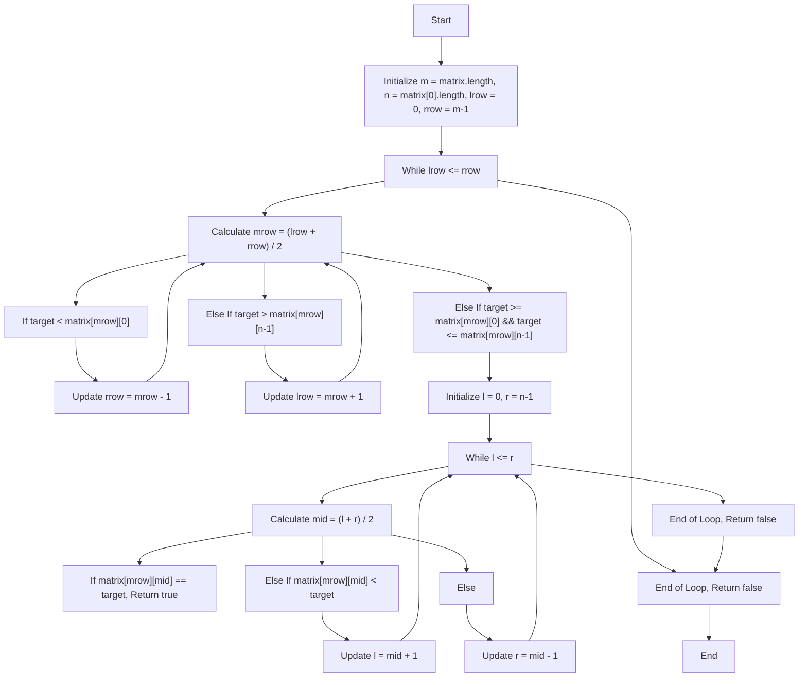
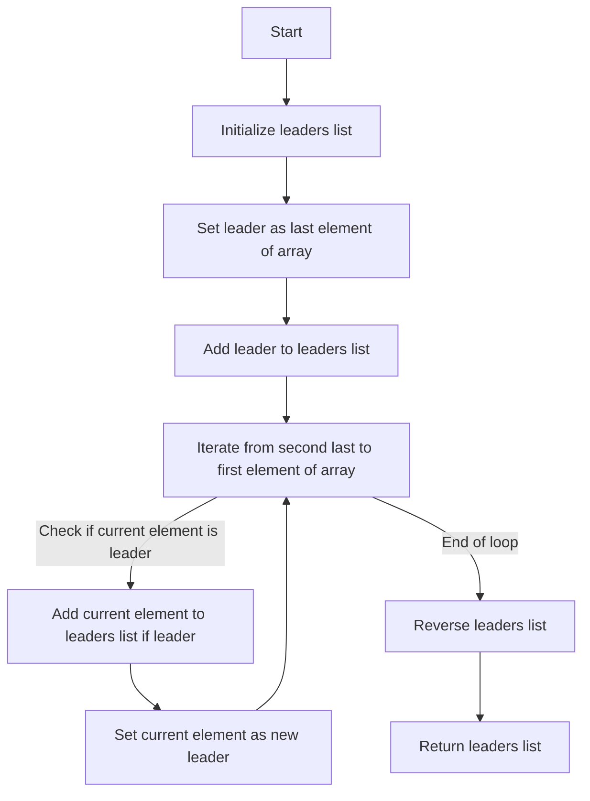

# Striver's Array Series (***Day 3 - Medium***)

- [Striver's Array Series (***Day 3 - Medium***)](#strivers-array-series-day-3---medium)
  - [Question 13 : Search a 2D Matrix](#question-13--search-a-2d-matrix)
    - [🔍 Intuition and Approach](#-intuition-and-approach)
    - [🧠 Intuition](#-intuition)
    - [📝 Approach](#-approach)
    - [🔍 Detailed Walkthrough](#-detailed-walkthrough)
    - [💻 Code](#-code)
    - [📊 Flowchart](#-flowchart)
  - [Question 14 : Leader in an Array](#question-14--leader-in-an-array)
    - [💡 Intuition and Approach](#-intuition-and-approach-1)
    - [🧠 Intuition](#-intuition-1)
    - [🔍 Detailed Walkthrough](#-detailed-walkthrough-1)
    - [📜 Code Explanation](#-code-explanation)
    - [📊 Flowchart](#-flowchart-1)

## Question 13 : [Search a 2D Matrix](https://leetcode.com/problems/search-a-2d-matrix/description/)

### 🔍 Intuition and Approach

The problem involves searching for a target value in a 2D matrix where each row is sorted in ascending order and the first element of each row is greater than the last element of the previous row. This structure allows us to perform an efficient search using a combination of binary search techniques on both rows and columns.

### 🧠 Intuition

Given the matrix's properties, we can break the search into two parts:

1. **Row Search**: Since each row is sorted and the first element of each row is greater than the last element of the previous row, we can use binary search to find the row where the target might be located.
2. **Column Search**: Once the appropriate row is found, perform another binary search within that row to find the target element.

### 📝 Approach

1. **Binary Search on Rows**:
    - Initialize two pointers, `lrow` and `rrow`, to represent the current search range in the rows.
    - Calculate the middle row `mrow`.
    - Check if the target is within the range of values in the middle row:
        - If the target is less than the first element of `mrow`, search the upper half.
        - If the target is greater than the last element of `mrow`, search the lower half.
        - If the target is within the bounds of `mrow`, proceed to search within this row.

2. **Binary Search within the Row**:
    - Initialize two pointers, `l` and `r`, to represent the search range within the row.
    - Calculate the middle element `mid`.
    - If the middle element is equal to the target, return `true`.
    - If the middle element is less than the target, search the right half.
    - If the middle element is greater than the target, search the left half.
    - If the target is not found within the row, return `false`.

### 🔍 Detailed Walkthrough

Let's walk through an example to clarify:

Consider the matrix :  
$$
\begin{array}{ccc}
1 & 3 & 5 \\
7 & 9 & 11 \\
13 & 15 & 17 \\
\end{array}
$$
and the target `9`.

1. **Row Search**:
    - Initialize `lrow = 0`, `rrow = 2`.
    - Calculate `mrow = (0 + 2) / 2 = 1`.
    - Check row `1`: `[7, 9, 11]`.
    - The target `9` is within this row.

2. **Column Search**:
    - Initialize `l = 0`, `r = 2`.
    - Calculate `mid = (0 + 2) / 2 = 1`.
    - The element at `matrix[1][1]` is `9`, which matches the target.
    - Return `true`.

### 💻 Code 
```java
public static boolean search(int[][] matrix, int target) {
    int m = matrix.length; 
    int n = matrix[0].length;
    int lrow = 0, rrow = m-1, mrow = (lrow+rrow)/2;
    while(lrow <= rrow){
        if(target < matrix[mrow][0]){
            rrow = mrow-1;
            mrow = (lrow+rrow)/2;
        }
        else if(target > matrix[mrow][n-1]){
            lrow = mrow+1;
            mrow = (lrow+rrow)/2;
        }
        else if(target >= matrix[mrow][0] && target <= matrix[mrow][n-1]){
            int l = 0;
            int r = n-1;
            int mid = (l+r)/2;

            while(l <= r){
                if(matrix[mrow][mid] == target) return true;
                else if(matrix[mrow][mid] < target){
                    l = mid+1;
                    mid = (l+r)/2;
                }
                else{
                    r = mid-1;
                    mid = (l+r)/2;
                }
            }
            return false;
        }
    }
    return false;
}
```

> [!NOTE]
> [Click here to see full code](/IntermediateJAVA/Arrays/Striver's%20Array%20Series/Search2DMatrix.java)

### 📊 Flowchart

Here is the flowchart for the code:



## Question 14 : [Leader in an Array](https://www.geeksforgeeks.org/problems/leaders-in-an-array-1587115620/0)

### 💡 Intuition and Approach

The task is to find the leaders in an array, where a leader is an element whose value is greater than all the elements to its right.

### 🧠 Intuition

- **Given**: An array `arr` of integers.
- **Objective**: Find the leaders in the array.
- **Approach**:
  1. **Iterate from the end**: Start iterating from the end of the array.
  2. **Track the leader**: Initialize a variable `leader` with the last element of the array.
  3. **Find leaders**: Iterate backwards through the array. If an element is greater than or equal to the current `leader`, it is a leader. Update `leader` accordingly.
  4. **Reverse the leaders list**: Since we're adding leaders from right to left, reverse the list to get the correct order.

### 🔍 Detailed Walkthrough

- **Example**:
  - Given array: `[16, 17, 4, 3, 5, 2]`
  - Leaders: `17`, `5`, `2`
    - Start from the end: `2` is the initial leader.
    - Iterate backwards:
      - `5` is greater than `2`, so it's a leader.
      - `17` is greater than `5`, so it's a leader.
  - Reverse the leaders list to get `[17, 5, 2]`.

### 📜 Code Explanation

```java
public static ArrayList<Integer> leaders(int[] arr, int n){
    ArrayList<Integer> leaders = new ArrayList<>();
    int leader = arr[n-1]; // Start with the last element as the leader
    leaders.add(leader); // Add the last element to leaders list
    for(int i = n-2; i >= 0; i--){
        if(arr[i] < leader) continue; // If current element is smaller, skip
        leader = arr[i]; // Update leader
        leaders.add(leader); // Add leader to leaders list
    }
    Collections.reverse(leaders); // Reverse the leaders list
    return leaders; // Return the leaders list
}
```
> [!NOTE]
> [Click here to see full code](/IntermediateJAVA/Arrays/Striver's%20Array%20Series/LeaderInAnArray.java)

### 📊 Flowchart
