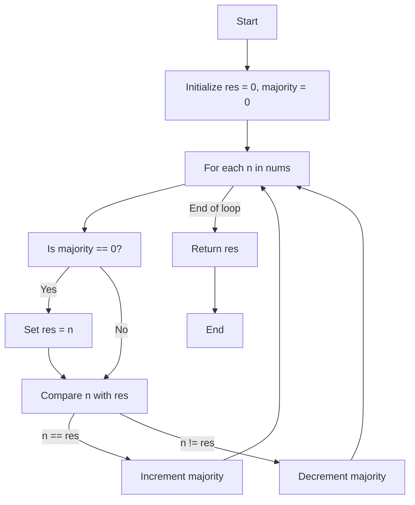

# Striver's Array Series (***Day 4 - Hard***)
- [Striver's Array Series (***Day 4 - Hard***)](#strivers-array-series-day-4---hard)
  - [🗳️ Question 24 : Majority Element](#️-question-24--majority-element)
    - [🧠 Intuition](#-intuition)
    - [🚀 Approach](#-approach)
    - [📜 Detailed Walkthrough](#-detailed-walkthrough)
    - [🔍 Dry Run](#-dry-run)
    - [🔢 Code](#-code)
    - [🕰️ Complexity Analysis](#️-complexity-analysis)
    - [🗺️ Flowchart](#️-flowchart)
    - [🎉 Summary](#-summary)

## 🗳️ Question 24 : [Majority Element](https://leetcode.com/problems/majority-element/description/)

### 🧠 Intuition

The problem is to find the element that appears more than $(n/2)$ times in an array. Using the **Boyer-Moore Voting Algorithm**, we can find this element in linear time and constant space.

### 🚀 Approach

1. **Boyer-Moore Voting Algorithm**:
   - Initialize two variables: `res` to store the candidate for the majority element and `majority` to keep track of the count.
   - Traverse through the array. If the `majority` count is zero, set `res` to the current element.
   - If the current element is equal to `res`, increment the `majority` count. Otherwise, decrement it.
   - At the end of the traversal, `res` will be the majority element.

### 📜 Detailed Walkthrough

1. **Initialization**:
   - `res = 0`: This will store the candidate for the majority element.
   - `majority = 0`: This will count the number of occurrences of the current candidate.

2. **Traversal**:
   - For each element `n` in the array:
     - If `majority` is `0`, set `res = n`.
     - If `n` is equal to `res`, increment `majority` by `1`. Otherwise, decrement `majority` by `1`.

3. **Return Result**:
   - The variable `res` will hold the majority element after the traversal.

### 🔍 Dry Run

Consider `nums = [3, 2, 3]`.

1. **Initialization**:
   - `res = 0`
   - `majority = 0`

2. **First Iteration (n = 3)**:
   - `majority` is `0`, so `res = 3`
   - `majority = 1`

3. **Second Iteration (n = 2)**:
   - `n != res`, so `majority = 0`

4. **Third Iteration (n = 3)**:
   - `majority` is `0`, so `res = 3`
   - `majority = 1`

**Result**: `res = 3`

### 🔢 Code

```java
public static int majorityElement2(int[] nums) { // Without HashTable - Most Optimal
    int res = 0;
    int majority = 0;
    for (int n : nums) {
        if (majority == 0) res = n;
        majority += n == res ? 1 : -1;
    }
    return res;        
}
```

> [!NOTE]
> To see full code, [click here](/IntermediateJAVA/Arrays/Striver's%20Array%20Series/MajorityElement.java)

### 🕰️ Complexity Analysis
- **Time Complexity**: O(n)
  - We traverse the array once.
- **Space Complexity**: O(1)
  - We use constant extra space.

### 🗺️ Flowchart



### 🎉 Summary
- The **Boyer-Moore Voting Algorithm** efficiently finds the majority element in linear time and constant space.
- By maintaining a count of the majority element and adjusting it based on the current element, we can identify the element that appears more than half the time.

