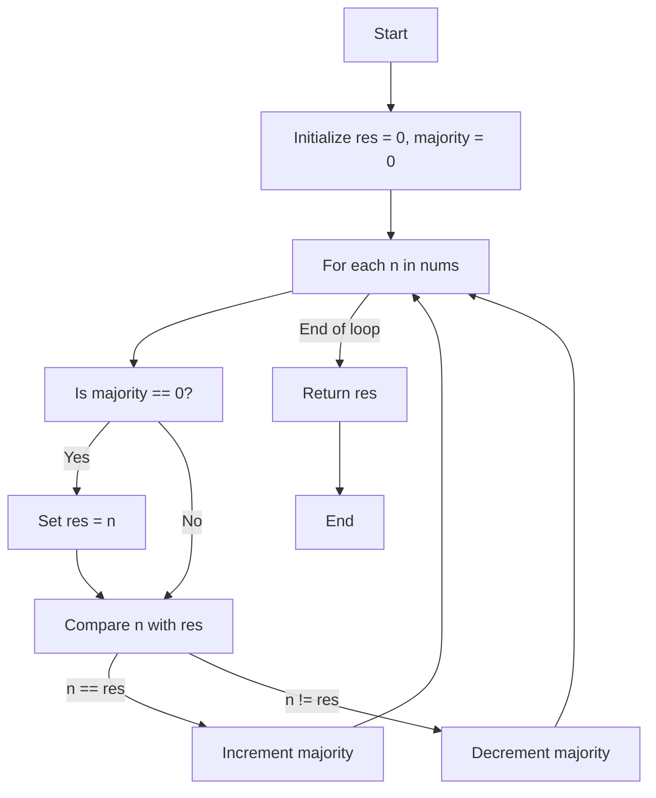
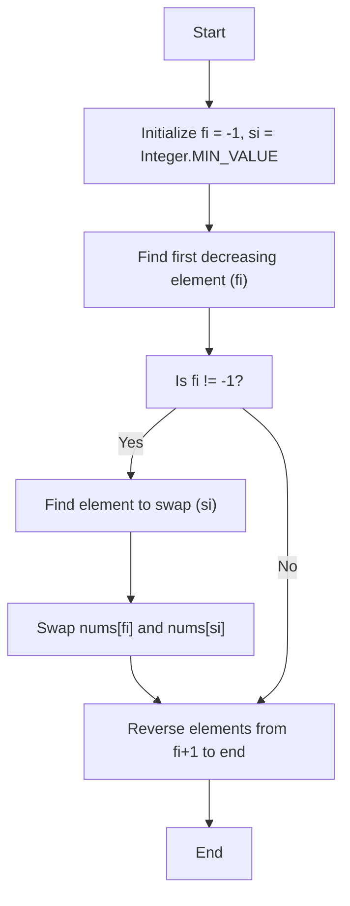
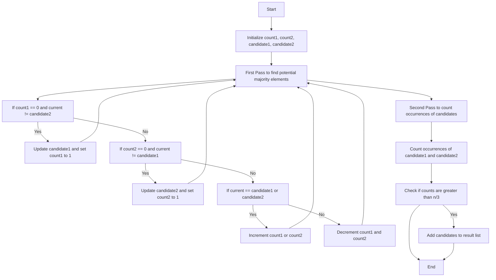
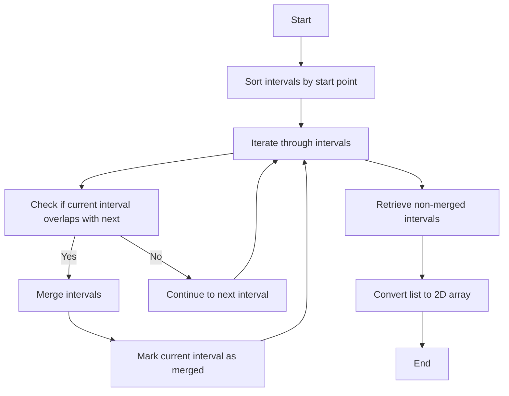
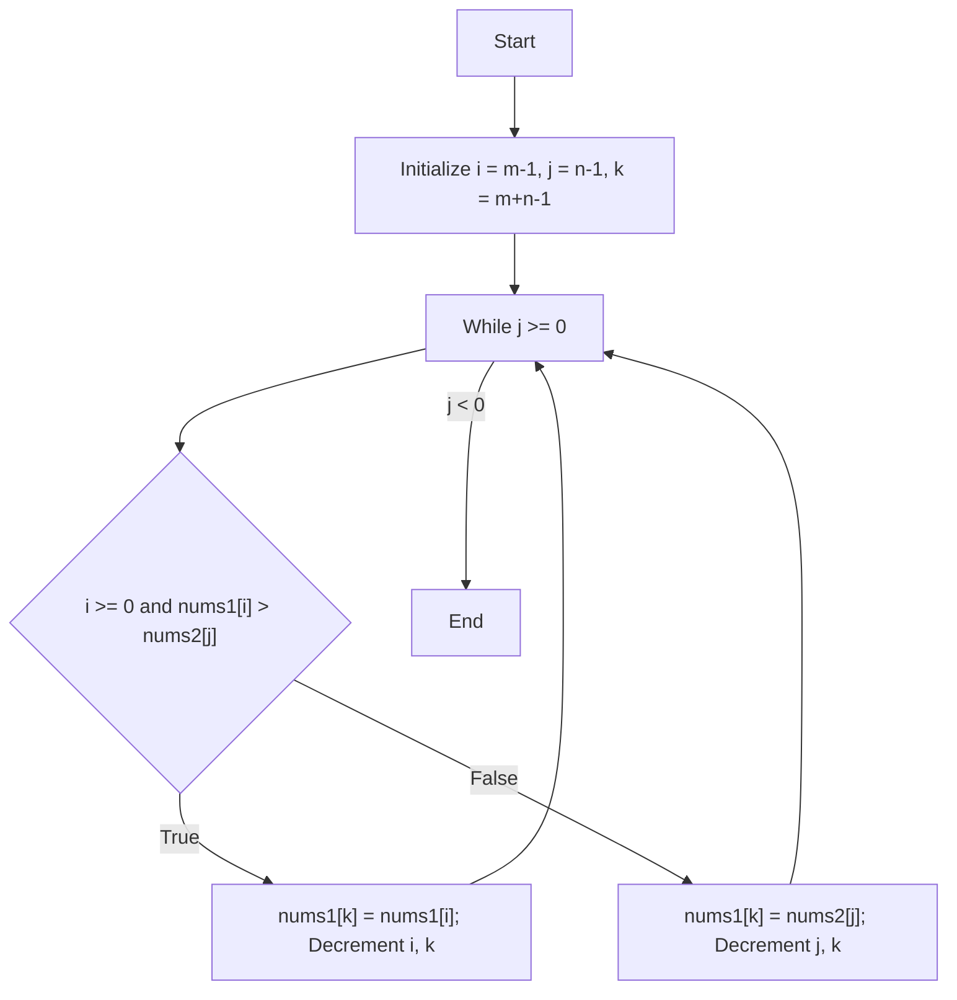
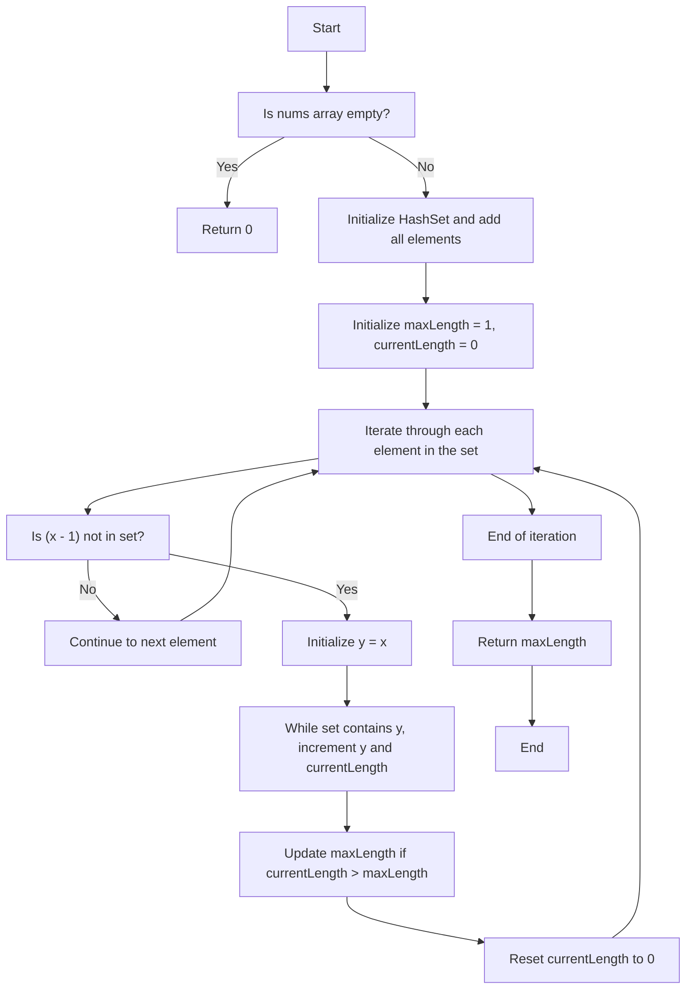

# Striver's Array Series (***Day 4 - Hard***)
- [Striver's Array Series (***Day 4 - Hard***)](#strivers-array-series-day-4---hard)
  - [🗳️ Question 24 : Majority Element](#️-question-24--majority-element)
    - [🧠 Intuition](#-intuition)
    - [🚀 Approach](#-approach)
    - [📜 Detailed Walkthrough](#-detailed-walkthrough)
    - [🔍 Dry Run](#-dry-run)
    - [🔢 Code](#-code)
    - [🕰️ Complexity Analysis](#️-complexity-analysis)
    - [🗺️ Flowchart](#️-flowchart)
    - [🎉 Summary](#-summary)
  - [Question 25 : Next Permutation](#question-25--next-permutation)
    - [🧠 Intuition](#-intuition-1)
    - [🚀 Approach](#-approach-1)
    - [📝 Detailed Walkthrough](#-detailed-walkthrough-1)
    - [🔢 Code](#-code-1)
    - [🔍 Dry Run](#-dry-run-1)
    - [🗺️ Flowchart](#️-flowchart-1)
    - [📋 Summary](#-summary-1)
    - [📈 Complexity Analysis](#-complexity-analysis)
  - [Question 26 : Majority Element - II](#question-26--majority-element---ii)
    - [🧠 Intuition](#-intuition-2)
    - [🚀 Approach](#-approach-2)
    - [📝 Detailed Walkthrough](#-detailed-walkthrough-2)
    - [🔍 Dry Run](#-dry-run-2)
    - [🔢 Code](#-code-2)
    - [🗺️ Flowchart](#️-flowchart-2)
    - [📋 Summary](#-summary-2)
    - [📈 Complexity Analysis](#-complexity-analysis-1)
  - [Question 27 : Merge Intervals](#question-27--merge-intervals)
    - [🧠 Intuition](#-intuition-3)
    - [🚀 Approach](#-approach-3)
    - [📝 Detailed Walkthrough](#-detailed-walkthrough-3)
    - [🔍 Dry Run](#-dry-run-3)
    - [🔢 Code](#-code-3)
    - [🗺️ Flowchart](#️-flowchart-3)
    - [📋 Summary](#-summary-3)
    - [📈 Complexity Analysis](#-complexity-analysis-2)
  - [Question 28 : Merge Sorted Array](#question-28--merge-sorted-array)
    - [🧠 Intuition](#-intuition-4)
    - [🚀 Approach](#-approach-4)
    - [📝 Detailed Walkthrough](#-detailed-walkthrough-4)
    - [🔍 Dry Run](#-dry-run-4)
    - [🔢 Code](#-code-4)
    - [🗺️ Flowchart](#️-flowchart-4)
    - [📋 Summary](#-summary-4)
    - [📈 Complexity Analysis](#-complexity-analysis-3)
  - [Question 29 : Longest Consecutive Sequence](#question-29--longest-consecutive-sequence)
    - [🧠 Intuition](#-intuition-5)
    - [🚀 Approach](#-approach-5)
    - [📝 Detailed Walkthrough](#-detailed-walkthrough-5)
    - [🔢 Code](#-code-5)
    - [🔍 Dry Run](#-dry-run-5)
    - [🗺️ Flowchart](#️-flowchart-5)

## 🗳️ Question 24 : [Majority Element](https://leetcode.com/problems/majority-element/description/)

### 🧠 Intuition

The problem is to find the element that appears more than $(n/2)$ times in an array. Using the **Boyer-Moore Voting Algorithm**, we can find this element in linear time and constant space.

### 🚀 Approach

1. **Boyer-Moore Voting Algorithm**:
   - Initialize two variables: `res` to store the candidate for the majority element and `majority` to keep track of the count.
   - Traverse through the array. If the `majority` count is zero, set `res` to the current element.
   - If the current element is equal to `res`, increment the `majority` count. Otherwise, decrement it.
   - At the end of the traversal, `res` will be the majority element.

### 📜 Detailed Walkthrough

1. **Initialization**:
   - `res = 0`: This will store the candidate for the majority element.
   - `majority = 0`: This will count the number of occurrences of the current candidate.

2. **Traversal**:
   - For each element `n` in the array:
     - If `majority` is `0`, set `res = n`.
     - If `n` is equal to `res`, increment `majority` by `1`. Otherwise, decrement `majority` by `1`.

3. **Return Result**:
   - The variable `res` will hold the majority element after the traversal.

### 🔍 Dry Run

Consider `nums = [3, 2, 3]`.

1. **Initialization**:
   - `res = 0`
   - `majority = 0`

2. **First Iteration (n = 3)**:
   - `majority` is `0`, so `res = 3`
   - `majority = 1`

3. **Second Iteration (n = 2)**:
   - `n != res`, so `majority = 0`

4. **Third Iteration (n = 3)**:
   - `majority` is `0`, so `res = 3`
   - `majority = 1`

**Result**: `res = 3`

### 🔢 Code

```java
public static int majorityElement2(int[] nums) { // Without HashTable - Most Optimal
    int res = 0;
    int majority = 0;
    for (int n : nums) {
        if (majority == 0) res = n;
        majority += n == res ? 1 : -1;
    }
    return res;        
}
```

> [!NOTE]
> To see full code, [click here](/IntermediateJAVA/Arrays/Striver's%20Array%20Series/MajorityElement.java)

### 🕰️ Complexity Analysis
- **Time Complexity**: O(n)
  - We traverse the array once.
- **Space Complexity**: O(1)
  - We use constant extra space.

### 🗺️ Flowchart



### 🎉 Summary
- The **Boyer-Moore Voting Algorithm** efficiently finds the majority element in linear time and constant space.
- By maintaining a count of the majority element and adjusting it based on the current element, we can identify the element that appears more than half the time.


## Question 25 : [Next Permutation](https://leetcode.com/problems/next-permutation/description/)

### 🧠 Intuition

The problem of finding the next permutation is about rearranging the numbers into the next lexicographically larger permutation. If such a permutation is not possible (i.e., the array is sorted in descending order), the function rearranges the array to the lowest possible order (ascending order).

### 🚀 Approach

1. **Identify the first decreasing element**:
   - Traverse from the end of the array to find the first element that is smaller than the element next to it.
2. **Identify the element to swap**:
   - Find the smallest element larger than the identified element in step 1 and swap them.
3. **Reverse the suffix**:
   - Reverse the sequence after the original position of the element found in step 1 to get the next permutation.

### 📝 Detailed Walkthrough

1. **Finding the first decreasing element (`fi`)**:
   - Traverse from the end of the array. The first element `nums[i]` such that `nums[i] < nums[i+1]` is our `fi`.
   
2. **Finding the swap index (`si`)**:
   - From the end of the array, find the first element `nums[j]` greater than `nums[fi]` to swap with `nums[fi]`.

3. **Swapping the elements**:
   - Swap `nums[fi]` and `nums[si]`.

4. **Reversing the suffix**:
   - Reverse the elements from `fi + 1` to the end of the array.

### 🔢 Code

```java
public static void nextPermutation(int[] nums) {
    int fi = -1;
    int si = Integer.MIN_VALUE;

    // Step 1: Find the first decreasing element from the end
    for (int i = nums.length - 2; i >= 0; i--) {
        if (nums[i] < nums[i + 1]) {
            fi = i;
            break;
        }
    }

    // Step 2: If fi is not -1, find the element to swap with
    if (fi != -1) {
        for (int i = nums.length - 1; i > fi; i--) {
            if (nums[i] > nums[fi]) {
                si = i;
                break;
            }
        }
        // Swap
        int temp = nums[fi];
        nums[fi] = nums[si];
        nums[si] = temp;
    }

    // Step 3: Reverse the elements from fi+1 to end
    int l = fi + 1, r = nums.length - 1;
    while (l < r) {
        int temp = nums[l];
        nums[l] = nums[r];
        nums[r] = temp;
        l++;
        r--;
    }
}
```

> [!NOTE]
> To see full code, [click here](/IntermediateJAVA/Arrays/Striver's%20Array%20Series/NextPermutation.java)

### 🔍 Dry Run

**Input**: `[1, 2, 3]`

1. **Finding the first decreasing element (`fi`)**:
   - Traverse from the end: `nums[2] (3) > nums[1] (2)` → No change
   - Traverse next: `nums[1] (2) > nums[0] (1)` → `fi = 0`
2. **Finding the element to swap (`si`)**:
   - Traverse from the end: `nums[2] (3) > nums[0] (1)` → `si = 2`
3. **Swapping**:
   - Swap `nums[0]` and `nums[2]`: `[3, 2, 1]`
4. **Reversing the suffix**:
   - Reverse from `fi+1` (index 1) to end: `[3, 1, 2]`

**Output**: `[1, 3, 2]`

### 🗺️ Flowchart



### 📋 Summary

The `nextPermutation` method:
1. Identifies the first decreasing element from the end of the array.
2. Finds the smallest element larger than this element to swap.
3. Swaps the two elements and reverses the suffix of the array to get the next lexicographical permutation.

### 📈 Complexity Analysis

- **Time Complexity**: $O(n)$, where `n` is the length of the array. Each step (finding `fi`, finding `si`, swapping, and reversing) takes linear time.
- **Space Complexity**: $O(1)$, since the algorithm modifies the array in place without requiring additional storage.

> [!IMPORTANT]
> - Article Link for the solution [Link](https://takeuforward.org/data-structure/next_permutation-find-next-lexicographically-greater-permutation/)
> - Video Link for the solution [Link](https://youtu.be/JDOXKqF60RQ)

## Question 26 : [Majority Element - II](https://leetcode.com/problems/majority-element-ii/description/)

### 🧠 Intuition

The problem is to find all elements that appear more than ⌊n/3⌋ times in an array. This is an extension of the classic Boyer-Moore Voting Algorithm, which is used to find the majority element that appears more than ⌊n/2⌋ times. Since an element appearing more than ⌊n/3⌋ times can have at most two such elements, we use two counters and two candidate variables.

### 🚀 Approach

1. **First Pass**:
   - Identify two potential majority candidates using a modified Boyer-Moore Voting Algorithm.
2. **Second Pass**:
   - Count the occurrences of these two candidates to confirm if they appear more than ⌊n/3⌋ times.

### 📝 Detailed Walkthrough

1. **Initialization**:
   - `count1`, `count2` for counting the potential majority elements.
   - `candidate1`, `candidate2` for storing the potential majority element candidates.

2. **First Pass**:
   - Traverse through the array to find two potential candidates.
   - If `count1` is 0 and the current number is not `candidate2`, update `candidate1`.
   - If `count2` is 0 and the current number is not `candidate1`, update `candidate2`.
   - If the current number matches `candidate1` or `candidate2`, increment their respective counters.
   - If the current number doesn't match either candidate, decrement both counters.

3. **Second Pass**:
   - Reset `count1` and `count2` to count the actual occurrences of `candidate1` and `candidate2`.
   - Traverse through the array to count the occurrences.
   - If the count of a candidate is greater than ⌊n/3⌋, add it to the result list.

### 🔍 Dry Run

**Input**: `[3, 2, 3]`

1. **First Pass**:
   - Initial: `count1=0, candidate1=0, count2=0, candidate2=0`
   - Iteration 1: `nums[0]=3`
     - `count1=1, candidate1=3`
   - Iteration 2: `nums[1]=2`
     - `count2=1, candidate2=2`
   - Iteration 3: `nums[2]=3`
     - `count1=2, candidate1=3`

2. **Second Pass**:
   - Reset: `count1=0, count2=0`
   - Count occurrences:
     - `nums[0]=3`: `count1=1`
     - `nums[1]=2`: `count2=1`
     - `nums[2]=3`: `count1=2`

3. **Result**:
   - `count1=2` (threshold is 1), so `candidate1=3` is added to the result.

**Output**: `[3]`

### 🔢 Code

```java
public class Solution {
    public List<Integer> majorityElement(int[] nums) {
        int count1 = 0, count2 = 0; // Counters for the potential majority elements
        int candidate1 = 0, candidate2 = 0; // Potential majority element candidates

        // First pass to find potential majority elements.
        for (int i = 0; i < nums.length; i++) {
            // If count1 is 0 and the current number is not equal to candidate2, update candidate1.
            if (count1 == 0 && nums[i] != candidate2) {
                count1 = 1;
                candidate1 = nums[i];
            } 
            // If count2 is 0 and the current number is not equal to candidate1, update candidate2.
            else if (count2 == 0 && nums[i] != candidate1) {
                count2 = 1;
                candidate2 = nums[i];
            } 
            // Update counts for candidate1 and candidate2.
            else if (candidate1 == nums[i]) {
                count1++;
            } else if (candidate2 == nums[i]) {
                count2++;
            } 
            // If the current number is different from both candidates, decrement their counts.
            else {
                count1--;
                count2--;
            }
        }

        List<Integer> result = new ArrayList<>();
        int threshold = nums.length / 3; // Threshold for majority element

        // Second pass to count occurrences of the potential majority elements.
        count1 = 0;
        count2 = 0;
        for (int i = 0; i < nums.length; i++) {
            if (candidate1 == nums[i]) {
                count1++;
            } else if (candidate2 == nums[i]) {
                count2++;
            }
        }

        // Check if the counts of potential majority elements are greater than n/3 and add them to the result.
        if (count1 > threshold) {
            result.add(candidate1);
        }
        if (count2 > threshold) {
            result.add(candidate2);
        }

        return result;
    }
}
```
> [!NOTE]
> To see full code, [click here](/IntermediateJAVA/Arrays/Striver's%20Array%20Series/MajorityElementTwo.java)

### 🗺️ Flowchart



### 📋 Summary

The `majorityElement` method:
1. **First Pass**:
   - Identifies two potential majority candidates using a modified Boyer-Moore Voting Algorithm.
2. **Second Pass**:
   - Counts the occurrences of these candidates and confirms if they appear more than ⌊n/3⌋ times.

### 📈 Complexity Analysis
- **Time Complexity**: O(n), where `n` is the length of the array. The algorithm requires two passes through the array.
- **Space Complexity**: O(1), since the algorithm uses a constant amount of extra space for the counters and candidates.

> [!IMPORTANT]
> - Article Link for the solution [Link](https://takeuforward.org/data-structure/majority-elementsn-3-times-find-the-elements-that-appears-more-than-n-3-times-in-the-array/)
> - Video Link for the solution [Link](https://youtu.be/vwZj1K0e9U8)

## Question 27 : [Merge Intervals](https://leetcode.com/problems/merge-intervals/description/)

### 🧠 Intuition

The problem is to merge overlapping intervals. This can be visualized by sorting the intervals by their starting points and then iterating through them to merge where overlaps occur. Overlapping intervals have the property that the start of one interval lies between the start and end of another interval.

### 🚀 Approach

1. **Sort the intervals** based on the starting point.
2. **Iterate through the sorted intervals** and merge overlapping intervals by updating the end points.
3. **Store non-overlapping intervals** in an output list.
4. **Convert the output list** to a 2D array to return the result.

### 📝 Detailed Walkthrough

1. **Initialization**:
   - An `ArrayList` is used to store the merged intervals.
   - Sort the intervals based on the starting point using `Arrays.sort`.

2. **Merge Logic**:
   - Iterate through the sorted intervals.
   - If the current interval overlaps with the next interval, merge them by updating the start and end points of the next interval.
   - Mark the current interval as merged by setting its start and end points to `-1`.

3. **Retrieve Merged Intervals**:
   - Iterate through the intervals again.
   - Add non-merged intervals to the output list.

4. **Convert to 2D Array**:
   - Convert the `ArrayList` to a 2D array for the final result.

### 🔍 Dry Run

**Input**: `[[1, 3], [2, 6], [8, 10], [15, 18]]`

1. **Sort**:
   - Sorted intervals: `[[1, 3], [2, 6], [8, 10], [15, 18]]`

2. **Merge**:
   - Iteration 1: `[[1, 6], [-1, -1], [8, 10], [15, 18]]`
   - Iteration 2: No merge.
   - Iteration 3: No merge.

3. **Retrieve**:
   - Result list: `[[1, 6], [8, 10], [15, 18]]`

4. **Convert**:
   - Final output: `[[1, 6], [8, 10], [15, 18]]`

### 🔢 Code

```java
class Solution {
    public int[][] merge(int[][] intervals) {
        ArrayList<int[]> output = new ArrayList<>();
        // Sorting Matrix - Intervals
        Arrays.sort(intervals, (a, b) -> Integer.compare(a[0], b[0]));
        // Logic
        for(int i = 0; i < intervals.length-1; i++){
            if(intervals[i+1][0] >= intervals[i][0] && intervals[i+1][0] <= intervals[i][1]){
                intervals[i+1][0] = Math.min(intervals[i][0], intervals[i+1][0]);
                intervals[i+1][1] = Math.max(intervals[i][1], intervals[i+1][1]);
                intervals[i][0] = -1;
                intervals[i][1] = -1;
            }
        }
        // Retreiving the Merged Intervals
        for(int i = 0; i < intervals.length; i++){
            if(intervals[i][0] == -1 && intervals[i][1] == -1) continue;
            output.add(new int[]{intervals[i][0], intervals[i][1]});
        }
        // Converting the ArrayList to 2D matrix
        int[][] mergedList = convertTo2DArray(output);
        // Return Statement
        return mergedList;
    }

    public static int[][] convertTo2DArray(ArrayList<int[]> list) {
        if (list.isEmpty()) {
            return new int[0][0];
        }
        int rowCount = list.size();
        int colCount = list.get(0).length; // Assuming all rows have the same number of columns
        int[][] matrix = new int[rowCount][colCount];
        for (int i = 0; i < rowCount; i++) {
            matrix[i] = list.get(i);
        }
        return matrix;
    }
}
```
> [!NOTE]
> To see full code, [click here](/IntermediateJAVA/Arrays/Striver's%20Array%20Series/MergeIntervals.java)

### 🗺️ Flowchart



### 📋 Summary

The `merge` method:
1. **Sorts intervals** by their starting points.
2. **Merges overlapping intervals** using a loop and conditions.
3. **Stores non-overlapping intervals** in an output list.
4. **Converts the list to a 2D array** for the final result.

### 📈 Complexity Analysis

- **Time Complexity**: $O(n log n)$ due to sorting, where `n` is the number of intervals.
- **Space Complexity**: $O(n)$ for the output list and the final 2D array.

> [!IMPORTANT]
> - Article Link for the solution [Link](https://takeuforward.org/data-structure/merge-overlapping-sub-intervals/)
> - Video Link for the solution [Link](https://youtu.be/IexN60k62jo)


## Question 28 : [Merge Sorted Array](https://leetcode.com/problems/merge-sorted-array/)

### 🧠 Intuition

The problem is to merge two sorted arrays (`nums1` and `nums2`) into one sorted array in place. The `nums1` array has enough space to hold elements from both arrays. We can take advantage of the fact that both arrays are already sorted by starting the merge process from the end of both arrays.

### 🚀 Approach

1. **Initialize Pointers**:
   - `i` for the last element in the initialized part of `nums1`.
   - `j` for the last element in `nums2`.
   - `k` for the last position in `nums1` (which can accommodate elements from both arrays).

2. **Merge from the End**:
   - Compare the elements pointed to by `i` and `j`.
   - Place the larger element at the position pointed to by `k` in `nums1`.
   - Move the respective pointer (`i`, `j`, or `k`) accordingly.

3. **Repeat Until All Elements from `nums2` are Merged**:
   - Continue the process until `j` becomes less than 0.

### 📝 Detailed Walkthrough

1. **Initialization**:
   - `i = m - 1` points to the last initialized element in `nums1`.
   - `j = n - 1` points to the last element in `nums2`.
   - `k = m + n - 1` points to the last position in `nums1`.

2. **Merge Process**:
   - While `j >= 0`:
     - If `i >= 0` and `nums1[i] > nums2[j]`, place `nums1[i]` at `nums1[k]` and decrement `i` and `k`.
     - Otherwise, place `nums2[j]` at `nums1[k]` and decrement `j` and `k`.

### 🔍 Dry Run

**Input**: `nums1 = [1, 2, 3, 0, 0, 0]`, `m = 3`, `nums2 = [2, 5, 6]`, `n = 3`

1. **Initialization**:
   - `i = 2`, `j = 2`, `k = 5`

2. **Merge**:
   - `nums1[2] < nums2[2]` → `nums1[5] = nums2[2]` → `k = 4`, `j = 1`
   - `nums1[2] < nums2[1]` → `nums1[4] = nums2[1]` → `k = 3`, `j = 0`
   - `nums1[2] > nums2[0]` → `nums1[3] = nums1[2]` → `k = 2`, `i = 1`
   - `nums1[1] < nums2[0]` → `nums1[2] = nums2[0]` → `k = 1`, `j = -1`

3. **Result**:
   - `nums1 = [1, 2, 2, 3, 5, 6]`

### 🔢 Code

```java
class Solution {
    public void merge(int[] nums1, int m, int[] nums2, int n) {
        int i = m - 1;
        int j = n - 1;
        int k = m + n - 1;
        
        while (j >= 0) {
            if (i >= 0 && nums1[i] > nums2[j]) {
                nums1[k--] = nums1[i--];
            } else {
                nums1[k--] = nums2[j--];
            }
        }
    }
}
```
> [!NOTE]
> To see full code, [click here](/IntermediateJAVA/Arrays/Striver's%20Array%20Series/MergeSortedArray.java)

### 🗺️ Flowchart



### 📋 Summary

The `merge` method:
1. **Initializes pointers** for both arrays and the position in `nums1`.
2. **Merges the arrays** from the end, ensuring sorted order.
3. **Places elements** from `nums2` and `nums1` into their correct positions.

### 📈 Complexity Analysis

- **Time Complexity**: O(m + n) where `m` and `n` are the lengths of `nums1` and `nums2` respectively.
- **Space Complexity**: O(1) as the merging is done in place.

> [!IMPORTANT]
> - Article Link for the solution [Link](https://takeuforward.org/data-structure/merge-two-sorted-arrays-without-extra-space/)
> - Video Link for the solution [Link](https://youtu.be/n7uwj04E0I4)

## Question 29 : [Longest Consecutive Sequence](https://leetcode.com/problems/longest-consecutive-sequence/description/)

### 🧠 Intuition
The goal is to find the length of the longest consecutive sequence in an unsorted array of integers. Using a `HashSet` allows us to efficiently check for the existence of elements and ensures linear time complexity.

### 🚀 Approach
1. **Insert all elements into a `HashSet`:** This allows for O(1) average time complexity for checking the existence of an element.
2. **Iterate through the set:** For each element, check if it is the start of a sequence (i.e., the element before it does not exist in the set). If it is, count the length of the consecutive sequence starting from this element.
3. **Track the maximum length:** Keep a variable to store the maximum length of consecutive sequences found.

### 📝 Detailed Walkthrough
1. **Initialization:**
   - If the input array is empty, return 0.
   - Create a `HashSet` and add all elements from the array to the set.

2. **Iterate through the set:**
   - For each element, check if it is the start of a sequence by checking if `x - 1` is not in the set.
   - If it is the start, count the length of the sequence by incrementing and checking for subsequent elements in the set.
   - Update the maximum length if the current sequence length is greater than the previous maximum.

3. **Return the maximum length found.**

### 🔢 Code
```java
class Solution {
    public int longestConsecutive(int[] nums) {
        if (nums.length == 0) return 0; // Base case: empty array

        HashSet<Integer> set = new HashSet<>();
        for (int num : nums) set.add(num); // Add all elements to the set

        int maxLength = 1; // To store the maximum length of consecutive sequence
        int currentLength = 0; // To store the current sequence length

        for (int x : set) {
            // If x is the start of a sequence
            if (set.contains(x - 1)) continue;
            
            int y = x;
            while (set.contains(y++)) currentLength++; // Count the length of the sequence
            
            maxLength = Math.max(maxLength, currentLength); // Update maximum length
            currentLength = 0; // Reset current length for the next sequence
        }

        return maxLength;
    }
}
```

> [!NOTE]
> To see full code, [click here](/IntermediateJAVA/Arrays/Striver's%20Array%20Series/LongestConsecutiveSequence.java)

### 🔍 Dry Run
Let's dry run the code with the input array: `[100, 4, 200, 1, 3, 2]`.

1. **Initialization:**
   - `set` = `{100, 4, 200, 1, 3, 2}`
   - `maxLength` = 1
   - `currentLength` = 0

2. **Iteration:**
   - For `x = 1`:
     - Start of a sequence.
     - Count sequence: `1, 2, 3, 4` (currentLength = 4)
     - Update `maxLength` to 4.
   - For `x = 2`:
     - Not the start of a sequence (`1` exists in the set).
   - For `x = 3`:
     - Not the start of a sequence (`2` exists in the set).
   - For `x = 4`:
     - Not the start of a sequence (`3` exists in the set).
   - For `x = 100`:
     - Start of a sequence.
     - Count sequence: `100` (currentLength = 1)
     - `maxLength` remains 4.
   - For `x = 200`:
     - Start of a sequence.
     - Count sequence: `200` (currentLength = 1)
     - `maxLength` remains 4.

3. **Return `maxLength`:**
   - The final `maxLength` is 4.

### 🗺️ Flowchart


This approach ensures you efficiently find the longest consecutive sequence in linear time while using additional space for the `HashSet`.

> [!IMPORTANT]
> - Article Link for the solution [Link](https://takeuforward.org/data-structure/longest-consecutive-sequence-in-an-array/)
> - Video Link for the solution [Link](https://youtu.be/n7uwj04E0I4)

<!-- ## Question 00 : []()

> [!NOTE]
> To see full code, [click here]()

> [!IMPORTANT]
> - Article Link for the solution [Link]()
> - Video Link for the solution [Link]() -->