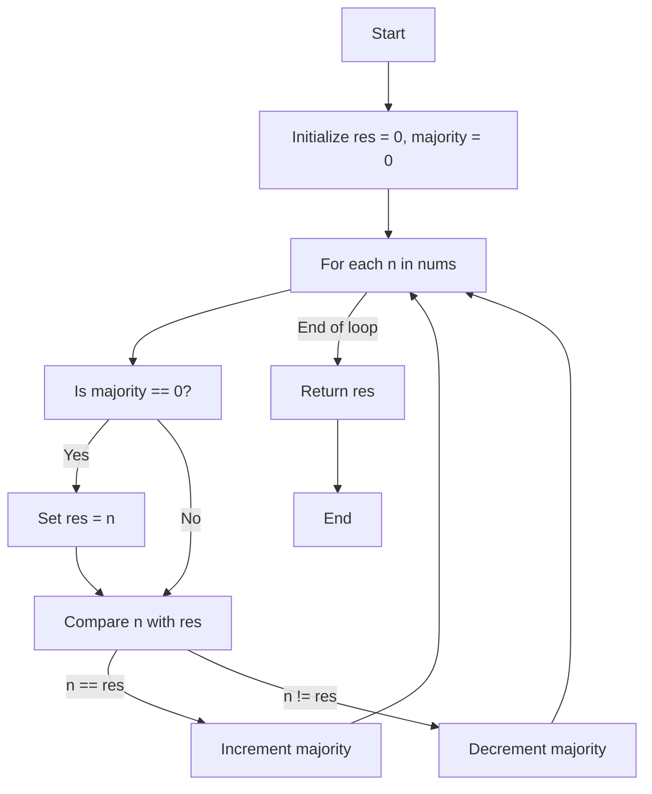
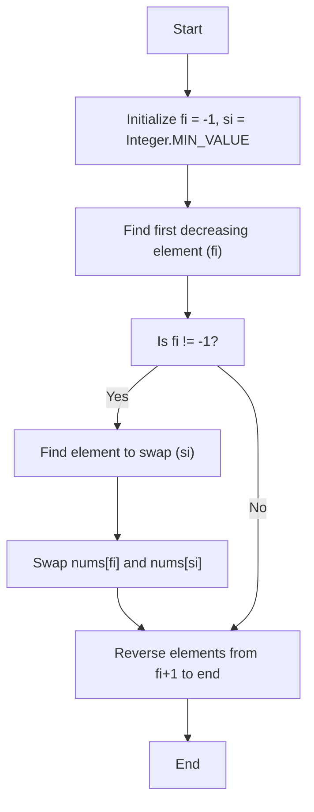

# Striver's Array Series (***Day 4 - Hard***)
- [Striver's Array Series (***Day 4 - Hard***)](#strivers-array-series-day-4---hard)
  - [🗳️ Question 24 : Majority Element](#️-question-24--majority-element)
    - [🧠 Intuition](#-intuition)
    - [🚀 Approach](#-approach)
    - [📜 Detailed Walkthrough](#-detailed-walkthrough)
    - [🔍 Dry Run](#-dry-run)
    - [🔢 Code](#-code)
    - [🕰️ Complexity Analysis](#️-complexity-analysis)
    - [🗺️ Flowchart](#️-flowchart)
    - [🎉 Summary](#-summary)
  - [Question 25 : Next Permutation](#question-25--next-permutation)
    - [🧠 Intuition](#-intuition-1)
    - [🚀 Approach](#-approach-1)
    - [📝 Detailed Walkthrough](#-detailed-walkthrough-1)
    - [🔢 Code](#-code-1)
    - [🔍 Dry Run](#-dry-run-1)
    - [🗺️ Flowchart](#️-flowchart-1)
    - [📋 Summary](#-summary-1)
    - [📈 Complexity Analysis](#-complexity-analysis)

## 🗳️ Question 24 : [Majority Element](https://leetcode.com/problems/majority-element/description/)

### 🧠 Intuition

The problem is to find the element that appears more than $(n/2)$ times in an array. Using the **Boyer-Moore Voting Algorithm**, we can find this element in linear time and constant space.

### 🚀 Approach

1. **Boyer-Moore Voting Algorithm**:
   - Initialize two variables: `res` to store the candidate for the majority element and `majority` to keep track of the count.
   - Traverse through the array. If the `majority` count is zero, set `res` to the current element.
   - If the current element is equal to `res`, increment the `majority` count. Otherwise, decrement it.
   - At the end of the traversal, `res` will be the majority element.

### 📜 Detailed Walkthrough

1. **Initialization**:
   - `res = 0`: This will store the candidate for the majority element.
   - `majority = 0`: This will count the number of occurrences of the current candidate.

2. **Traversal**:
   - For each element `n` in the array:
     - If `majority` is `0`, set `res = n`.
     - If `n` is equal to `res`, increment `majority` by `1`. Otherwise, decrement `majority` by `1`.

3. **Return Result**:
   - The variable `res` will hold the majority element after the traversal.

### 🔍 Dry Run

Consider `nums = [3, 2, 3]`.

1. **Initialization**:
   - `res = 0`
   - `majority = 0`

2. **First Iteration (n = 3)**:
   - `majority` is `0`, so `res = 3`
   - `majority = 1`

3. **Second Iteration (n = 2)**:
   - `n != res`, so `majority = 0`

4. **Third Iteration (n = 3)**:
   - `majority` is `0`, so `res = 3`
   - `majority = 1`

**Result**: `res = 3`

### 🔢 Code

```java
public static int majorityElement2(int[] nums) { // Without HashTable - Most Optimal
    int res = 0;
    int majority = 0;
    for (int n : nums) {
        if (majority == 0) res = n;
        majority += n == res ? 1 : -1;
    }
    return res;        
}
```

> [!NOTE]
> To see full code, [click here](/IntermediateJAVA/Arrays/Striver's%20Array%20Series/MajorityElement.java)

### 🕰️ Complexity Analysis
- **Time Complexity**: O(n)
  - We traverse the array once.
- **Space Complexity**: O(1)
  - We use constant extra space.

### 🗺️ Flowchart



### 🎉 Summary
- The **Boyer-Moore Voting Algorithm** efficiently finds the majority element in linear time and constant space.
- By maintaining a count of the majority element and adjusting it based on the current element, we can identify the element that appears more than half the time.


## Question 25 : [Next Permutation](https://leetcode.com/problems/next-permutation/description/)

### 🧠 Intuition

The problem of finding the next permutation is about rearranging the numbers into the next lexicographically larger permutation. If such a permutation is not possible (i.e., the array is sorted in descending order), the function rearranges the array to the lowest possible order (ascending order).

### 🚀 Approach

1. **Identify the first decreasing element**:
   - Traverse from the end of the array to find the first element that is smaller than the element next to it.
2. **Identify the element to swap**:
   - Find the smallest element larger than the identified element in step 1 and swap them.
3. **Reverse the suffix**:
   - Reverse the sequence after the original position of the element found in step 1 to get the next permutation.

### 📝 Detailed Walkthrough

1. **Finding the first decreasing element (`fi`)**:
   - Traverse from the end of the array. The first element `nums[i]` such that `nums[i] < nums[i+1]` is our `fi`.
   
2. **Finding the swap index (`si`)**:
   - From the end of the array, find the first element `nums[j]` greater than `nums[fi]` to swap with `nums[fi]`.

3. **Swapping the elements**:
   - Swap `nums[fi]` and `nums[si]`.

4. **Reversing the suffix**:
   - Reverse the elements from `fi + 1` to the end of the array.

### 🔢 Code

```java
public static void nextPermutation(int[] nums) {
    int fi = -1;
    int si = Integer.MIN_VALUE;

    // Step 1: Find the first decreasing element from the end
    for (int i = nums.length - 2; i >= 0; i--) {
        if (nums[i] < nums[i + 1]) {
            fi = i;
            break;
        }
    }

    // Step 2: If fi is not -1, find the element to swap with
    if (fi != -1) {
        for (int i = nums.length - 1; i > fi; i--) {
            if (nums[i] > nums[fi]) {
                si = i;
                break;
            }
        }
        // Swap
        int temp = nums[fi];
        nums[fi] = nums[si];
        nums[si] = temp;
    }

    // Step 3: Reverse the elements from fi+1 to end
    int l = fi + 1, r = nums.length - 1;
    while (l < r) {
        int temp = nums[l];
        nums[l] = nums[r];
        nums[r] = temp;
        l++;
        r--;
    }
}
```

> [!NOTE]
> To see full code, [click here](/IntermediateJAVA/Arrays/Striver's%20Array%20Series/NextPermutation.java)

### 🔍 Dry Run

**Input**: `[1, 2, 3]`

1. **Finding the first decreasing element (`fi`)**:
   - Traverse from the end: `nums[2] (3) > nums[1] (2)` → No change
   - Traverse next: `nums[1] (2) > nums[0] (1)` → `fi = 0`
2. **Finding the element to swap (`si`)**:
   - Traverse from the end: `nums[2] (3) > nums[0] (1)` → `si = 2`
3. **Swapping**:
   - Swap `nums[0]` and `nums[2]`: `[3, 2, 1]`
4. **Reversing the suffix**:
   - Reverse from `fi+1` (index 1) to end: `[3, 1, 2]`

**Output**: `[1, 3, 2]`

### 🗺️ Flowchart



### 📋 Summary

The `nextPermutation` method:
1. Identifies the first decreasing element from the end of the array.
2. Finds the smallest element larger than this element to swap.
3. Swaps the two elements and reverses the suffix of the array to get the next lexicographical permutation.

### 📈 Complexity Analysis

- **Time Complexity**: $O(n)$, where `n` is the length of the array. Each step (finding `fi`, finding `si`, swapping, and reversing) takes linear time.
- **Space Complexity**: $O(1)$, since the algorithm modifies the array in place without requiring additional storage.

> [!IMPORTANT]
> - Article Link for the solution [Link](https://takeuforward.org/data-structure/next_permutation-find-next-lexicographically-greater-permutation/)
> - Video Link for the solution [Link](https://youtu.be/JDOXKqF60RQ)