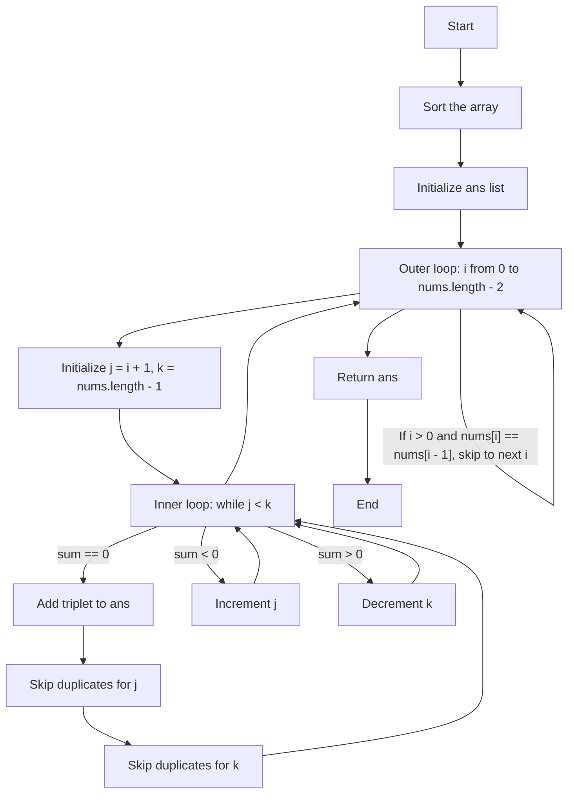

# Striver's Array Series (***Day 5 - Expert***)
- [Striver's Array Series (***Day 5 - Expert***)](#strivers-array-series-day-5---expert)
  - [Question 34 : Three Sum](#question-34--three-sum)
    - [🧠 Intuition](#-intuition)
    - [🛠️ Approach](#️-approach)
    - [🚶 Detailed Walkthrough](#-detailed-walkthrough)
    - [🧪 Dry Run](#-dry-run)
    - [💻 Code](#-code)
    - [📊 Complexity Analysis](#-complexity-analysis)
    - [🔄 Flowchart](#-flowchart)
    - [✨ Summary](#-summary)

## Question 34 : [Three Sum](https://leetcode.com/problems/3sum/description/)

### 🧠 Intuition
The problem aims to find all unique triplets in the array which gives the sum of zero. The approach leverages sorting and the two-pointer technique to efficiently find such triplets.

### 🛠️ Approach
1. **Sorting**: First, sort the array. This helps in easily skipping duplicates and efficiently finding the triplets.
2. **Iteration**: Iterate through the array and use two pointers to find the triplets:
   - Fix one element (`nums[i]`) and use two pointers (`j` and `k`) to find the other two elements such that their sum is zero.
3. **Skip Duplicates**: Ensure that the same triplet is not added multiple times by skipping duplicate values for `i`, `j`, and `k`.

### 🚶 Detailed Walkthrough
1. **Sorting**: Sort the input array.
2. **Outer Loop**: Iterate through the sorted array with index `i`.
   - Skip duplicates for the `i` element to avoid repeated triplets.
3. **Two-Pointer Technique**: For each fixed `i`:
   - Initialize `j` to `i + 1` and `k` to the last index of the array.
   - Calculate the sum of `nums[i] + nums[j] + nums[k]`.
   - If the sum is zero, add the triplet to the result and adjust pointers while skipping duplicates.
   - If the sum is less than zero, increment `j`.
   - If the sum is greater than zero, decrement `k`.

### 🧪 Dry Run
Example: `nums = [-1, 0, 1, 2, -1, -4]`
1. **Sorted Array**: `[-4, -1, -1, 0, 1, 2]`
2. **Iteration**:
   - `i = 0`: `-4`
     - `j = 1`, `k = 5`: `(-4, -1, 2)`, sum = -3, increment `j`
     - `j = 2`, `k = 5`: `(-4, -1, 2)`, sum = -3, increment `j`
     - `j = 3`, `k = 5`: `(-4, 0, 2)`, sum = -2, increment `j`
     - `j = 4`, `k = 5`: `(-4, 1, 2)`, sum = -1, increment `j`
   - `i = 1`: `-1`
     - `j = 2`, `k = 5`: `(-1, -1, 2)`, sum = 0, add `[-1, -1, 2]`
     - Skip duplicates for `j` and `k`
     - `j = 3`, `k = 4`: `(-1, 0, 1)`, sum = 0, add `[-1, 0, 1]`
     - Skip duplicates for `j` and `k`
   - `i = 2`: skip since `nums[2] == nums[1]`
   - `i = 3`: `0`
     - `j = 4`, `k = 5`: `(0, 1, 2)`, sum = 3, decrement `k`

### 💻 Code
```java
public static List<List<Integer>> threeSum3(int[] nums) {
    List<List<Integer>> ans = new ArrayList<>();
    Arrays.sort(nums);
    for (int i = 0; i < nums.length - 2; i++) {
        if (i > 0 && nums[i] == nums[i - 1]) continue; // Skip duplicates for i
        int j = i + 1, k = nums.length - 1;
        while (j < k) {
            int sum = nums[i] + nums[j] + nums[k];
            if (sum == 0) {
                ans.add(Arrays.asList(nums[i], nums[j], nums[k]));
                // Skip duplicates for j
                while (j < k && nums[j] == nums[j + 1]) j++;
                j++;
                // Skip duplicates for k
                while (j < k && nums[k] == nums[k - 1]) k--;
                k--;
            } else if (sum < 0) {
                j++;
            } else {
                k--;
            }
        }
    }
    return ans;
}
```
> [!NOTE]
> To see full code, [click here](/IntermediateJAVA/Arrays/Striver's%20Array%20Series/ThreeSum.java)

### 📊 Complexity Analysis
- **Time Complexity**: $O(n^2)$
  - Sorting the array takes $O(n log n)$.
  - The nested loops together take $O(n^2)$ in the worst case.
- **Space Complexity**: $O(1)$
  - We are using only constant extra space (not counting the space required for the output list).

### 🔄 Flowchart


### ✨ Summary
- **Intuition**: Sort the array and use the two-pointer technique to find unique triplets.
- **Approach**: Use a sorted array and skip duplicates to efficiently find the triplets.
- **Dry Run**: Ensured correctness through step-by-step iteration.
- **Complexity**: Efficient with $O(n^2)$ time complexity and $O(1)$ space complexity.

> [!IMPORTANT]
> - Article Link for the solution [Link](https://takeuforward.org/data-structure/3-sum-find-triplets-that-add-up-to-a-zero/)
> - Video Link for the solution [Link](https://youtu.be/DhFh8Kw7ymk)


<!-- ## Question 00 : []()

> [!NOTE]
> To see full code, [click here]()

> [!IMPORTANT]
> - Article Link for the solution [Link]()
> - Video Link for the solution [Link]() -->