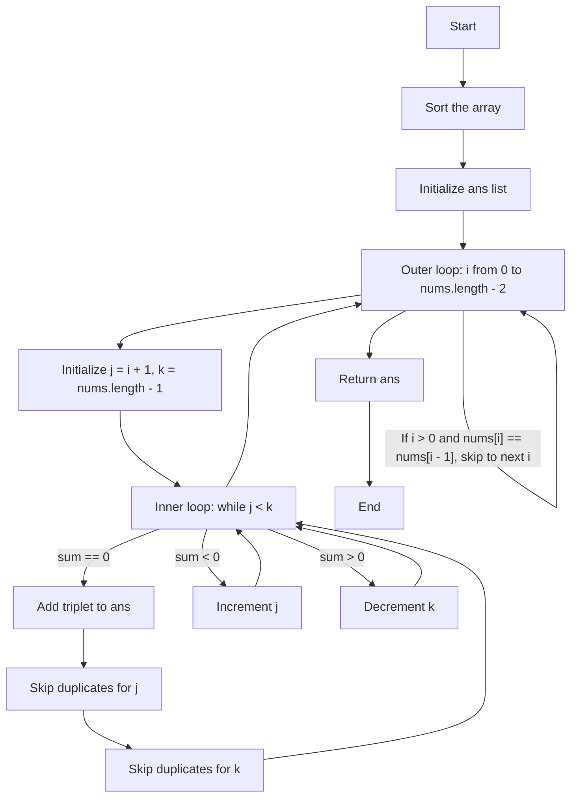
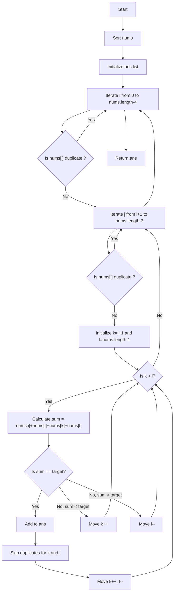
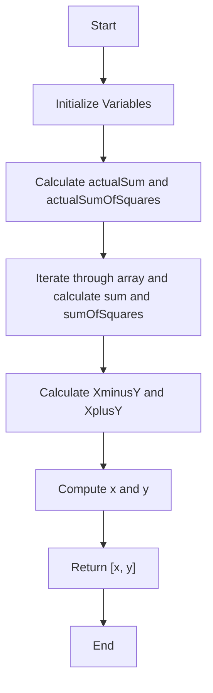

# Striver's Array Series (***Day 5 - Expert***)
- [Striver's Array Series (***Day 5 - Expert***)](#strivers-array-series-day-5---expert)
  - [Question 34 : Three Sum](#question-34--three-sum)
    - [🧠 Intuition](#-intuition)
    - [🛠️ Approach](#️-approach)
    - [🚶 Detailed Walkthrough](#-detailed-walkthrough)
    - [🧪 Dry Run](#-dry-run)
    - [💻 Code](#-code)
    - [📊 Complexity Analysis](#-complexity-analysis)
    - [🔄 Flowchart](#-flowchart)
    - [✨ Summary](#-summary)
  - [Question 35 : Four Sum](#question-35--four-sum)
    - [Intuition 🌟](#intuition-)
    - [Approach 🚀](#approach-)
    - [Detailed Walkthrough 🛤️](#detailed-walkthrough-️)
    - [Code 📝](#code-)
    - [Dry Run 🏃‍♂️](#dry-run-️)
    - [Flowchart 🗺️](#flowchart-️)
    - [Complexity Analysis 🧮](#complexity-analysis-)
  - [Question 36 : Missing and Repeating](#question-36--missing-and-repeating)
    - [Intuition and Approach 🚀](#intuition-and-approach-)
    - [Steps to Approach 🔍](#steps-to-approach-)
    - [Detailed Walkthrough 📝](#detailed-walkthrough-)
    - [Dry Run Example 🌧️](#dry-run-example-️)
    - [Code with Explanations 🧑‍💻](#code-with-explanations-)
    - [Flowchart 📊](#flowchart-)
    - [Complexity Analysis 📈](#complexity-analysis--1)

## Question 34 : [Three Sum](https://leetcode.com/problems/3sum/description/)

### 🧠 Intuition
The problem aims to find all unique triplets in the array which gives the sum of zero. The approach leverages sorting and the two-pointer technique to efficiently find such triplets.

### 🛠️ Approach
1. **Sorting**: First, sort the array. This helps in easily skipping duplicates and efficiently finding the triplets.
2. **Iteration**: Iterate through the array and use two pointers to find the triplets:
   - Fix one element (`nums[i]`) and use two pointers (`j` and `k`) to find the other two elements such that their sum is zero.
3. **Skip Duplicates**: Ensure that the same triplet is not added multiple times by skipping duplicate values for `i`, `j`, and `k`.

### 🚶 Detailed Walkthrough
1. **Sorting**: Sort the input array.
2. **Outer Loop**: Iterate through the sorted array with index `i`.
   - Skip duplicates for the `i` element to avoid repeated triplets.
3. **Two-Pointer Technique**: For each fixed `i`:
   - Initialize `j` to `i + 1` and `k` to the last index of the array.
   - Calculate the sum of `nums[i] + nums[j] + nums[k]`.
   - If the sum is zero, add the triplet to the result and adjust pointers while skipping duplicates.
   - If the sum is less than zero, increment `j`.
   - If the sum is greater than zero, decrement `k`.

### 🧪 Dry Run
Example: `nums = [-1, 0, 1, 2, -1, -4]`
1. **Sorted Array**: `[-4, -1, -1, 0, 1, 2]`
2. **Iteration**:
   - `i = 0`: `-4`
     - `j = 1`, `k = 5`: `(-4, -1, 2)`, sum = -3, increment `j`
     - `j = 2`, `k = 5`: `(-4, -1, 2)`, sum = -3, increment `j`
     - `j = 3`, `k = 5`: `(-4, 0, 2)`, sum = -2, increment `j`
     - `j = 4`, `k = 5`: `(-4, 1, 2)`, sum = -1, increment `j`
   - `i = 1`: `-1`
     - `j = 2`, `k = 5`: `(-1, -1, 2)`, sum = 0, add `[-1, -1, 2]`
     - Skip duplicates for `j` and `k`
     - `j = 3`, `k = 4`: `(-1, 0, 1)`, sum = 0, add `[-1, 0, 1]`
     - Skip duplicates for `j` and `k`
   - `i = 2`: skip since `nums[2] == nums[1]`
   - `i = 3`: `0`
     - `j = 4`, `k = 5`: `(0, 1, 2)`, sum = 3, decrement `k`

### 💻 Code
```java
public static List<List<Integer>> threeSum3(int[] nums) {
    List<List<Integer>> ans = new ArrayList<>();
    Arrays.sort(nums);
    for (int i = 0; i < nums.length - 2; i++) {
        if (i > 0 && nums[i] == nums[i - 1]) continue; // Skip duplicates for i
        int j = i + 1, k = nums.length - 1;
        while (j < k) {
            int sum = nums[i] + nums[j] + nums[k];
            if (sum == 0) {
                ans.add(Arrays.asList(nums[i], nums[j], nums[k]));
                // Skip duplicates for j
                while (j < k && nums[j] == nums[j + 1]) j++;
                j++;
                // Skip duplicates for k
                while (j < k && nums[k] == nums[k - 1]) k--;
                k--;
            } else if (sum < 0) {
                j++;
            } else {
                k--;
            }
        }
    }
    return ans;
}
```
> [!NOTE]
> To see full code, [click here](/IntermediateJAVA/Arrays/Striver's%20Array%20Series/ThreeSum.java)

### 📊 Complexity Analysis
- **Time Complexity**: $O(n^2)$
  - Sorting the array takes $O(n log n)$.
  - The nested loops together take $O(n^2)$ in the worst case.
- **Space Complexity**: $O(1)$
  - We are using only constant extra space (not counting the space required for the output list).

### 🔄 Flowchart


### ✨ Summary
- **Intuition**: Sort the array and use the two-pointer technique to find unique triplets.
- **Approach**: Use a sorted array and skip duplicates to efficiently find the triplets.
- **Dry Run**: Ensured correctness through step-by-step iteration.
- **Complexity**: Efficient with $O(n^2)$ time complexity and $O(1)$ space complexity.

> [!IMPORTANT]
> - Article Link for the solution [Link](https://takeuforward.org/data-structure/3-sum-find-triplets-that-add-up-to-a-zero/)
> - Video Link for the solution [Link](https://youtu.be/DhFh8Kw7ymk)


## Question 35 : [Four Sum](https://leetcode.com/problems/4sum/description/)

### Intuition 🌟
The 4Sum problem aims to find all unique quadruplets in the array that sum up to a given target. Using sorting and the two-pointer technique helps efficiently narrow down potential candidates.

### Approach 🚀
1. **Sort the Array**: Sorting helps in easily skipping duplicates and applying the two-pointer technique.
2. **Fix Two Numbers and Use Two-Pointer for the Remaining Two**: Iterate through each pair of numbers and use the two-pointer technique to find pairs that sum up to the remaining target.
3. **Skip Duplicates**: Ensure that no duplicate quadruplets are added to the result.

### Detailed Walkthrough 🛤️

1. **Sort the Array**: Sorting the array in ascending order.
2. **Outer Loop**: Iterate through the array to fix the first number.
   - **Skip Duplicates**: Skip the current number if it's the same as the previous number.
3. **Inner Loop**: Iterate through the remaining array to fix the second number.
   - **Skip Duplicates**: Skip the current number if it's the same as the previous number.
4. **Two-Pointer Technique**:
   - Initialize two pointers, one starting right after the second number and the other at the end of the array.
   - Calculate the sum of the four numbers.
   - If the sum equals the target, add the quadruplet to the result and move both pointers inward while skipping duplicates.
   - If the sum is less than the target, move the left pointer to the right to increase the sum.
   - If the sum is greater than the target, move the right pointer to the left to decrease the sum.

### Code 📝
```java
public static List<List<Integer>> fourSum(int[] nums, int target) {
    List<List<Integer>> ans = new ArrayList<>();
    Arrays.sort(nums);
    for (int i = 0; i < nums.length - 3; i++) {
        if (i > 0 && nums[i] == nums[i - 1]) continue;
        for (int j = i + 1; j < nums.length - 2; j++) {
            if (j > i + 1 && nums[j] == nums[j - 1]) continue;
            int k = j + 1;
            int l = nums.length - 1;
            while (k < l) {
                long sum = (long) nums[i] + nums[j] + nums[k] + nums[l];
                if (sum == target) {
                    ans.add(Arrays.asList(nums[i], nums[j], nums[k], nums[l]));
                    k++;
                    l--;
                    while (k < l && nums[k] == nums[k - 1]) k++;
                    while (k < l && nums[l] == nums[l + 1]) l--;
                } else if (sum < target) {
                    k++;
                } else {
                    l--;
                }
            }
        }
    }
    return ans;
}
```
> [!NOTE]
> To see full code, [click here](/IntermediateJAVA/Arrays/Striver's%20Array%20Series/FourSum.java)

### Dry Run 🏃‍♂️
**Input**: nums = [1, 0, -1, 0, -2, 2], target = 0
1. **Sorted**: [-2, -1, 0, 0, 1, 2]
2. **Iteration**:
   - i = 0 (nums[i] = -2)
     - j = 1 (nums[j] = -1)
       - k = 2, l = 5
         - sum = -2 + (-1) + 0 + 2 = -1 (k++)
         - sum = -2 + (-1) + 0 + 2 = -1 (k++)
         - sum = -2 + (-1) + 1 + 2 = 0 (found, move k and l)
         - ...
     - j = 2 (nums[j] = 0)
       - ...

### Flowchart 🗺️


### Complexity Analysis 🧮
- **Time Complexity**: $O(n^3)$
  - Sorting takes $O(n log n)$.
  - The three nested loops each contribute to $O(n)$ time complexity.
- **Space Complexity**: $O(n)$
  - The result list can store up to $O(n)$ quadruplets in the worst case.

> [!IMPORTANT]
> - Article Link for the solution [Link](https://takeuforward.org/data-structure/4-sum-find-quads-that-add-up-to-a-target-value/)
> - Video Link for the solution [Link](https://youtu.be/eD95WRfh81c)


## Question 36 : [Missing and Repeating](https://www.geeksforgeeks.org/problems/find-missing-and-repeating2512/1)

### Intuition and Approach 🚀
The problem is to find one repeating number and one missing number in an array containing numbers from 1 to n. We can solve this problem using mathematical properties of sums and sums of squares.

### Steps to Approach 🔍
1. **Sum Calculation:**
   - Calculate the sum of the first n natural numbers: $\text{actualSum} = \frac{n(n+1)}{2}$
   - Calculate the sum of the squares of the first n natural numbers: $\text{actualSumOfSquares} = \frac{n(n+1)(2n+1)}{6}$
   
2. **Array Sum Calculation:**
   - Calculate the sum of all elements in the array: `sum`
   - Calculate the sum of the squares of all elements in the array: `sumOfSquares`
   
3. **Equations Setup:**
   - Let $X$ be the repeating number and $Y$ be the missing number.
   - From the sums, derive: $X - Y = \text{sum} - \text{actualSum}$ (Equation 1)
   - From the sum of squares, derive: $X^2 - Y^2 = \text{sumOfSquares} - \text{actualSumOfSquares}$
   - Use the identity $X^2 - Y^2 = (X + Y)(X - Y)$ to simplify: $X + Y = \frac{\text{sumOfSquares} - \text{actualSumOfSquares}}{X - Y}$ (Equation 2)

4. **Solve for X and Y:**
   - Using Equation 1 and Equation 2, solve for $X$ and $Y$.

### Detailed Walkthrough 📝
1. **Calculate Expected Sums:**
   - `actualSum` = $\frac{n(n+1)}{2}$
   - `actualSumOfSquares` = $\frac{n(n+1)(2n+1)}{6}$

2. **Calculate Actual Sums from the Array:**
   - Iterate through the array to compute `sum` and `sumOfSquares`.

3. **Derive Differences:**
   - `XminusY` = $\text{sum} - \text{actualSum}$
   - `XplusY` = $\frac{\text{sumOfSquares} - \text{actualSumOfSquares}}{XminusY}$

4. **Compute Missing and Repeating Numbers:**
   - $X$ = $\frac{XplusY + XminusY}{2}$
   - $Y$ = $X - XminusY$

### Dry Run Example 🌧️
Consider an example with `arr = [4, 3, 6, 2, 1, 1]` and `n = 6`.

1. **Calculate Expected Values:**
   - `actualSum` = $\frac{6 \cdot 7}{2} = 21$
   - `actualSumOfSquares` = $\frac{6 \cdot 7 \cdot 13}{6} = 91$

2. **Calculate Array Sums:**
   - `sum` = 4 + 3 + 6 + 2 + 1 + 1 = 17
   - `sumOfSquares` = $4^2 + 3^2 + 6^2 + 2^2 + 1^2 + 1^2 = 16 + 9 + 36 + 4 + 1 + 1 = 67$

3. **Derive Differences:**
   - `XminusY` = 17 - 21 = -4
   - `XplusY` = $\frac{67 - 91}{-4} = \frac{-24}{-4} = 6$

4. **Compute Missing and Repeating Numbers:**
   - $X$ = $\frac{6 - 4}{2} = 1$ (Repeating number)
   - $Y$ = $1 - (-4) = 5$ (Missing number)

### Code with Explanations 🧑‍💻
Here's the code annotated with comments:

```java
public static int[] findTwoElement2(int[] arr, int n) {
    // Initialize variables for sums
    long sum = 0;
    long actualSum = (n * (n + 1L)) / 2;
    long sumOfSquares = 0;
    long actualSumOfSquares = (n * (n + 1L) * (2L * n + 1)) / 6;

    // Calculate the sum and sum of squares of array elements
    for (int i = 0; i < n; i++) {
        sum += arr[i];
        sumOfSquares += (long) arr[i] * arr[i];
    }

    // Calculate differences
    long XminusY = sum - actualSum;
    long XplusY = (sumOfSquares - actualSumOfSquares) / XminusY;

    // Calculate repeating and missing numbers
    long x = (XplusY + XminusY) / 2;
    long y = x - XminusY;

    // Return the result as an array
    return new int[] {(int) x, (int) y};
}
```
> [!NOTE]
> To see full code, [click here](/IntermediateJAVA/Arrays/Striver's%20Array%20Series/MissingAndRepeating.java)

### Flowchart 📊


### Complexity Analysis 📈
- **Time Complexity:** $O(n)$
  - Calculating sums involves iterating through the array once.
- **Space Complexity:** $O(1)$
  - Uses constant extra space for variables.

By following this approach, we can efficiently determine the repeating and missing numbers in the array. The code is designed to handle large input sizes due to its $O(n)$ time complexity and constant space usage.

> [!IMPORTANT]
> - Article Link for the solution [Link](https://takeuforward.org/data-structure/find-the-repeating-and-missing-numbers/)
> - Video Link for the solution [Link](https://youtu.be/2D0D8HE6uak)


<!-- ## Question 00 : []()

> [!NOTE]
> To see full code, [click here]()

> [!IMPORTANT]
> - Article Link for the solution [Link]()
> - Video Link for the solution [Link]() -->