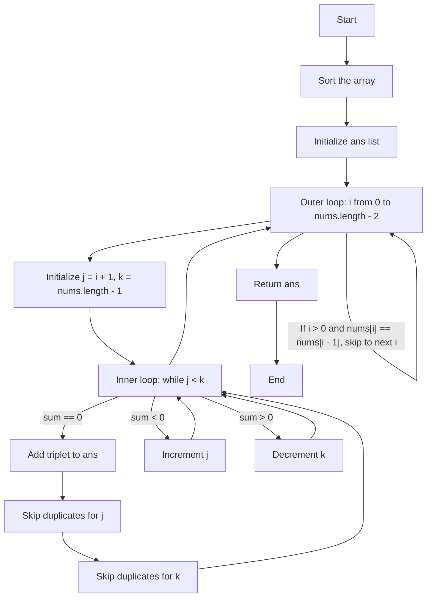
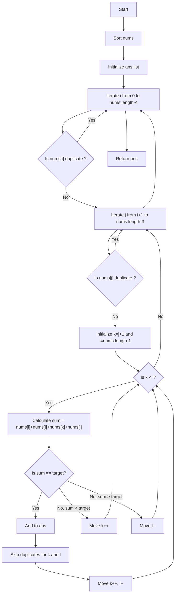
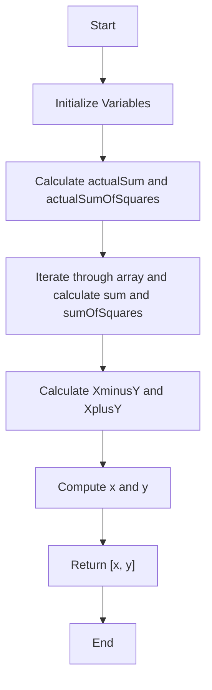
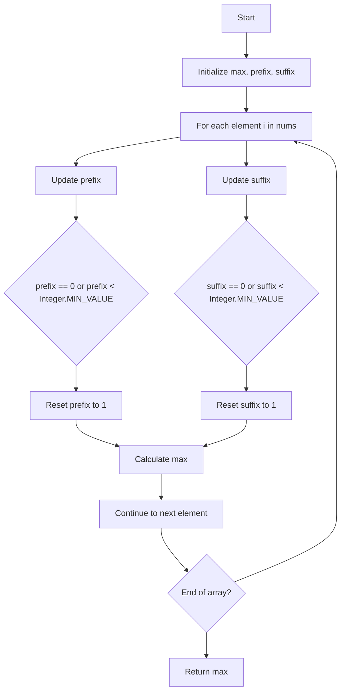
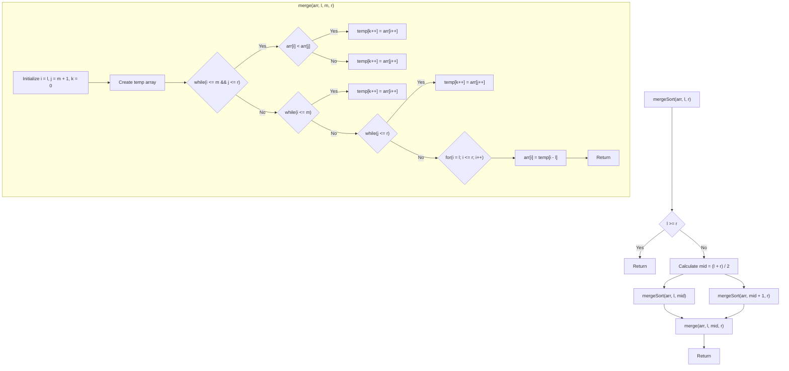
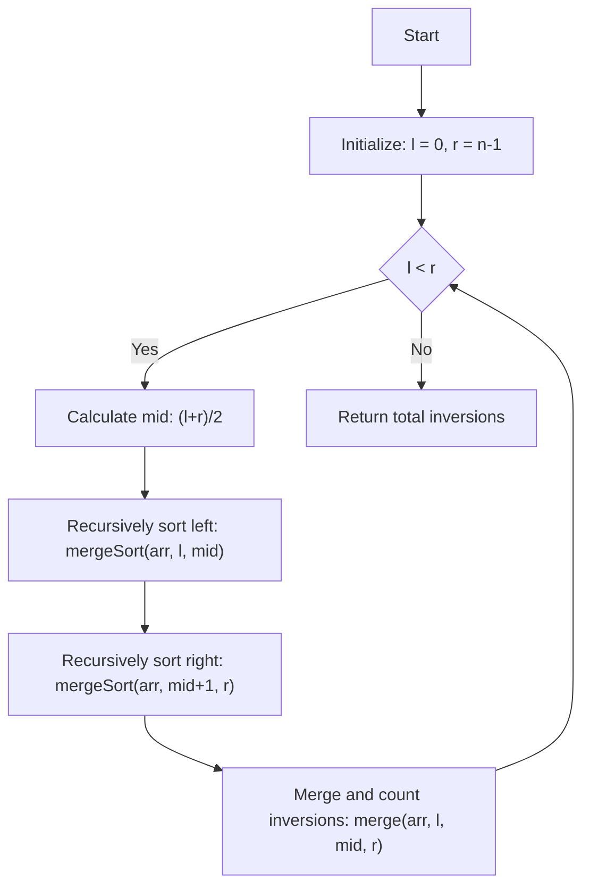
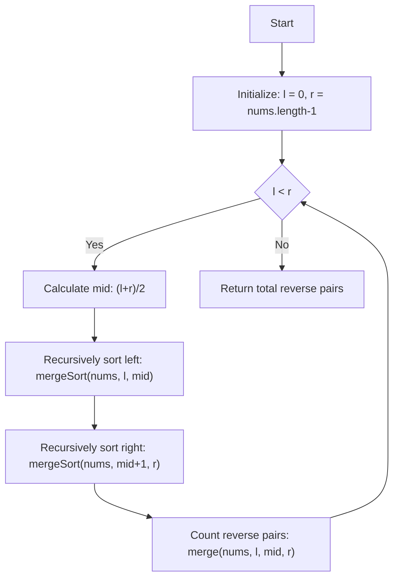

# Striver's Array Series (***Day 5 - Expert***)
- [Striver's Array Series (***Day 5 - Expert***)](#strivers-array-series-day-5---expert)
  - [Question 34 : Three Sum](#question-34--three-sum)
    - [🧠 Intuition](#-intuition)
    - [🛠️ Approach](#️-approach)
    - [🚶 Detailed Walkthrough](#-detailed-walkthrough)
    - [🧪 Dry Run](#-dry-run)
    - [💻 Code](#-code)
    - [📊 Complexity Analysis](#-complexity-analysis)
    - [🔄 Flowchart](#-flowchart)
    - [✨ Summary](#-summary)
  - [Question 35 : Four Sum](#question-35--four-sum)
    - [Intuition 🌟](#intuition-)
    - [Approach 🚀](#approach-)
    - [Detailed Walkthrough 🛤️](#detailed-walkthrough-️)
    - [Code 📝](#code-)
    - [Dry Run 🏃‍♂️](#dry-run-️)
    - [Flowchart 🗺️](#flowchart-️)
    - [Complexity Analysis 🧮](#complexity-analysis-)
  - [Question 36 : Missing and Repeating](#question-36--missing-and-repeating)
    - [Intuition and Approach 🚀](#intuition-and-approach-)
    - [Steps to Approach 🔍](#steps-to-approach-)
    - [Detailed Walkthrough 📝](#detailed-walkthrough-)
    - [Dry Run Example 🌧️](#dry-run-example-️)
    - [Code with Explanations 🧑‍💻](#code-with-explanations-)
    - [Flowchart 📊](#flowchart-)
    - [Complexity Analysis 📈](#complexity-analysis--1)
  - [Question 37 : Maximum Product Subarray](#question-37--maximum-product-subarray)
    - [Intuition 🌟](#intuition--1)
    - [Approach 🚀](#approach--1)
    - [Detailed Walkthrough 📝](#detailed-walkthrough--1)
    - [Dry Run 🔍](#dry-run-)
    - [Code 💻](#code--1)
    - [Flowchart 📊](#flowchart--1)
    - [Complexity Analysis 🧮](#complexity-analysis--2)
    - [Final Thoughts 🌟](#final-thoughts-)
  - [Question 38 : Merge Sort](#question-38--merge-sort)
    - [📚 Intuition](#-intuition-1)
    - [🛠️ Approach](#️-approach-1)
    - [🚶 Detailed Walkthrough](#-detailed-walkthrough-1)
      - [$merge()$ Function](#merge-function)
      - [$mergeSort()$ Function](#mergesort-function)
    - [📝 Dry Run](#-dry-run-1)
      - [Recursive Breakdown](#recursive-breakdown)
    - [📝 Code](#-code-1)
    - [🔁 Flowchart](#-flowchart-1)
    - [📈 Complexity Analysis](#-complexity-analysis-1)
  - [Question 39 : Count Inversions](#question-39--count-inversions)
    - [Intuition and Approach 🌟](#intuition-and-approach--1)
    - [Detailed Walkthrough 🛤️](#detailed-walkthrough-️-1)
    - [Code Implementation 💻](#code-implementation-)
    - [Dry Run 🧪](#dry-run--1)
    - [Flowchart 📈](#flowchart--2)
    - [Complexity Analysis 📊](#complexity-analysis--3)
  - [Question 40 : Reverse Pairs](#question-40--reverse-pairs)
    - [Intuition and Approach 🌟](#intuition-and-approach--2)
    - [Detailed Walkthrough 🛤️](#detailed-walkthrough-️-2)
    - [Code Implementation 💻](#code-implementation--1)
    - [Dry Run 🧪](#dry-run--2)
    - [Flowchart 📈](#flowchart--3)
    - [Complexity Analysis 📊](#complexity-analysis--4)

## Question 34 : [Three Sum](https://leetcode.com/problems/3sum/description/)

### 🧠 Intuition
The problem aims to find all unique triplets in the array which gives the sum of zero. The approach leverages sorting and the two-pointer technique to efficiently find such triplets.

### 🛠️ Approach
1. **Sorting**: First, sort the array. This helps in easily skipping duplicates and efficiently finding the triplets.
2. **Iteration**: Iterate through the array and use two pointers to find the triplets:
   - Fix one element (`nums[i]`) and use two pointers (`j` and `k`) to find the other two elements such that their sum is zero.
3. **Skip Duplicates**: Ensure that the same triplet is not added multiple times by skipping duplicate values for `i`, `j`, and `k`.

### 🚶 Detailed Walkthrough
1. **Sorting**: Sort the input array.
2. **Outer Loop**: Iterate through the sorted array with index `i`.
   - Skip duplicates for the `i` element to avoid repeated triplets.
3. **Two-Pointer Technique**: For each fixed `i`:
   - Initialize `j` to `i + 1` and `k` to the last index of the array.
   - Calculate the sum of `nums[i] + nums[j] + nums[k]`.
   - If the sum is zero, add the triplet to the result and adjust pointers while skipping duplicates.
   - If the sum is less than zero, increment `j`.
   - If the sum is greater than zero, decrement `k`.

### 🧪 Dry Run
Example: `nums = [-1, 0, 1, 2, -1, -4]`
1. **Sorted Array**: `[-4, -1, -1, 0, 1, 2]`
2. **Iteration**:
   - `i = 0`: `-4`
     - `j = 1`, `k = 5`: `(-4, -1, 2)`, sum = -3, increment `j`
     - `j = 2`, `k = 5`: `(-4, -1, 2)`, sum = -3, increment `j`
     - `j = 3`, `k = 5`: `(-4, 0, 2)`, sum = -2, increment `j`
     - `j = 4`, `k = 5`: `(-4, 1, 2)`, sum = -1, increment `j`
   - `i = 1`: `-1`
     - `j = 2`, `k = 5`: `(-1, -1, 2)`, sum = 0, add `[-1, -1, 2]`
     - Skip duplicates for `j` and `k`
     - `j = 3`, `k = 4`: `(-1, 0, 1)`, sum = 0, add `[-1, 0, 1]`
     - Skip duplicates for `j` and `k`
   - `i = 2`: skip since `nums[2] == nums[1]`
   - `i = 3`: `0`
     - `j = 4`, `k = 5`: `(0, 1, 2)`, sum = 3, decrement `k`

### 💻 Code
```java
public static List<List<Integer>> threeSum3(int[] nums) {
    List<List<Integer>> ans = new ArrayList<>();
    Arrays.sort(nums);
    for (int i = 0; i < nums.length - 2; i++) {
        if (i > 0 && nums[i] == nums[i - 1]) continue; // Skip duplicates for i
        int j = i + 1, k = nums.length - 1;
        while (j < k) {
            int sum = nums[i] + nums[j] + nums[k];
            if (sum == 0) {
                ans.add(Arrays.asList(nums[i], nums[j], nums[k]));
                // Skip duplicates for j
                while (j < k && nums[j] == nums[j + 1]) j++;
                j++;
                // Skip duplicates for k
                while (j < k && nums[k] == nums[k - 1]) k--;
                k--;
            } else if (sum < 0) {
                j++;
            } else {
                k--;
            }
        }
    }
    return ans;
}
```
> [!NOTE]
> To see full code, [click here](/IntermediateJAVA/Arrays/Striver's%20Array%20Series/ThreeSum.java)

### 📊 Complexity Analysis
- **Time Complexity**: $O(n^2)$
  - Sorting the array takes $O(n log n)$.
  - The nested loops together take $O(n^2)$ in the worst case.
- **Space Complexity**: $O(1)$
  - We are using only constant extra space (not counting the space required for the output list).

### 🔄 Flowchart


### ✨ Summary
- **Intuition**: Sort the array and use the two-pointer technique to find unique triplets.
- **Approach**: Use a sorted array and skip duplicates to efficiently find the triplets.
- **Dry Run**: Ensured correctness through step-by-step iteration.
- **Complexity**: Efficient with $O(n^2)$ time complexity and $O(1)$ space complexity.

> [!IMPORTANT]
> - Article Link for the solution [Link](https://takeuforward.org/data-structure/3-sum-find-triplets-that-add-up-to-a-zero/)
> - Video Link for the solution [Link](https://youtu.be/DhFh8Kw7ymk)


## Question 35 : [Four Sum](https://leetcode.com/problems/4sum/description/)

### Intuition 🌟
The 4Sum problem aims to find all unique quadruplets in the array that sum up to a given target. Using sorting and the two-pointer technique helps efficiently narrow down potential candidates.

### Approach 🚀
1. **Sort the Array**: Sorting helps in easily skipping duplicates and applying the two-pointer technique.
2. **Fix Two Numbers and Use Two-Pointer for the Remaining Two**: Iterate through each pair of numbers and use the two-pointer technique to find pairs that sum up to the remaining target.
3. **Skip Duplicates**: Ensure that no duplicate quadruplets are added to the result.

### Detailed Walkthrough 🛤️

1. **Sort the Array**: Sorting the array in ascending order.
2. **Outer Loop**: Iterate through the array to fix the first number.
   - **Skip Duplicates**: Skip the current number if it's the same as the previous number.
3. **Inner Loop**: Iterate through the remaining array to fix the second number.
   - **Skip Duplicates**: Skip the current number if it's the same as the previous number.
4. **Two-Pointer Technique**:
   - Initialize two pointers, one starting right after the second number and the other at the end of the array.
   - Calculate the sum of the four numbers.
   - If the sum equals the target, add the quadruplet to the result and move both pointers inward while skipping duplicates.
   - If the sum is less than the target, move the left pointer to the right to increase the sum.
   - If the sum is greater than the target, move the right pointer to the left to decrease the sum.

### Code 📝
```java
public static List<List<Integer>> fourSum(int[] nums, int target) {
    List<List<Integer>> ans = new ArrayList<>();
    Arrays.sort(nums);
    for (int i = 0; i < nums.length - 3; i++) {
        if (i > 0 && nums[i] == nums[i - 1]) continue;
        for (int j = i + 1; j < nums.length - 2; j++) {
            if (j > i + 1 && nums[j] == nums[j - 1]) continue;
            int k = j + 1;
            int l = nums.length - 1;
            while (k < l) {
                long sum = (long) nums[i] + nums[j] + nums[k] + nums[l];
                if (sum == target) {
                    ans.add(Arrays.asList(nums[i], nums[j], nums[k], nums[l]));
                    k++;
                    l--;
                    while (k < l && nums[k] == nums[k - 1]) k++;
                    while (k < l && nums[l] == nums[l + 1]) l--;
                } else if (sum < target) {
                    k++;
                } else {
                    l--;
                }
            }
        }
    }
    return ans;
}
```
> [!NOTE]
> To see full code, [click here](/IntermediateJAVA/Arrays/Striver's%20Array%20Series/FourSum.java)

### Dry Run 🏃‍♂️
**Input**: nums = [1, 0, -1, 0, -2, 2], target = 0
1. **Sorted**: [-2, -1, 0, 0, 1, 2]
2. **Iteration**:
   - i = 0 (nums[i] = -2)
     - j = 1 (nums[j] = -1)
       - k = 2, l = 5
         - sum = -2 + (-1) + 0 + 2 = -1 (k++)
         - sum = -2 + (-1) + 0 + 2 = -1 (k++)
         - sum = -2 + (-1) + 1 + 2 = 0 (found, move k and l)
         - ...
     - j = 2 (nums[j] = 0)
       - ...

### Flowchart 🗺️


### Complexity Analysis 🧮
- **Time Complexity**: $O(n^3)$
  - Sorting takes $O(n log n)$.
  - The three nested loops each contribute to $O(n)$ time complexity.
- **Space Complexity**: $O(n)$
  - The result list can store up to $O(n)$ quadruplets in the worst case.

> [!IMPORTANT]
> - Article Link for the solution [Link](https://takeuforward.org/data-structure/4-sum-find-quads-that-add-up-to-a-target-value/)
> - Video Link for the solution [Link](https://youtu.be/eD95WRfh81c)


## Question 36 : [Missing and Repeating](https://www.geeksforgeeks.org/problems/find-missing-and-repeating2512/1)

### Intuition and Approach 🚀
The problem is to find one repeating number and one missing number in an array containing numbers from 1 to n. We can solve this problem using mathematical properties of sums and sums of squares.

### Steps to Approach 🔍
1. **Sum Calculation:**
   - Calculate the sum of the first n natural numbers: $\text{actualSum} = \frac{n(n+1)}{2}$
   - Calculate the sum of the squares of the first n natural numbers: $\text{actualSumOfSquares} = \frac{n(n+1)(2n+1)}{6}$
   
2. **Array Sum Calculation:**
   - Calculate the sum of all elements in the array: `sum`
   - Calculate the sum of the squares of all elements in the array: `sumOfSquares`
   
3. **Equations Setup:**
   - Let $X$ be the repeating number and $Y$ be the missing number.
   - From the sums, derive: $X - Y = \text{sum} - \text{actualSum}$ (Equation 1)
   - From the sum of squares, derive: $X^2 - Y^2 = \text{sumOfSquares} - \text{actualSumOfSquares}$
   - Use the identity $X^2 - Y^2 = (X + Y)(X - Y)$ to simplify: $X + Y = \frac{\text{sumOfSquares} - \text{actualSumOfSquares}}{X - Y}$ (Equation 2)

4. **Solve for X and Y:**
   - Using Equation 1 and Equation 2, solve for $X$ and $Y$.

### Detailed Walkthrough 📝
1. **Calculate Expected Sums:**
   - `actualSum` = $\frac{n(n+1)}{2}$
   - `actualSumOfSquares` = $\frac{n(n+1)(2n+1)}{6}$

2. **Calculate Actual Sums from the Array:**
   - Iterate through the array to compute `sum` and `sumOfSquares`.

3. **Derive Differences:**
   - `XminusY` = $\text{sum} - \text{actualSum}$
   - `XplusY` = $\frac{\text{sumOfSquares} - \text{actualSumOfSquares}}{XminusY}$

4. **Compute Missing and Repeating Numbers:**
   - $X$ = $\frac{XplusY + XminusY}{2}$
   - $Y$ = $X - XminusY$

### Dry Run Example 🌧️
Consider an example with `arr = [4, 3, 6, 2, 1, 1]` and `n = 6`.

1. **Calculate Expected Values:**
   - `actualSum` = $\frac{6 \cdot 7}{2} = 21$
   - `actualSumOfSquares` = $\frac{6 \cdot 7 \cdot 13}{6} = 91$

2. **Calculate Array Sums:**
   - `sum` = 4 + 3 + 6 + 2 + 1 + 1 = 17
   - `sumOfSquares` = $4^2 + 3^2 + 6^2 + 2^2 + 1^2 + 1^2 = 16 + 9 + 36 + 4 + 1 + 1 = 67$

3. **Derive Differences:**
   - `XminusY` = 17 - 21 = -4
   - `XplusY` = $\frac{67 - 91}{-4} = \frac{-24}{-4} = 6$

4. **Compute Missing and Repeating Numbers:**
   - $X$ = $\frac{6 - 4}{2} = 1$ (Repeating number)
   - $Y$ = $1 - (-4) = 5$ (Missing number)

### Code with Explanations 🧑‍💻
Here's the code annotated with comments:

```java
public static int[] findTwoElement2(int[] arr, int n) {
    // Initialize variables for sums
    long sum = 0;
    long actualSum = (n * (n + 1L)) / 2;
    long sumOfSquares = 0;
    long actualSumOfSquares = (n * (n + 1L) * (2L * n + 1)) / 6;

    // Calculate the sum and sum of squares of array elements
    for (int i = 0; i < n; i++) {
        sum += arr[i];
        sumOfSquares += (long) arr[i] * arr[i];
    }

    // Calculate differences
    long XminusY = sum - actualSum;
    long XplusY = (sumOfSquares - actualSumOfSquares) / XminusY;

    // Calculate repeating and missing numbers
    long x = (XplusY + XminusY) / 2;
    long y = x - XminusY;

    // Return the result as an array
    return new int[] {(int) x, (int) y};
}
```
> [!NOTE]
> To see full code, [click here](/IntermediateJAVA/Arrays/Striver's%20Array%20Series/MissingAndRepeating.java)

### Flowchart 📊


### Complexity Analysis 📈
- **Time Complexity:** $O(n)$
  - Calculating sums involves iterating through the array once.
- **Space Complexity:** $O(1)$
  - Uses constant extra space for variables.

By following this approach, we can efficiently determine the repeating and missing numbers in the array. The code is designed to handle large input sizes due to its $O(n)$ time complexity and constant space usage.

> [!IMPORTANT]
> - Article Link for the solution [Link](https://takeuforward.org/data-structure/find-the-repeating-and-missing-numbers/)
> - Video Link for the solution [Link](https://youtu.be/2D0D8HE6uak)


## Question 37 : [Maximum Product Subarray](https://leetcode.com/problems/maximum-product-subarray/description/)

### Intuition 🌟

The problem is to find the maximum product subarray in a given integer array `nums`. The main challenge is handling the sign changes caused by negative numbers and zeros. To handle this efficiently, we use both prefix and suffix products to ensure all potential subarrays are considered.

### Approach 🚀

1. **Prefix Product**: Calculate the product from the beginning of the array.
2. **Suffix Product**: Calculate the product from the end of the array.
3. **Reset Conditions**: Reset the prefix or suffix product to 1 if a zero is encountered, or if the product goes below `Integer.MIN_VALUE` to avoid overflow issues.
4. **Track Maximum**: Track the maximum product encountered during the traversal.

### Detailed Walkthrough 📝

1. **Initialization**: 
    - `max` to store the maximum product found, initialized to `Integer.MIN_VALUE`.
    - `prefix` and `suffix` to store the products of elements from the start and end of the array, respectively.

2. **Loop through the Array**:
    - For each element in the array:
      - Update the prefix product by multiplying with the current element.
      - Update the suffix product by multiplying with the corresponding element from the end of the array.
      - Check if the prefix or suffix product should be reset to 1 (when a zero is encountered or if it goes below `Integer.MIN_VALUE`).
      - Update the maximum product found.

3. **Return Result**:
    - Cast the maximum product to `int` and return it.

### Dry Run 🔍

Let's perform a dry run of the code for the input array `nums = [2, 3, -2, 4]`.

1. Initial State
   - `max = Integer.MIN_VALUE`
   - `prefix = 1`
   - `suffix = 1`
   - `n = 4`

2. Iterations

   1. Iteration 1 (`i = 0`)
      - `prefix *= nums[0]` → `prefix = 1 * 2 = 2`
      - `suffix *= nums[3]` → `suffix = 1 * 4 = 4`
      - `max = Math.max(max, Math.max(prefix, suffix))`
        - `max = Math.max(Integer.MIN_VALUE, Math.max(2, 4))`
        - `max = 4`

   2. Iteration 2 (`i = 1`)
      - `prefix *= nums[1]` → `prefix = 2 * 3 = 6`
      - `suffix *= nums[2]` → `suffix = 4 * -2 = -8`
      - `max = Math.max(max, Math.max(prefix, suffix))`
        - `max = Math.max(4, Math.max(6, -8))`
        - `max = 6`

   3. Iteration 3 (`i = 2`)
      - `prefix *= nums[2]` → `prefix = 6 * -2 = -12`
      - `suffix *= nums[1]` → `suffix = -8 * 3 = -24`
      - `max = Math.max(max, Math.max(prefix, suffix))`
        - `max = Math.max(6, Math.max(-12, -24))`
        - `max = 6`

   4. Iteration 4 (`i = 3`)
      - `prefix *= nums[3]` → `prefix = -12 * 4 = -48`
      - `suffix *= nums[0]` → `suffix = -24 * 2 = -48`
      - `max = Math.max(max, Math.max(prefix, suffix))`
        - `max = Math.max(6, Math.max(-48, -48))`
        - `max = 6`

3. Final Result
   - `max = 6`
   - Return `max` as the result.

### Code 💻

```java
class Solution {
    public int maxProduct(int[] nums) {
        int n = nums.length;
        long max = Integer.MIN_VALUE;
        long prefix = 1, suffix = 1;
        for(int i = 0; i < n; i++){
            if(prefix == 0 || prefix < Integer.MIN_VALUE) prefix = 1;
            if(suffix == 0 || suffix < Integer.MIN_VALUE) suffix = 1;
            prefix *= nums[i];
            suffix *= nums[n-i-1];
            max = Math.max(max, Math.max(prefix, suffix));
        }
        return (int) max;
    }
}
```
> [!NOTE]
> To see full code, [click here](/IntermediateJAVA/Arrays/Striver's%20Array%20Series/MaximumProductSubarray.java)

### Flowchart 📊

Here's a flowchart to visualize the approach:



### Complexity Analysis 🧮
1. Time Complexity ⏱️
   - The algorithm runs in $O(n)$ time, where n is the length of the array. This is because we iterate through the array once.
2. Space Complexity 🗂️
   - The space complexity is $O(1)$ because we only use a few extra variables (`max`, `prefix`, `suffix`), regardless of the input size.

### Final Thoughts 🌟
This approach ensures we efficiently find the maximum product subarray by considering both prefix and suffix products, handling zeros and negative numbers gracefully. By resetting the products when necessary and tracking the maximum product, we avoid overflow issues and achieve an optimal solution.

> [!IMPORTANT]
> - Article Link for the solution [Link](https://takeuforward.org/data-structure/maximum-product-subarray-in-an-array/)
> - Video Link for the solution [Link](https://youtu.be/hnswaLJvr6g)


## Question 38 : [Merge Sort](https://www.geeksforgeeks.org/problems/merge-sort/1)

### 📚 Intuition

The `mergeSort` algorithm is a classic divide-and-conquer algorithm that recursively divides an array into smaller subarrays, sorts them, and then merges them back together in a sorted order. The merging process ensures that the final array is sorted.

### 🛠️ Approach

1. **Divide**: The array is divided into two halves until each subarray contains a single element.
2. **Conquer**: Recursively sort the subarrays.
3. **Combine**: Merge the sorted subarrays to produce the sorted array.

### 🚶 Detailed Walkthrough

#### $merge()$ Function

The `merge` function takes two sorted subarrays and merges them into a single sorted array.

1. **Initialization**:
   - `i = l` (start of the first subarray)
   - `j = m + 1` (start of the second subarray)
   - `k = 0` (start of the temporary array `temp`)
2. **Merging**:
   - Compare elements from both subarrays and insert the smaller one into `temp`.
   - Continue this until all elements from one subarray are exhausted.
3. **Copy Remaining Elements**:
   - Copy remaining elements from the first subarray (if any) to `temp`.
   - Copy remaining elements from the second subarray (if any) to `temp`.
4. **Copy Back to Original Array**:
   - Copy all elements from `temp` back to the original array `arr`.

#### $mergeSort()$ Function

The `mergeSort` function recursively divides the array and sorts it.

1. **Base Case**: If the subarray has one or no elements (`l >= r`), return.
2. **Recursive Case**:
   - Calculate the middle index `mid = (l + r) / 2`.
   - Recursively sort the left half (`mergeSort(arr, l, mid)`).
   - Recursively sort the right half (`mergeSort(arr, mid + 1, r)`).
   - Merge the two halves using `merge(arr, l, mid, r)`.

### 📝 Dry Run

Let's dry run the code for an example array `arr = [38, 27, 43, 3, 9, 82, 10]`.

**Initial Call**: `mergeSort(arr, 0, 6)`

#### Recursive Breakdown

1. **First Level**:
   - `mergeSort(arr, 0, 3)`
     - `mergeSort(arr, 0, 1)`
       - `mergeSort(arr, 0, 0)` (base case)
       - `mergeSort(arr, 1, 1)` (base case)
       - `merge(arr, 0, 0, 1)` → `[27, 38]`
     - `mergeSort(arr, 2, 3)`
       - `mergeSort(arr, 2, 2)` (base case)
       - `mergeSort(arr, 3, 3)` (base case)
       - `merge(arr, 2, 2, 3)` → `[3, 43]`
     - `merge(arr, 0, 1, 3)` → `[3, 27, 38, 43]`
   - `mergeSort(arr, 4, 6)`
     - `mergeSort(arr, 4, 5)`
       - `mergeSort(arr, 4, 4)` (base case)
       - `mergeSort(arr, 5, 5)` (base case)
       - `merge(arr, 4, 4, 5)` → `[9, 82]`
     - `mergeSort(arr, 6, 6)` (base case)
     - `merge(arr, 4, 5, 6)` → `[9, 10, 82]`
   - `merge(arr, 0, 3, 6)` → `[3, 9, 10, 27, 38, 43, 82]`

### 📝 Code

```java
public static void merge(int arr[], int l, int m, int r) {
    int i = l;
    int j = m + 1;
    int k = 0;
    int[] temp = new int[r - l + 1];

    while(i <= m && j <= r) {
        if(arr[i] < arr[j]) temp[k++] = arr[i++];
        else temp[k++] = arr[j++];
    }
    while(i <= m) temp[k++] = arr[i++];
    while(j <= r) temp[k++] = arr[j++];

    for(i = l; i <= r; i++) {
        arr[i] = temp[i - l];
    }
}

public static void mergeSort(int arr[], int l, int r) {
    if(l >= r) return;
    int mid = (l + r) / 2;
    mergeSort(arr, l, mid);
    mergeSort(arr, mid + 1, r);
    merge(arr, l, mid, r);
}
```
> [!NOTE]
> To see full code, [click here](/IntermediateJAVA/Arrays/Striver's%20Array%20Series/MergeSort.java)

### 🔁 Flowchart

Here's the flowchart in Mermaid code:



### 📈 Complexity Analysis

- **Time Complexity**: $O(n log n)$
  - The array is divided into halves $log n$ times.
  - Each level of recursion involves merging $n$ elements.
- **Space Complexity**: $O(n)$
  - Temporary array `temp` is used for merging.


> [!IMPORTANT]
> - Article Link for the solution [Link](https://takeuforward.org/data-structure/merge-sort-algorithm/)
> - Video Link for the solution [Link](https://youtu.be/ogjf7ORKfd8)


## Question 39 : [Count Inversions](https://www.geeksforgeeks.org/problems/inversion-of-array-1587115620/1)

### Intuition and Approach 🌟

The problem of counting inversions in an array can be efficiently solved using a modified merge sort algorithm. The key idea is to count inversions while merging the two halves of the array. An inversion is counted when an element from the right half of the array is smaller than an element from the left half, as this means that all remaining elements in the left half will form inversions with the current element from the right half.

### Detailed Walkthrough 🛤️

1. **Initialization**: 
    - Start with the entire array.
    - Recursively split the array into two halves until each subarray contains a single element.

2. **Merge Process**:
    - While merging two halves, count the inversions.
    - If an element from the right half (`arr[j]`) is smaller than an element from the left half (`arr[i]`), then it forms an inversion with all remaining elements in the left half.

3. **Combining Results**:
    - The total inversion count is the sum of inversions from the left half, the right half, and the inversions counted during the merge process.

### Code Implementation 💻

```java
public class Solution {
    public static long inversionCount(long arr[], int n) {
        return mergeSort(arr, 0, n - 1);
    }

    public static long merge(long arr[], int l, int m, int r) {
        int i = l;
        int j = m + 1;
        int k = 0;
        long[] temp = new long[r - l + 1];
        long inversions = 0;

        while (i <= m && j <= r) {
            if (arr[i] <= arr[j]) {
                temp[k++] = arr[i++];
            } else {
                temp[k++] = arr[j++];
                inversions += (m - i + 1); // Counting inversions
            }
        }
        while (i <= m) temp[k++] = arr[i++];
        while (j <= r) temp[k++] = arr[j++];

        for (i = l; i <= r; i++) {
            arr[i] = temp[i - l];
        }

        return inversions;
    }

    public static long mergeSort(long arr[], int l, int r) {
        long inversions = 0;
        if (l < r) {
            int mid = (l + r) / 2;
            inversions += mergeSort(arr, l, mid);
            inversions += mergeSort(arr, mid + 1, r);
            inversions += merge(arr, l, mid, r);
        }
        return inversions;
    }

    public static void main(String[] args) {
        long[] arr = {57, 38, 91, 10, 38, 28, 79, 41};
        System.out.println("Inversions: " + inversionCount(arr, arr.length));
    }
}
```

> [!NOTE]
> To see full code, [click here](/IntermediateJAVA/Arrays/Striver's%20Array%20Series/CountInversions.java)

### Dry Run 🧪

For the array `[57, 38, 91, 10, 38, 28, 79, 41]`:

1. **Initial Split**:
   - Left: `[57, 38, 91, 10]`
   - Right: `[38, 28, 79, 41]`

2. **Further Splitting and Merging**:
   - Split `[57, 38, 91, 10]` to `[57, 38]` and `[91, 10]`
   - Split `[38, 28, 79, 41]` to `[38, 28]` and `[79, 41]`

3. **Counting Inversions During Merge**:
   - Merge `[57, 38]`: Inversions: `(57, 38)`
   - Merge `[91, 10]`: Inversions: `(91, 10)`
   - Merge `[57, 38, 91, 10]`: Inversions: `(57, 10)`, `(38, 10)`, `(91, 10)`

   - Merge `[38, 28]`: Inversions: `(38, 28)`
   - Merge `[79, 41]`: Inversions: `(79, 41)`
   - Merge `[38, 28, 79, 41]`: Inversions: `(38, 28)`, `(79, 41)`

4. **Final Merge**:
   - Merge `[57, 38, 91, 10, 38, 28, 79, 41]`:
     - Inversions: `(57, 28)`, `(57, 38)`, `(57, 41)`, `(38, 28)`, `(38, 28)`, `(91, 10)`, `(91, 28)`, `(91, 38)`, `(91, 41)`

Total inversions counted correctly during the merge process should sum up to the expected result.

### Flowchart 📈



### Complexity Analysis 📊

- **Time Complexity**: $O(n \log n)$
  - The array is divided into two halves recursively $O(\log n)$.
  - Merging process takes linear time $O(n)$.

- **Space Complexity**: $O(n)$
  - Additional space is required for the temporary array used in the merge process.

This approach efficiently counts the number of inversions in the array using the divide-and-conquer paradigm of merge sort.

> [!IMPORTANT]
> - Article Link for the solution [Link](https://takeuforward.org/data-structure/count-inversions-in-an-array/)
> - Video Link for the solution [Link](https://youtu.be/AseUmwVNaoY)


## Question 40 : [Reverse Pairs](https://leetcode.com/problems/reverse-pairs/description/)

### Intuition and Approach 🌟

The problem of counting reverse pairs in an array can be efficiently solved using a modified merge sort algorithm. A reverse pair is defined as a pair `(i, j)` such that `i < j` and `nums[i] > 2 * nums[j]`. The merge sort algorithm can be adapted to count these pairs during the merge process, similar to counting inversions.

### Detailed Walkthrough 🛤️

1. **Initialization**:
   - Start with the entire array.
   - Recursively split the array into two halves until each subarray contains a single element.

2. **Main Logic for Counting Reverse Pairs**:
   - Before merging the two halves, count the reverse pairs.
   - For each element in the left half, count the number of elements in the right half that satisfy the condition `nums[i] > 2 * nums[j]`.

3. **Merge Process**:
   - Merge the two halves into a sorted array.

4. **Combining Results**:
   - The total reverse pair count is the sum of reverse pairs from the left half, the right half, and the reverse pairs counted during the merge process.

### Code Implementation 💻

```java
public class Solution {
    public static int reversePairs(int[] nums) {
        return mergeSort(nums, 0, nums.length - 1);
    }

    public static int merge(int nums[], int l, int m, int r) {
        int i = l;
        int j = m + 1;
        int k = 0;
        int[] temp = new int[r - l + 1];
        int rpCount = 0;

        // Main Logic for Counting Reverse Pairs
        while (i <= m) {
            while (j <= r && nums[i] > (2 * (long) nums[j])) {
                j++;
            }
            rpCount += (j - (m + 1));
            i++;
        }

        // Merge Logic
        i = l;
        j = m + 1;
        while (i <= m && j <= r) {
            if (nums[i] <= nums[j]) temp[k++] = nums[i++];
            else temp[k++] = nums[j++];
        }
        while (i <= m) temp[k++] = nums[i++];
        while (j <= r) temp[k++] = nums[j++];

        for (i = l; i <= r; i++) {
            nums[i] = temp[i - l];
        }

        return rpCount;
    }

    public static int mergeSort(int nums[], int l, int r) {
        int rpCount = 0;
        if (l < r) {
            int mid = (l + r) / 2;
            rpCount += mergeSort(nums, l, mid);
            rpCount += mergeSort(nums, mid + 1, r);
            rpCount += merge(nums, l, mid, r);
        }
        return rpCount;
    }

    public static void main(String[] args) {
        int[] nums = {1, 3, 2, 3, 1};
        System.out.println("Reverse Pairs: " + reversePairs(nums)); // Output should be 2
    }
}
```
> [!NOTE]
> To see full code, [click here](/IntermediateJAVA/Arrays/Striver's%20Array%20Series/ReversePairs.java)

### Dry Run 🧪

For the array `[1, 3, 2, 3, 1]`:

1. **Initial Split**:
   - Left: `[1, 3, 2]`
   - Right: `[3, 1]`

2. **Further Splitting and Counting Reverse Pairs**:
   - Split `[1, 3, 2]` to `[1, 3]` and `[2]`
   - Split `[3, 1]` to `[3]` and `[1]`

3. **Counting Reverse Pairs During Merge**:
   - Merge `[1, 3]`:
     - No reverse pairs.
   - Merge `[1, 3, 2]`:
     - Reverse pair: `(3, 2)`
   - Merge `[3, 1]`:
     - Reverse pair: `(3, 1)`
   - Merge `[1, 3, 2, 3, 1]`:
     - Reverse pairs: `(3, 1)`, `(2, 1)`

Total reverse pairs counted correctly during the merge process should sum up to the expected result.

### Flowchart 📈



### Complexity Analysis 📊

- **Time Complexity**: $O(n \log n)$
  - The array is divided into two halves recursively $O(\log n)$.
  - Counting reverse pairs and merging process takes linear time $O(n)$.

- **Space Complexity**: $O(n)$
  - Additional space is required for the temporary array used in the merge process.

This approach efficiently counts the number of reverse pairs in the array using the divide-and-conquer paradigm of merge sort.

> [!IMPORTANT]
> - Article Link for the solution [Link](https://takeuforward.org/data-structure/count-reverse-pairs/)
> - Video Link for the solution [Link](https://youtu.be/0e4bZaP3MDI)


<!-- ## Question 00 : []()

> [!NOTE]
> To see full code, [click here]()

> [!IMPORTANT]
> - Article Link for the solution [Link]()
> - Video Link for the solution [Link]() -->